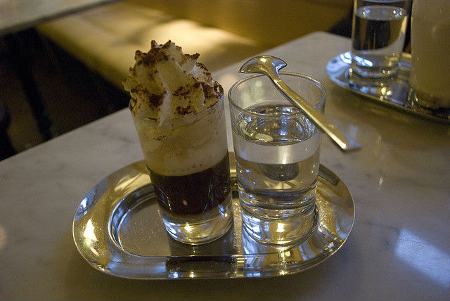

I don’t know about you but sometimes I feel myself getting into a coffee rut. I mean, you can only order so many half-caff, low-fat, no whipped cream macchiatos before you start to feel like you are missing out on things the greatest drink in the world can offer.

Well, no more.

Cultures around the world have developed an abundance of alternative ways to make (and drink) coffee, including everything from lemon juice to eggs to alcohol.

So set your French press and V60 aside for a minute and learn about these crazy coffee drinks.

### #1 Turkish Coffee

*[Turkish Coffee](https://flic.kr/p/9ZXQa4) by Quinn Dombrowski*

You have probably heard of, if not tried, this one.

Turkish coffee is consumed all over the world, but it is the drink of choice in many parts of (you guessed it) Turkey, the Middle East, and Eastern Europe.

It is a drink steeped in history, going back well over 400 years with the recipe changed very little.

The preparation is relatively simple. You take water and sugar (recipe in the link below) and boil them together before adding a very fine mix of coffee and cardamom powder and reboiling. After boiling, let it sit briefly to foam before pouring it, grounds and all, into a small cup (think Italian espresso cup).

You then sip slowly and enjoy. The slowly part is key here because if you do not, you learn the hard way what mouth full of coffee and cardamom powder tastes like.

**Recipe: [Preparing a Traditional Turkish Coffee](http://ineedcoffee.com/preparing-a-traditional-turkish-coffee/) (I Need Coffee)**

### #2 Vietnamese Iced Coffee

*From [How to Brew Vietnamese Coffee](http://ineedcoffee.com/brew-vietnamese-coffee/)*

Next, we head over to Asia, where hot drinks have been commonplace for eons.

Vietnamese coffee has gained popularity over recent years, so you have probably heard of it. It is immensely popular on the streets of Vietnam, and variations of it appear all over Southeast Asia.

It is essentially a two-layer ice coffee with sweetened condensed milk as the base with black coffee in the middle and foam on top. It is traditionally served over ice and made using robusta beans (not my favorite) but using arabica and drinking it hot is just as enjoyable.

**Recipe: [How to Brew Vietnamese Iced Coffee](http://ineedcoffee.com/brew-vietnamese-coffee/) (I Need Coffee)**

### #3 Oliang (Thai Coffee)

*[Thai Iced Coffee](https://flic.kr/p/ap5CY3) by Chris Goldberg*

Now just a hop, skip, and a jump over to Thailand where we find Oliang or Thai iced-corn-soya bean-sesame coffee.

Oliang is made by taking your coffee and additional ingredients blend (see recipe below), putting it into a [coffee sock](http://ineedcoffee.com/brewing-coffee-coffee-sock/), pouring boiling water through it, and letting it steep for ~10-15 minutes before adding sugar and pouring over ice. You then add sweetened condensed milk (how they do it on the streets of Bangkok), pop in a straw, and enjoy!

If for some reason you are opposed to the sock method, you can simply steep the coffee blend in hot water for the same time and then filter it (it won’t be traditional though).

**Recipe: [Thai Iced Coffee Recipe (Oliang)](https://www.templeofthai.com/recipes/iced_coffee_oliang.php) (Temple of Thai)**

### #4 Yuan Yang (Coffee with Tea)

*[Photo](https://flic.kr/p/dS63cn) by Petra Bensted*

Coffee? Tea? Why not some of both? Yuan yang is a favorite drink in Hong Kong; so much so that the Starbucks stores in Hong Kong actually had a limited-time offering of it as a Frappucino.

Yuan Yang is made by making strong black tea in a pot, stirring in evaporated or sweetened condensed milk and coffee, then sweetening it to taste. Add some shortbread cookies and you have yourself an Asian twist on high tea.. ahem, coffee.

**Recipe: [Hong Kong Yuan Yang Tea](http://www.food.com/recipe/hong-kong-yuan-yang-tea-496985) (Food.com)**

### #5 Mazagran (Portuguese Lemon Coffee)

Next, we head to Portugal, where they have found other unique takes on coffee, specifically adding lemon to it. Now, you may not think that coffee and lemon sound intuitive, but this iced drink can actually be incredibly refreshing.

It is essentially a coffee lemonade made by mixing strong coffee with lemon juice and sugar to taste. You then pour it all over the ice, kick back, and enjoy your fresh take on lemonade.

**Recipe: [Portuguese Coffee Lemonade (Mazagran / Capile)](https://www.cookingwithalia.com/247-coffee-lemonade-mazagran-capile-portuguese-recipe/) (Cooking with Alia)**

### #6 Greek Frappé

*Greek Frappé by Tilemahos Efthimiadis (photo removed from Flickr)*

Staying in Europe, another refreshing take on the world’s greatest drink, the renowned frappé, is especially loved throughout Greece.

To make, add a small amount of cold water, instant coffee, and sugar to a jar or shaker and shake vigorously for 10-20 seconds or until it is incredibly foamy.

You then pour the mixture over ice, add water and milk to taste, and voila, you have created a frappé!

**Recipe: [Greek Frappe Recipe](http://ineedcoffee.com/greek-frappe-recipe/) (I Need Coffee)**

### #7 Swedish Egg Coffee

*Photo by [Alex Freemon](http://ineedcoffee.com/by/alex-freemon/)*

Now, we move to Scandinavia, where they have created a new take on coffee for breakfast. Popular in both Sweden and Norway, egg coffee is exactly what it sounds like.

To make it, you mix a raw egg with coffee grounds and a small amount of water and mix it until it has the consistency of, well, an egg-coffee slurry. You then take the slurry, pour it into a pot of boiling water, mix, strain, and serve.

The result is supposedly one of the smoothest and creamiest cups of coffee you will ever have; make sure you use good eggs though.

**Recipe: [Swedish Egg Coffee](http://ineedcoffee.com/the-smoothest-cup-youll-ever-drink-swedish-egg-coffee/) (INeedCoffee)**

### #8 Irish Coffee

*Irish Coffee by [Chris Arnold](http://ineedcoffee.com/by/chris-arnold/)* 

Alcohol and coffee, what else do you really need? Almost everyone has heard of, if not tried, an Irish coffee, though most people simply use Baileys rather than making the real thing.

All you need for this bonafide beverage is your coffee of choice, Irish whiskey, brown sugar, and some whipped heavy cream (or just whipped cream from a can if you’re lazy).

It makes an excellent after-dinner dessert drink, or, you know, something for breakfast.

**Recipe: [The Best Irish Coffee in the World](http://ineedcoffee.com/the-best-irish-coffee-in-the-world/) (I Need Coffee)**

### #9 Pharisäer (German Rum Coffee)

*[Pharisäer](https://flic.kr/p/6XsvQa) by Agnes Chang*

Continuing our alcoholic trend, Pharisäer, or rum coffee. It is a decadent drink that originated in Germany but can really be enjoyed anywhere in the world.

Similar to the Irish method, you simply take your favorite strong cup of coffee, add sugar and then add in a shot (or more) of rum before topping with whipped cream and a dusting of cocoa. Also, a good thing to remember is that you are not technically supposed to stir this drink once it is assembled, but rather sip it through the layer of whipped cream.

**Recipe: [Pharisees Coffee with Rum – Pharisaeer](https://www.thespruceeats.com/german-coffee-with-rum-recipe-1446818) (About.com)**

### #10 Cafe de Olla (Mexican Coffee)

*Cafe de Olla by [Chris Arnold](http://ineedcoffee.com/by/chris-arnold/)* 

Nearing the end of our trip is café de olla, or Mexican cinnamon coffee. While it does not contain alcohol, it is similar to Irish coffee or a pharisäer in that it is more of a dessert than a drink, but there is no shame in that.

It is incredibly easy to make, you take water, coarse coffee, brown sugar, and a cinnamon stick and boil it all together. You then take it off the heat and let it infuse for about 10 minutes before straining and serving; you can optionally add whipped cream for extra richness.

The cinnamon pairs excellently with the coffee and adds another depth of flavour, while the brown sugar adds decadence that plain white sugar lacks.

**Recipe: [How To Make Mexican Coffee (Cafe de Olla)](https://www.mrbreakfast.com/superdisplay.asp?recipeid=1644) (MrBreakfast.com)**

### #11 Ethiopian Coffee Ceremony

*[Ethiopian Coffee Ceremony](https://flic.kr/p/4inn2W) by Matt Handy*

Last on our crazy list is more of a ritual than a type of drink, but bears an honorable mention. Similar to a tea ceremony in Japan, the coffee ceremony considers everything from the type of cups and pots used to the atmosphere of the environment.

It is traditionally performed as a sign of friendship and welcoming and should never be turned down as it would be a great insult to the host.

To begin, the woman (traditionally it is a female that performs it) will burn incense to ward away evil spirits and will continue to burn it throughout the ceremony. She will then set a jebena, or clay coffee pot, filled with water and place it over heat before taking green coffee beans and cleaning them over hot coals.

After the heat removes the husk, the hostess will then proceed to roast the beans over the hot coals similar to how one might use the stove to make popcorn; she will typically roast the beans until they are medium to dark brown.

The freshly roasted beans are then ground in a mortar and pestle and added to the jebena, where the entire mixture is brought to a boil before serving in handle-less cups.

The entire process can take several hours and each part should be treated with reverence and respect. If you ever get the chance to attend a ceremony be sure to take advantage of the opportunity!

**Ritual: [Coffee Cultures: Eritrea and Ethiopia](http://ineedcoffee.com/coffee-cultures-eritrea-and-ethiopia/)  (I Need Coffee)**

### Conclusion

So there you have it: 11 unique and crazy ways to spice up coffee—not that it needs them.

Go out, impress your friends, and never let your coffee be dull again!

*Title image by [Alex Jones](https://unsplash.com/@alexjones)*