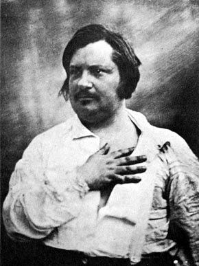
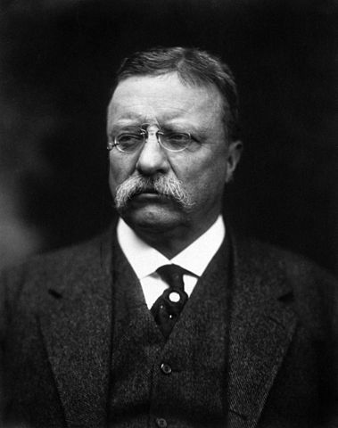

I can’t remember the last day I started without my daily cup of coffee. I stumble out of bed every morning and drag my body to my coffee maker, brew myself a cup, and then, only then do I feel alive enough to start my day. My love for coffee was so deep that I started thinking. I wanted to know everything that I could know about my favorite drink. And here are a few of the facts I found most amazing.

  
*Honore de Balzac*

1.  During Turkish wedding ceremonies, grooms were made to vow to always provide their brides with coffee. Failure to do so could result in divorce.
2.  Beethoven (like me!) was such an ardent coffee lover that he’d count 60 beans per cup before making his brew.
3.  The Boston Tea Party resulted in Americans switching from tea to coffee as an expression of freedom.
4.  Did you know that coffee doesn’t just give us humans a buzz? No siree. BEES get a buzz when drinking coffee, and what’s even more interesting is that it supercharges their long-term memory! How else do you think they find their way back to the same plant over and over again? ([reference](https://www.nationalgeographic.com/science/article/130308-bees-caffeine-animal-behavior-science))
5.  Exfoliate your skin with moist coffee grounds at least twice a week, rinse, and watch your face glow. ([reference](https://www.sheknows.com/living/articles/956905/how-to-make-your-own-exfoliating-scrub-2/))
6.  French novelist and playwright Honore de Balzac supposedly consumed 50 cups of coffee a day to fuel his inspiration while writing. It’s scary to think that the lethal dose is about 100 cups of coffee.
7.  Back in 1674, there was a mass uprising against coffee. In fact, the [‘Women’s Petition against Coffee’](http://ineedcoffee.com/the-coffee-house-a-history/) said that coffee was turning British men into ‘useless corpses’ and so a ban was demanded for those under the age of 60.
8.  In 1511, coffee was banned in Mecca on the grounds of preventing free-thinking people from getting together to hang out.
9.  Kopi Luwak, the world’s most expensive coffee is made from coffee beans eaten and excreted by a Sumatran wildcat. And at one time commanded a price of over $300 a pound!
10.  During WWII, American soldiers ordered their espresso watered down because it was too strong for them.
11.  In fact, the term “cup of Joe” comes from the American soldiers, also known as GI Joes of WWII, who loved their coffee and were big drinkers.
12.  Coffee was declared illegal not once, not twice, but a whopping three times in three different cultures! The first was in Mecca in 1511, followed by Charles II in Europe in an attempt to quell the ongoing rebellion, and the third was by Frederick the Great in Germany in 1677, who was worried about the economic implications of money leaving the country to buy this beverage.
13.  There has been an indication that coffee can actually be used to [fuel a car](http://ineedcoffee.com/chicken-john-coffee-achiever/). Not now, of course, but maybe someday in the future. Kind of reassuring, don’t you think, to imagine a world where one day we might never have to worry about running out of fuel?
14.  In 1906, a Belgian man living in Guatemala by the name George Washington invented instant coffee. Not the first American president, but the first inventor of [instant coffee](http://ineedcoffee.com/the-history-of-instant-coffee/). Not bad at all, if you ask me!
15.  In ancient Arab culture, a woman could only divorce her husband if he didn’t like coffee enough. Talk about extreme love for coffee!
16.  The word coffee originates from the Arabic word *‘*qahhwat *al-bun’*, which was then shortened to ‘qahwa’. The Turks called it ‘kahve’, after which the Dutch made it ‘koffie’, until it was finally translated to ‘coffee’ in English.
17.  In the 17th century, there was great debate over whether or not Catholics could drink coffee. It was only after Pope Clement VII Okayed it that they were allowed to drink it.
18.  We now drink coffee with our breakfast, but back in the 17th century people [drank beer](http://ineedcoffee.com/before-there-was-tea-there-was-coffee/) along with their breakfast every morning!
19.  Teddy Roosevelt drank a gallon of coffee every day. (Not something you’d want to try today. Just putting it out there.)
20.  Coffee was so scarce in Germany during WWII that ‘coffee bombs’ were dropped from planes to turn the people against the government.

  
*Teddy Roosevelt*