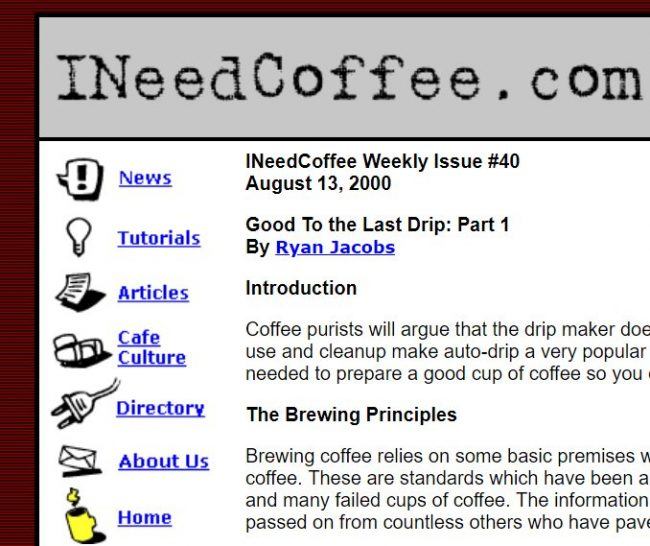
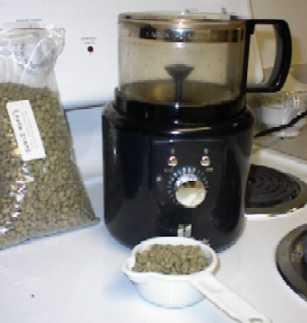
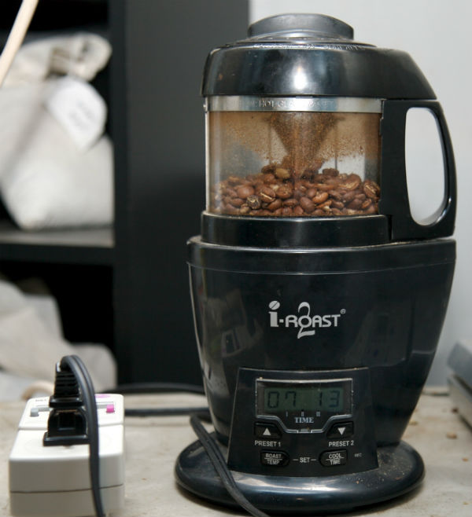

Twenty years ago today, on April 4th, 1999, INeedCoffee.com went online with our first article. We are still here, still brewing, and still posting.

### History

INeedCoffee was started while I was living in the Washington DC Metro. I had just moved there from Tampa Bay, where I had another website called the [Tampa Bay Coffee Guide](https://web.archive.org/web/19970610013528/http://www.cyberspy.com/~mas/Coffee/index.html) that reviewed local coffee shops. Once I moved to the DC area, I quickly learned that I could no longer update my old website, as this was still the age of dial-up modems, and connecting to my Tampa-based Internet Service Provider would have been a long-distance phone call.

I wanted to start something new. I liked coffee and creating web pages, so on September 1, 1998, I registered the domain INeedCoffee.com. Over the years, I’ve both liked and disliked the name. At one point, I tried to change it to AllCoffee.net, but it didn’t stick, so I reversed course and stayed with INeedCoffee.

*A screenshot from the original INeedCoffee design.* 

My team leader at work offered to host INeedCoffee from his home server for free. This turned out to be a bad decision, as it was often down and I could not connect to the server most of the time. Months were wasted on that setup until I moved the site to a legitimate web hosting company. Had I hired a real web host from the start, INeedCoffee would have had a 1998 birth date. Lesson learned. Since then, I’ve only used excellent web hosts.

The first article went live on April 4th, 1999. [Coffee History Primer](/coffee-history-primer/) was written by Ryan Jacobs. Ryan also taught me how to home roast coffee, which is as cool as it sounds, especially if you’ve never done it before. Home roasting became an important topic for several posts in the early years.

In the first decade, INeedCoffee experimented with accepting content from many writers across many coffee-related topics. Some topics, such as brewing tutorials, home roasting, and comics, were popular, whereas fiction, poetry, and travel articles weren’t. We stopped publishing those topics. Our agriculture section grew so big that we spun off that content to [EcoFriendlyCoffee.org](https://ecofriendlycoffee.org/), which releases new content monthly.

Over the years, we have increasingly focused on coffee education, which has turned out to be our niche. When INeedCoffee started, most Internet users used dial-up modems and had those terrible heavy CRT computer monitors. Pages were small and slow, so we had to keep our images small so they would load quickly. Today, that is no longer an issue. Having photo-rich tutorials helps us communicate better with our coffee-loving readers.

*A photo of the Hearthware Precision roaster from 2000.* 

*Hearthware I-Roast 2 photo taken by [Chris Arnold](/by/chris-arnold/) in 2007*

In recent years, we’ve taken new photos for many older articles. It is something we continue to do from time to time.

Today INeedCoffee is based out of Seattle, a legendary coffee market. Our website is secure (runs on HTTPS), mobile and tablet friendly, and uses a CDN (Content Delivery Network) to speed up the site, especially to readers outside of North America. We continue to publish a few articles each month.

### Lessons

Over the last twenty years, I’ve seen many sites start and quit. I’ve also seen people who want to start a blog but never do. Here are a few tips.

1.  Don’t wait for everything to be perfect before you launch. It never will be. Start with something plain and worry about making it pretty later.
2.  You don’t need to buy a domain and hosting to see if blogging suits you. Go to [WordPress.com](https://wordpress.com/) and set up a free account. Later, you can transfer it to your domain, either with them or a third-party web host.
3.  Once you know you want to blog and are committed, register a domain name and purchase web hosting.
4.  When choosing a web host, find one that offers Let’s Encrypt, a free way to make your site secure (HTTPS). There are a few reasons you want your site to be secure.
5.  Don’t focus on making money first. Focus on getting a valuable message to the reader. Do that enough times, and the traffic will come. Then, if you want, see if there is an opportunity to earn extra income. This is probably the primary reason people quit. They do it for money, and the money isn’t that much, so they lose their motivation and quit. INeedCoffee went the first 8 years without a single ad or affiliate program.
6.  Make sure your site is fast and mobile-friendly. If you are looking for themes, search for *Responsive* design. Most new sites are fine, but many older sites still have designs that look awful on smartphones.
7.  Stay up to date with security patches and make regular backups. I know of one popular fitness site that lost everything. They didn’t patch their blog software or make any backups, and then they got hacked.
8.  Don’t let your domain registration expire. INeedCoffee.com is usually registered out 5 to 10 years.

I didn’t include any social media tips because I’m not very good at them, and the rules are changing constantly.

### Thank You All!

I want to thank all our readers, contributors, and sponsors. Here is to another 20 years! Powered by coffee, of course. ☕❤

*20 Years Comic by [Todd Zapoli](/by/todd-zapoli/)*
