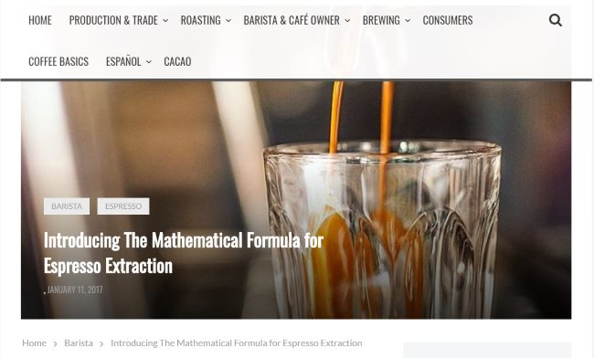
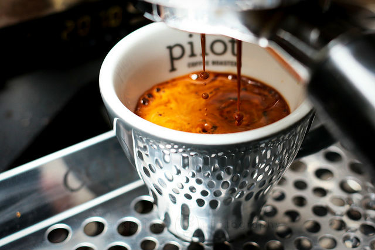
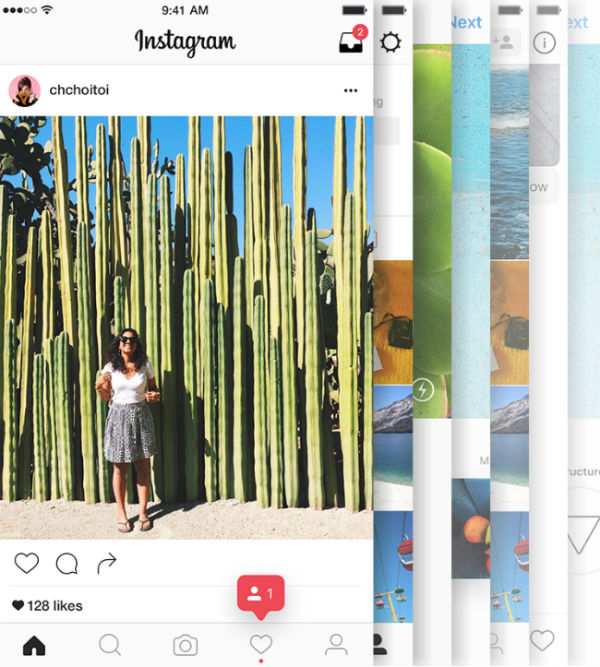

It has been 21 years since I published my first coffee website. Before INeedCoffee launched in April 1999, I had a website that reviewed the coffee shops in Tampa Bay. I left that area in 1998, and that website is now gone. Since then, I’ve seen numerous coffee websites start and quit. Today, I don’t follow many coffee sites as they don’t further my knowledge or love of the beverage, but there are still a few that I consider excellent.

### The Dirty Secret About Many Best of Coffee Site Lists

Before I get into my top 5 coffee sites, I want to share with the reader a dirty secret about these lists that you may not know. Often, sites are contacted in advance of the list being published. The person writing the list will ask the site for a promise to link back to the list should they make it onto the list. Your site won’t get on the list if you don’t promise.

These lists are often hack jobs written by people with little experience in coffee or even reading coffee websites. They are created to get a link back to their site, which improves their rankings in search engines. They never disclose this fact when they publish their best-of lists, either.

So, in the spirit of full disclosure, here are my top five coffee sites. I didn’t reach out to any of the top five, and they likely won’t share this link because they already know they are doing an awesome job.

### Perfect Daily Grind

[Perfect Daily Grind](https://perfectdailygrind.com/) is a coffee education site that bridges the gap between the coffee enthusiast and the coffee professional. Its articles on every aspect of coffee are well-researched. Also, as someone who is learning Spanish, I enjoy reading its Español section.

*Perfect Daily Grind*

### CoffeeGeek

I often get asked my opinion on a particular grinder or espresso machine by someone looking to make a major purchase. I always recommend going to [CoffeeGeek](https://coffeegeek.com/) to complete their research. CoffeeGeek has detailed reviews and forums with many other coffee geeks to help you decide which coffee equipment is best for you.

*In addition to extensive coffee equipment reviews, Mark from CoffeeGeek has a Flickr channel full of outstanding coffee photos. This photo is titled [Building yet another Americano](https://www.flickr.com/photos/coffeegeek/34911337954/).*

### Instagram

Wait, Instagram isn’t a coffee site. That is true, but Instagram is the social network that is doing the best job of connecting coffee drinkers with coffee professionals. With Instagram, you can follow your favorite coffee shops and roasters. From there, you might add a few baristas. Soon, a network of coffee information will be available to you, one photo at a time.

I learn more about what is happening in specialty coffee on Instagram than anywhere else. Many coffee professionals have left Facebook because their messages were not reaching the people who liked their page, and Twitter has become too noisy. These reasons have made Instagram an ideal tool for coffee professionals to share information with their fans.

The only downside is that the website allows you to view only images. You will need the mobile app to post your photos.

*Photo courtesy of Instagram*

### The Coffee Compass

This site dives deeper into some of the current events in coffee. So the next time the Huffington Post or some other non-coffee news outlet attempts to cover a coffee story, check to see if [The Coffee Compass](https://www.thecoffeecompass.com/) has written anything on the topic. I’d rather read my coffee news from coffee professionals.

The Coffee Compass is also doing an outstanding job covering regional coffee scenes.

### INeedCoffee

Of course, I’m going to give my site props. 🙂 We are committed to coffee education. Our audience is people looking to make better coffee. We have numerous coffee brewing tutorials that are always being updated. INeedCoffee doesn’t post as frequently as other coffee sites, and that is by design. We don’t want to bombard our readers with noise.

### Many More Great Coffee Websites

There are more great sites related to coffee that specialize in different areas. As my coffee journey continues, I will find more favorites. As for now, I consider these five to be the best coffee websites.

*In 2018, Perfect Daily Grind was added to the list. Sprudge fell off the list, as they now hide the year on their posts, which makes it hard to tell how current their cafe information is.*
