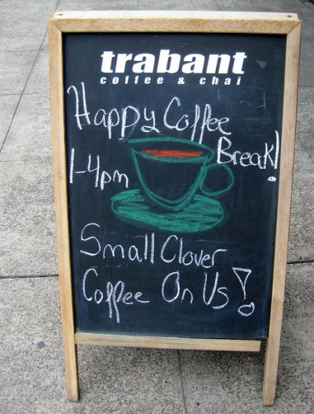

Time for a little rant. People have been sending me links to coffee news stories for as long as I can remember. They know me as the publisher of *INeedCoffee*, and they believe they’ve stumbled upon some coffee news item that has escaped my radar. Most of the time, I’m not only aware of the news item, but it is something I could care less about.

For this article, I’ve decided to list the five coffee news stories that I will NEVER read about again. Here they are.

### #1 Coffee Health Cheerleading Stories

I plan on doing a full article on this topic, but I’ll keep it brief for now. I drink coffee because I like the taste. It often makes me feel great, and I enjoy the social aspect. If there are positive health benefits, that doesn’t impact my behavior. I will still drink coffee.

We all have unique responses to coffee and caffeine. Those responses vary wildly from person to person. Those responses change over time. We are all unique. Sharing links to some study that a majority of individuals in some group achieved a minor health benefit from consuming coffee is meaningless to a group ALREADY consuming coffee.

Please don’t send me any stories that glamorize the health benefits of coffee. I won’t read them because they do nothing to improve my health. Remember, we are already drinking coffee. The only people who might benefit from these stories are people who love and can tolerate coffee but have stopped drinking it for fear it is damaging their health. That isn’t us, though.

### #2 Animals Pooping Coffee

Stop sending me links to stories about the latest animal that they have tricked into eating and pooping out coffee. Civet cats or birds or elephants or monkeys. I don’t care. It is old news. It may have been funny 10 years ago, but now there are [several reports of animal cruelty](https://sprudge.com/horrifying-animal-abuse-coffee-real-getting-worse-51697.html) related to civet cats and this process of coffee production.

### #3 Anything Starbucks is Up To

At the time of this writing, the Starbucks Corporation is worth $40 Billion (USD). Even though they are massively wealthy, they have figured out how to get millions of dollars in free marketing. Every month or so, they send out a press release about something they are up to, and lazy reporters everywhere rearrange the words and publish it as “news”. Meanwhile, small independent coffee businesses with no marketing budgets doing far more innovative stuff with coffee can barely get a mention in their neighborhood blog.

Several people have sent me the latest Starbucks “news” story about some $7 cup of coffee. Boring. In 2008, independent coffee shops charged between [$9 and $15 for a cup of Panama Esmeralda](http://ineedcoffee.com/the-2-best-cups-of-coffee-ive-ever-had/). Yeah, that is where independent coffee was four years ago. They sought the highest quality micro-lots and paid top dollar for those beans. Only for them, it wasn’t a marketing gimmick. Their mission was to push the envelope in terms of coffee quality, which they continue to do.

  
*My first Clover Coffee was at Seattle’s Trabant Coffee in May 2007. This was a full year before Starbucks purchased the company and even longer before they began deploying them into stores.*

Please don’t send me any news items related to Starbucks\*. When I look back at my coffee education, I consider them to be middle school at best. INeedCoffee exists to empower coffee drinkers to make better coffee at home. Tutorials on this site will teach you how to [brew](http://ineedcoffee.com/section/brewing-coffee/) and [roast](http://ineedcoffee.com/section/roasting-coffee/) coffee, which is superior to anything Starbucks can do.

*\* This also extends to Tully’s, Dunkin Donuts, Mcdonald’s, or any other publicly traded corporation that sells coffee.*

### #4 Automated Single Coffee Brewers

When did coffee become so difficult to make that we needed to fill our counters and break rooms with stale pod-based coffee brewers? Is making coffee really that hard or messy? May I never receive another email that mentions [Keurig](http://ineedcoffee.com/alternatives-to-using-a-keurig-coffee-maker/), [Senseo](http://ineedcoffee.com/senseo-coffee-brewing-revisited/), or whatever the latest mediocre pod-based coffee maker happens to be. These machines are the enemy of good coffee. They promote the belief that making coffee is hard and messy. It isn’t.

### #5 Any Coffee News Item Featured on the Homepage of Major News Outlets

We live in a hyper-connected world. By the time a coffee news item hits the front page of major news outlets, there is more than a decent chance I have seen it or will soon. Recently, NPR did a coffee story. About seven people sent me links to the story within a few days. I think it was about some animal pooping out coffee (see #2). Before you share any news item with anyone, give them a little credit and assume they aren’t living under a rock. The best news items will always be the ones that are way under the radar. A fresh angle on coffee that hasn’t been reprinted everywhere will always be more interesting than headline coffee news.

OK. Rant over. I feel better now.