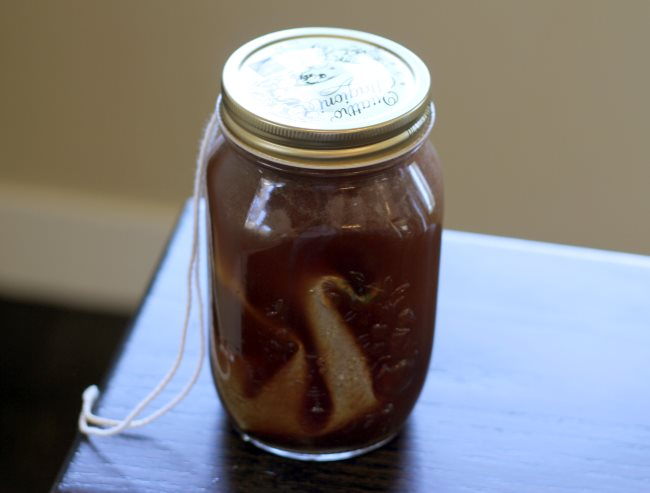
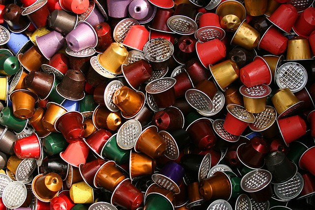

If you are looking for ideas on being more sustainable about your daily coffee habit, read on for five ideas.

### #1 Use a thermal coffee carafe

Many drip coffee makers have warming plates designed to keep coffee warm for hours. What these plates really do is burn your coffee and burn your wallet. One Computer World writer said his warming plate consumes nearly 1,000 watts of electricity while powered on. These plates also overheat coffee and ruin the taste.

Brew with a thermal coffee maker instead. Thermal carafes keep coffee warm for hours without the need to heat up. Your coffee and your energy bill will both be easier to digest, and metal carafes never break.

### #2 Try cold brew

Cold brewing coffee could significantly cut down your energy usage. Devices such as the [Toddy](http://ineedcoffee.com/cold-brew-coffee-with-the-toddy-coffee-maker/) or even [coffee grounds mixed with water in a bottle](http://ineedcoffee.com/cold-brew-coffee-is-not-rocket-science/), you can substitute energy with time. Traditional coffee makers use heat energy to quickly brew coffee. With cold brew, you must wait 12-24 hours, depending on the method, to enjoy your coffee. You can brew at room temperature or in a refrigerator. Heating up the coffee in a microwave uses very little energy, and since cold brew requires a relatively coarse grind, electric grinder owners will use less energy (hand grinding is the way to go)

*From the INeedCoffee tutorial, [Cold Brew Coffee is Not Rocket Science](http://ineedcoffee.com/cold-brew-coffee-is-not-rocket-science/).*

### #3 Don’t forget about the birds!

These days, birds have more than Windex to worry about. As our penchant for coffee grows, millions of acres of trees are being cut down to make way for plantations, destroying the habitats of many rare and endangered migratory birds. This affects ecosystems thousands of miles away from coffee-growing areas.

Look for a retailer that stocks Bird-Friendly-certified coffee. These shade-grown beans have all the benefits of organic and shade-grown coffee, including better taste, but also support the Smithsonian Migratory Bird Center. The birds and other wildlife that depend on preserving tropical forests will thank you.

Keep in mind that fair trade coffee isn’t necessarily organic (though most are), and organic coffee usually isn’t shade-grown unless otherwise specified. If you can’t find Bird Friendly coffee in your area, organic shade-grown coffee is your next best bet.

*Photo from the article [Ecofriendly Shade Coffee as Stopover Sites in Bird Migrations](https://ecofriendlycoffee.org/ecofriendly-cofriendly-shade-coffee-as-stopover-sites-in-bird-migrations/) by Dr. Anand Titus Pereira.*

### #4 Reuse Coffee Grounds

Reuse coffee grounds to make the most of your purchase. And by reuse, I don’t mean put them back in the coffee maker. Coffee is an excellent fertilizer. Coffee grounds are rich in phosphorus and potassium. They also contain nitrogen and other trace minerals essential for plant health. Add some to your houseplants or throw them in the garden.

You can also use coffee grounds to deodorize refrigerators as part of your beauty routine. Gently rub coffee against the skin to exfoliate. You can even dye your hair, albeit temporarily, with coffee!

### #5 Rethink single-serve coffee makers

Single-serve coffee makers such as the Keurig line and Nespresso are certainly convenient. Yet the pods are clogging up landfills across the country. Coffee capsules are made of a combination of plastic, aluminum, and paper that can be recycled individually, but not as a single unit thrown in the trash can.

Switch to a reusable coffee pod such as the Ekobrew for Keurig or the CoffeeDuck for Nespresso to be more sustainable. Your wallet and Mother Nature will thank you.

If you’re in the market for a new coffee maker and single-serve is a must, look for a model that uses a flow-through water heater. These heaters warm up water only as needed and power down when coffee is not brewing, resulting in up to 50% energy savings. The Department of Energy recommends the Bosch Tassimo for its flow-through heater.

  
*[Discarded Colors](https://www.flickr.com/photos/19614198@N00/2478359433) by Thomas Guignard*

### Bonus Idea – Switch to Compostable Keurig K-Cups

When this article was first published, Keurig K-Cup brewers did not have fully compostable options. Now they do. Glorybrew is available online in three roast levels.

### Resources

[Coffee Brewing Guide](http://ineedcoffee.com/coffee-brewing-guide/) – INeedCoffee guide to coffee brewing methods that are more environmentally friendly.

[Don’t breathe. And unplug that coffee pot please.](https://www.computerworld.com/article/1499538/don-t-breathe-and-unplug-that-coffee-pot-please.html) – Computer World

Keurig And Other Coffee Pods Piling Up In Landfills Across America – TreeHugger.com (article no longer online)

[Can You Recycle K Cups pods?](https://www.recycleacup.com/faqs/) – FAQ hosted by Recycleacup.

*Title photo by [Elke Karin Lugert](https://unsplash.com/@elke_karin)*