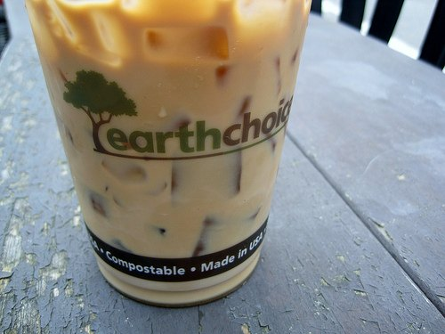

Coffee is among the most popular drinks in the world, if not the most popular drink in the world. Unfortunately, all those coffee drinkers are unknowingly taking a toll on the environment. Just think about how many coffee drinkers there are in the US. Imagine the coffee shops, office coffee makers, home coffee makers, coffee drunk in hotels and restaurants, and coffee served in airports, schools, and malls. Now take that number and imagine how many similar instances there are across the globe: Europe, Asia, Australia, the Middle East, and South America.

Then think about the millions and millions of paper and plastic products that go with the coffee. Things like cups, stirrers, lids, coffee carriers, napkins, etc., are thrown in the trash daily. That is in addition to the massive amounts of water that are taken to grow, harvest, and brew the coffee. Then think about the amount of fuel it takes to ship that coffee around the globe. In some cases, coffee travels 10,000 miles to reach your cup. No surprise that after oil, coffee is the most traded commodity in the world. What’s worse is the massive amount of deforestation that is needed to produce enough coffee to keep up with the world’s demand.

  
*Compostable Cup*

So yes, coffee does do a number on the environment, but that doesn’t mean you have to give up coffee cold-turkey. There are plenty of things you can do the lessen the effect of your coffee habit on the earth.

### #1 Just Drink Less

This isn’t the easiest thing for most people, but cutting at least some coffee out of your diet is bound to help the environment (not to mention keep your [teeth whiter](/no-coffee-or-tea-for-at-least-2-weeks/)). If this isn’t possible, don’t fret, there are plenty of good tips below.

### #2 Buy Local Coffee

Because shipping coffee beans around the world spews tons of toxic smoke into the atmosphere, look for coffee beans grown in countries closer to you. Love Kopi Luwak (the bean is best when it passes through the digestive tract of a small tree mammal called the Luwak)? There are tons of other specialty blends that you can get that are grown much closer to home. I know Kopi Luwak tastes good, but it comes from an animal’s feces and it is shipped from halfway across the world. I’m just sayin’…

### #3 Look for Organic Coffee and Fair Trade Coffee

Organic coffee is great because it’s (obviously) grown without chemicals, and is usually grown in such a way that protects sensitive ecosystems and the birds that live within them. Most of these toxic chemicals are produced in factories that spew toxins into the environment themselves, so you’re killing birds with one stone by going organic.

If you’re going organic and avoiding corporate coffee, you might as well buy fair trade coffee. Rainforest Alliance and Transfair coffees not only ensure fair living wages for coffee farmers, but they also take into account environmental standards in their certification process. It won’t immediately lift people out of poverty, but it’s a start.

### #4 Stay Away From Corporate Coffee

More and more coffee giants are cutting down the forest and converting them into large agricultural coffee plantations. Deforestation is not only horrible for the environment, it produces inferior quality coffee. Add that to the fact that the coffee farmers themselves can barely make a living working in these massive corporate coffee farms.

### #5 Use a Mug

This one is a no-brainer. But it’s easier if you invest in a really cool mug that you will want to use over and over again; eliminating the need for plastic or Styrofoam cups. There are plenty of websites that sell cool, unique, and funny coffee mugs. You can also create one yourself at CafePress.

### #6 Use Better Filters

Not only are they better for the environment, but reusable gold coffee filters also yield a better, less bitter cup of coffee. If that’s not your thing, look for unbleached, biodegradable ones.

### #7 Recycle the Coffee Grounds

If you already have a compost heap, you probably throw eggshells, banana peels, and old food into it. Why not add coffee grounds (if you haven’t already done so)? The next time you make some coffee, rather than throwing out the used coffee grounds, toss them in your compost heap or directly into your garden. All the nitrogen in the coffee is a powerful fertilizer.

Alternatively, you could use the coffee grounds to keep neighborhood cats from using your garden as a litter box. Instead of using harsh chemicals in your garden to keep away unwanted pests like ants and neighborhood cats, sprinkle coffee grounds and orange peels in your garden. The nitrogen in the coffee burns ants’ legs and is better for the environment than using harmful chemicals. Cats don’t like the smell of coffee either.

So here are seven easy ways to make your coffee habit less harmful to the environment. I’m sure there are tons of others. Please feel free to share your own tips.

### Resources

[Coffee Brewing Guide](/coffee-brewing-guide/) – Our collection of coffee brewing tutorials has many ideas for brewing coffee at home.

[5 Ways to Make Your Coffee Habit More Sustainable](/5-ways-to-make-your-coffee-habit-more-sustainable/) – INeedCoffee article.

[Top 3 Ways to Reuse Your Coffee Grounds](/top-3-ways-to-re-use-your-coffee-grounds/) – INeedCoffee article.

*Title image by [Matthew Henry](https://unsplash.com/@matthewhenry)*
