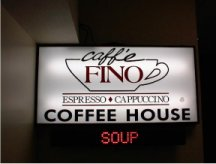
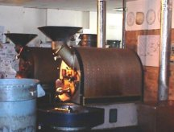
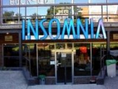
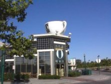
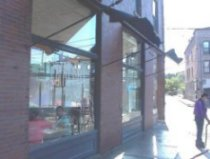
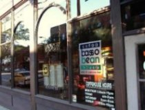
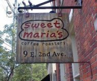

*Editor’s Note: This article was written in June 2000. Many of the places in this article are now gone. Enjoy this time capsule of the Columbus coffee scene.*

Columbus, Ohio is home to The Ohio State University as well as many excellent coffee shops. Whether you want to learn about chemistry or coffee, you can do both here and at the same time. Prior to moving to Columbus to attend *The Ohio State University*, I considered myself a connoisseur of coffee. I would scoff at my father’s pot of Folger’s, while I brewed “hazelnut” coffee for myself. I had much to learn.

### Caffe Fino

Caffe Fino resides in The Ohio Union, which is part of the OSU campus. It was here that I had my first espresso-based drink — a Caffe’ Latte. I was very impressed by the rich flavor that came through the steamed milk. At the time, Armando Escobar was running the shop. Soon after that latte, I graduated to drinking straight espresso, also a first at this shop. I am forever grateful that my first espresso was here because I still believe that theirs is consistently one of the best espressos I have ever had. I can only imagine what my attitude toward espresso would be if I had tasted a poorly made one my first time around. I may have been forever scarred, swearing off the drink forever.

  
*Caffe Fino at The Ohio State Student Union*

Fortunately, I took a sip and found it to be very good. In fact, at the time, I remember thinking that the pungent aroma and bitter taste combined with the creamy texture was intriguing. It wasn’t scalding hot — it was just right. I never imagined that a coffee beverage could have such body without adding sugar or cream. I didn’t realize it until much later, but their demitasse cups were very important to the quality of the espresso. They use the same cups used to serve cappuccino, which I would normally consider too large. However, they do a great job of keeping them heated on the espresso machine. By drinking the espresso from these wide-mouthed cups, your nose is stuck inside as you taste the espresso, which allows you to inhale the aroma as you taste it. This enhances the whole experience.

For four years, Caffe Fino was there for me when I needed it most. Before and after classes, before and after exams. Needless to say, I spent a lot of time there.

### Staufs Coffee Roasters

To me, finding Stauf’s coffee was like finding the Holy Grail of coffee. I came to Stauf’s shortly after having my first latte at Caffe Fino. Here, with their wide varieties of coffees from around the world, I learned that there was more to coffee than Colombia and Juan Valdez. When I walked in, I was immediately drawn to the new aromas that came from the large drum roasters and bins of coffee. As I examined each bin, I noticed the different sizes of beans, the different colors, textures, and roasts. At the time, darkly roasted coffees were new to me and smelled exotic and tasted the same. My first half-pound of coffee was Baba Budan blend, named after the hero who smuggled coffee seeds strapped to his belly out of Ethiopia. I was virtually obsessed with oily coffee for about six weeks.

  
*Stauf’s Coffee Roasters – 1277 Grandview Ave.*

I then began ordering the lighter roasts and was amazed at the differences in flavor I was discovering. What Stauf’s excels at is roasting. They treat each coffee carefully and roast it to just the right level. I soon tried blending their different beans to create customized blends and experienced moderate success.

Stauf’s was opened in 1988 by Tom Griesemer. Griesemer, originally from Davis, California, teaches a class routinely for the Creative Activities Program at their Grandview location. These classes are one night only, but they are informative and fun.

### Insomnia

My exposure to Insomnia started at their campus store. They also have a downtown location. Their house blend is unique (roasted by Stauf’s) and they have a very vibrant cafe. Some places are nice just to hang out in, and this is one of those places. The campus location caters to the students while the downtown location caters to the businessfolk who need a quick fix. As a result, the two locations harbor a different crowd, but the purpose is still the same — coffee.

  
*Insomnia Coffee – 1728 N High Street and 31 E Gay Street*

I didn’t limit myself to campus stores, though they were the most convenient. I found many other good coffeehouses in the Columbus area. Eventually, this led me to create The Columbus Coffee Guide, a website where I gave the location, hours of operation, phone numbers, and reviews of each shop I visited. I stopped writing the guide in 1997 when I moved to Indiana, but working on that site led me to the following gems.

### Cup O’ Joe

When I initially moved to Columbus, there was only one Cup O’ Joe. Now there are four. Bexley, German Village, Campus, and the Airport all have a Cup O’ Joe. This coffee shop serves Stauf’s coffee and, like Insomnia, has a great atmosphere. This cafe has been repeatedly voted “Favorite Coffeehouse” by Columbus readers of Columbus Alive, a local weekly paper. If dessert is your thing, they have a reputation for having a great dessert menu as well. Recently, Stauf’s Coffee Roasters and Cup O’ Joe merged. In the future, Cup O’ Joe will be responsible for handling retail operations while Stauf’s focuses on the coffee. In my opinion, this is a good plan. It is interesting to note that Starbucks really has weak infiltration in Columbus. I attribute this to the fact that Stauf’s excelled at supplying many of the local coffee houses with excellent coffee long before Starbucks became the force it is today. Merging a top-notch roaster with a great retail operation should strengthen both parties.

  
*Cup O Joe Coffee – multiple locations*

### The Coffee Table

The Coffee Table is a very trendy coffee shop in the heart of the Short North area of Columbus. They use Stauf’s Coffee and have tremendous window space, which gives it a bright atmosphere. The Coffee Table is one of longest-running coffee shops in Columbus and has a loyal customer base.

  
*The Coffee Table – 731 N High Street*

### Basso Bean

Not far from the Coffee Table is Basso Bean. They also serve Stauf’s coffee. The interesting thing about this location is that they also serve craft-brewed beers and have a wine list. You can get a great double espresso and they have good food to go along with whatever you get. This is a smoking establishment and you will recognize this upon entry.

  
*Basso Bean – 691 N. High Street*

### The Crimson Cup

The Crimson Cup doesn’t have any retail fronts that I know of, but they provide the coffee for Caffe Fino as well as Columbus Espresso Bars, a drive-thru espresso bar. They also roast coffee for Wild Oats, a large health food store.

### Sweet Maria’s

Sweet Maria’s opened in Columbus in 1997, right around the time I moved for a brief stint in Indiana. The irony is that I might never have discovered Sweet Maria’s if I hadn’t left Columbus. Sweet Maria’s caters to the home coffee roaster, and since Columbus was full of places that served good coffee, I had no reason to home roast. Living in Kokomo, Indiana with horrible coffee, however, put me in a tough spot. I was faced with a few choices:

1.  Go strictly mail order
2.  Revert back to the days of Hazelnut and French Roasted Folgers
3.  Investigate something I remembered reading about on a coffee newsgroup long ago — home coffee roasting.

Fortunately for me, I chose the third option. After discovering how to do it, I needed to find a supply of green beans. My research told me time and again that the best place was a shop called Sweet Maria’s in Columbus, Ohio. *Note: since the writing of this article, SweetMarias has relocated to Oakland, CA.*

  
*Sweet Marias – 9 E 2nd Street*

As I mentioned earlier, Sweet Maria’s caters to the home roaster. If I had thought that Stauf’s had a wide variety of coffees, Sweet Maria’s had more still. Tom, the owner, continually gets new beans in and even lists roast profiles of each bean on their website. Catering to the home roaster allows such luxuries as not carrying a Kenyan coffee if the particular crop is low grade. It is much more difficult to do this in a cafe where customers always expect Kenyans to be available. Home coffee roasters tend to understand the crop quality variations much more.

### Summary

Over the years, many stores have opened and many have closed. However, the good ones seem to have survived — even flourished. If you are ever in Columbus, check out some of these places if you get a chance. They have given me a well-rounded education, and I plan on being a perpetual student.