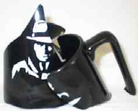

For those who thought the most ridiculous INeedCoffee story was how my kitten was tearing up my Kona plant, it gets worse. This is a story about finding the perfect coffee mug, owning that mug, and then watching it die. It is sort of like the timeless story of Romeo and Juliet, only this time Juliet is a coffee mug.

### Background

The year was 1998, and I was working in Clearwater, Florida, at Nielsen Media Research. NMR developed software applications for Nielsen TV ratings and other media. As a software development house, we were always courted by third-party vendors. These vendors were always trying to sell their databases, code libraries, or any other tool to improve our products.

Although vendors must get purchase approval from management, they must win over the developers. Developers need to be wooed with bagels, T-shirts, mousepads, and other gifts. When the final decision on which vendor to go with is too close to call, developers make a recommendation based on the company that gave them the best loot. It is a sad but true fact that a $200,000 contract could be lost simply because the sales representative forgot to pass out frisbees to the programmers.

### Forbidden Love

MicroStrategy was wooing one development group. At the time, I was building a collection of coffee mugs, and word got back to me that MicroStrategy was passing out mugs to that group. My collection was becoming cumbersome, and I was considering getting rid of a lot of my mugs, so I sort of brushed off the information. I didn’t need a 50th mug taking up space in my cabinet.

Then I saw a developer walking by with the mug, and it was love at first sight. This mug was a far cry from the traditionally bland pharmaceutical mugs. It was tall and black with a cool picture of an “agent” on the side. The product being promoted was something called DSS Agent, and the agent design had a 1940s retro look. What made it special was the handle. The handle was blocked and large enough to comfortably fit all four fingers. The first time I grabbed it, I knew it was my *Excalibur*. But it wasn’t my mug; it belonged to members of another group, and they knew this was too good of a bounty to trade for. Despite various attempts, I could not get a mug of my own.

A few days later, I was in the break room, and I spied one of the mugs by the sink caked with old coffee. Either someone had yet to clean their mug, or they sat it by the sink, hoping that someone would clean it for them. At that moment I decided I’d clean it for them, back at my house. When the break room was empty, I tossed the mug into a plastic bag and slipped out the back door. From there, I went to my car and buried it under the seat. Thankfully, no one saw me or came around asking for the mug.

The mug of my dreams and I were now united.

### Good Times

Although I never brought the mug to work, I drank my morning, evening, and weekend coffee almost exclusively from the mug. Coffee seemed to taste better. The larger size was perfect for a single French press. My other normal-size mugs no longer were of any value to me. But the handle was what made this mug perfect. My pinky wasn’t jammed into the handle like it was with smaller mugs. This chalice had no equal.

### The End

On January 26th, 2000, the fairy tale ended. Now living in the Washington, DC, metro area, my mug and I headed to work at 6 a.m. to avoid the traffic that normally occurs during snowstorms. The snowstorm was a dangerous semi-blizzard that blanketed the roads and sidewalks with about 12 inches of snow. While hiking from my car to the building in a blinding snowstorm, I dropped the bag holding my mug. When I got into the building, I saw the mug in pieces.

  
*My favorite mug was now broken.*

My favorite mug was dead. It was beyond repair. Goodbye, old buddy. You will be missed.