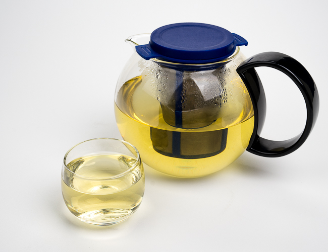
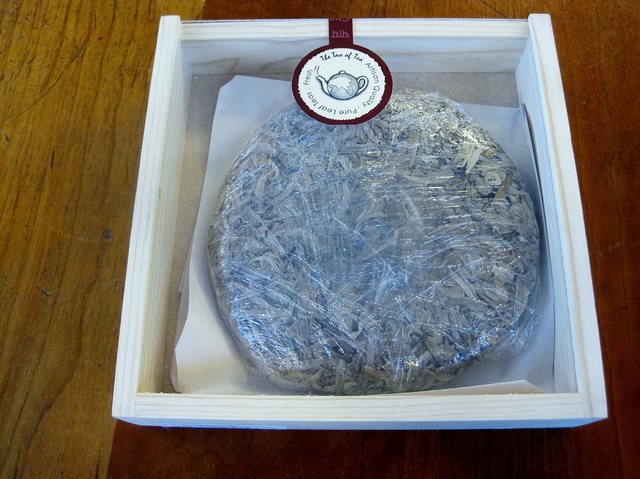
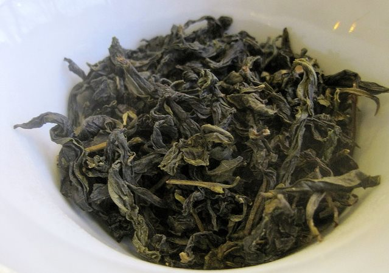
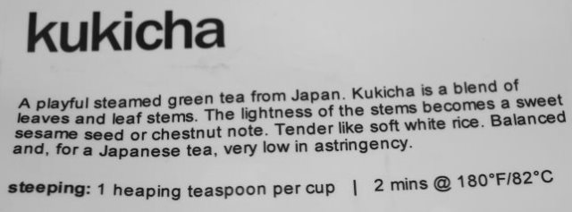
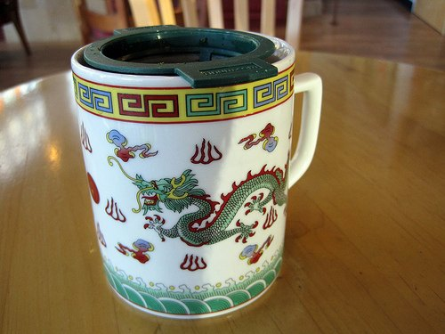

I never had much respect for tea. I enjoyed the beverage, but it didn’t interest me as much as coffee. That all changed in September 2007. I went to a tea shop in Seattle and tried several teas. Not the dull Earl Grey or the herbal crap, but high-quality loose leaf tea. I got to drink different types of tea brewed at the right temperature for the optimal brewing time. And in an hour, I gained a newfound respect for tea.

At that tea shop, I realized that the tea journey is very similar to the coffee journey. The majority of coffee consumed is either poor quality, made incorrectly, or both. The same is equally true for tea. Most of what passes for tea is bland. Just like with coffee, I decided right then and there that I would source high-quality teas and learn to brew them correctly. No more bagged tea, no more boiling water, no more over-steeping.

I went to tea tastings, took tea classes, went to tea festivals, and brewed a lot of different teas. Most of the teas I tried I had never known existed before. Coffee will always be my first love, but I decided that I wanted to take that journey with tea—the same journey I began with coffee many years before.

Within 6 months, I was a tea aficionado. Tea went from blah to ah!

If I haven’t convinced you to invest time and effort into quality tea, let me say that good tea always tastes better than OK coffee. Tea is far less perishable than coffee and, in most cases, less expensive. This article will be geared toward the coffee drinker who wishes to get up to speed quickly on tea.

### Types of Tea

All tea comes from the Camellia sinensis plant. What makes teas different is the level of oxidation and fermentation. Oxidation, in simple terms, is the browning of the tea leaves. Green teas are not oxidized, whereas black teas are fully oxidized. Oolong teas are partially oxidized and can vary from low oxidation to high oxidation. Pu-erh teas are fermented and aged. They can be a few years old or decades old.

When you read about tea, note that many books and websites use the term fermentation instead of oxidation. It can be confusing. For our sake, fermented applies only to Pu-erh teas.

Here is a list of the basic tea types. This is an overview. Entire books have been devoted to cataloging the different varietals of tea.

1.  **White Tea** – White tea is made from the first buds picked and has a light color.
2.  **Green Tea** – This tea is pan-fried or steamed to prevent oxidation.
3.  **Oolong Tea** – Oolong teas are partially oxidized teas. They could be lightly or darkly oxidized. They might even be [roasted](/home-roasting-oolong-tea/). Some are aged. This is where you’ll find many tea lovers. Some of the world’s finest and most expensive tea plants are used to make oolong tea.
4.  **Black Tea** – Black tea is fully oxidized tea.
5.  **Pu-erh Tea** – Another area of outstanding tea is the pu-erh (pu’er), which is divided into two groups: raw (green) and cooked (black). Raw pu-erh is fermented green tea. Cooked is fermented black tea. The tea might be one year old or decades old. I once had pu-erh tea that was 40 years old.
6.  **Herbal** – Herbal tea is not tea. You might like it, but it is not tea. However, Chai is a mixture of tea and herbs. See our [Traditional Chai Tea Recipe](/traditional-chai-tea-recipe/) for more information.

I’ve noticed that tea people think coffee drinkers will prefer black tea the most, but my observation is that coffee aficionados most like oolong and pu-erh. Black tea doesn’t hold our interest compared to black coffee. The unique flavors found in oolong and pu-erh are more enticing. My favorites are raw pu-erh, lighter oolongs, and a handful of green teas.

_Pu-erh tea from The Tao of Tea._

### Gear

Before we get into brewing tea, I want to cover the gear we will need. Coffee drinkers tend to view making their beverage in a scientific way. We measure and time everything. Some tea people do this, but not nearly as much. They like using fancy teapots and appreciate traditional tea ceremonies. None of which, in my opinion, makes the tea taste any better. It’s nice for special occasions, but not necessary for our purposes.

Tea is all about water temperature, steep time, and dose. We will ignore everything else.

To make excellent tea, you will need:

1.  A mug tea infuser or teapot with a filter.
2.  Temperature-controlled kettle.
3.  Timer
4.  Digital scale (optional)

We are brewing with a narrow range of temperatures just off a boil with coffee. Teas have a much wider range of brewing temperatures. The less oxidized a tea is, the more sensitive it is to water temperature. Black tea will be fine with water just off of boil, but a Japanese sencha wants water at 155° F. You could screw around with a thermometer in a regular kettle or pot, but we don’t need to do that anymore. Bonavita makes a kettle you can program to the exact degree you need. This is a godsend for making excellent tea, and the goose-neck makes it ideal for coffee pour-overs such as the [Kalita Wave](/kalita-wave-coffee-brewing-tutorial/) and the [AeroPress](/upside-aeropress-coffee-brewing-tutorial/).

That is all the gear you will need. You don’t need the drip tray or the special gong fu pots.

### How to Make Tea

With coffee, the brewing variations are determined more by the equipment than the bean. That is not true with tea. Each tea type has its own brewing recommendation, which varies by water temperature and steep time. If you do a search on times and temperatures for brewing tea, you will get wildly different recommendations. Most advise temperatures that are too high for green or lighter oolongs.

Many teas can be steeped multiple times. Oolong and pu-erh teas will usually taste better on subsequent steeps. Teas that may cost more are often the ones that can hold up to many steeps. Here are my general guidelines for tea temperatures and first steep times. Start here and adjust to your tastes. Good tea shops will include specific instructions for each tea on the bag.

| Tea        | Temperature | Steep Time      |
| ---------- | ----------- | --------------- |
| White Tea  | 170-185° F  | 2 minutes       |
| Green Tea  | 155-180° F  | 1.5 - 2 minutes |
| Oolong Tea | 170-195° F  | 2 - 3 minutes   |
| Black Tea  | 200-212° F  | 3 minutes       |
| Pu-erh Tea | 200-212° F  | 2 - 5 minutes   |

When you brew a second, third, or greater pot of tea with the same leaves, you may gradually extend the brew time or increase the temperature.

Coffee drinkers can be very specific about dosage. In several of the tutorials on this site, I advise using a gram scale to optimize the brewing ratio. Measuring by volume when making coffee can be a little inexact, and measuring by volume in tea is even more problematic.

Look at the two teas below. The Japanese kukicha is flat, whereas the Taiwanese oolong is airier. Other teas are rolled into balls and some are packed into cakes. A tablespoon of each will yield different amounts of tea. A digital scale solves the dosing problem.

Our go-to brewing ratio for coffee is 17 to 1. That means 17 parts water for every 1 part coffee. For tea, it is much higher. I’ve seen ranges from 50 to 1 up to 80 to 1. When dealing with ranges this wide, it speaks to the fact that tea doses are somewhat forgiving. If you are set on nailing down an optimal ratio, get a digital scale with 0.1 gram precision.

In my opinion, the dose is the least important variable when it comes to making great tea. Sourcing excellent tea, using filtered water, getting the temperature right, and not over-steeping are far more important. Ratios are more important for coffee. Even though I use my scale religiously for coffee, I usually follow the volume dosing instructions provided by the tea vendor.

_Kukicha brewing instructions from Adagio Tea._

### Sourcing Good Tea

I’ve been to many tea shops, and they seem to fall into two camps. The most common are the ones that specialize in black and herbal teas—think British. The other group is the Asian tea shops focusing on green, oolong, and Pu-erh teas. I strongly prefer Asian shops. They tend to have the teas I am more interested in trying.

Just like coffee drinkers seek out single-origin coffee from a region, tea shop owners should be cognizant of the labels they use. A generic label such as “Oolong tea” is suspicious, whereas “2014 Spring Alishan” is transparent and more informative.

Mail order is a great option. Those in the Seattle area can find high-quality tea from Floating Leaves, Miro Tea, and Phoenix Tea (Burien).

### Take the Journey!

My fellow coffee drinkers, I invite you to take the tea journey. I’m not saying it will be better than coffee—it probably won’t be—but it will be pretty awesome and very enjoyable. If you are going to have a backup beverage, tea is a great option. Just use the tips in this article, and you’ll be ahead of most tea drinkers.

_Don’t mess around with the alligator-style or caged tea filter. Oolong teas are often rolled into balls that can’t be unrolled unless there is room. The in-mug style of infuser lets the tea expand fully. Plus, it is easier to fill and clean._

### Resources

[Coffee and Tea Tasting Notes For Beginners](/coffee-and-tea-tasting-notes-for-beginners/) – A method for learning which teas you like the best.

