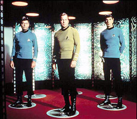

We’ve all heard about global warming and the problems it may create. We’re aware that it could cause severe weather, melting glaciers, and rising sea level. Most people live in the city though and when living in the city, it’s easy to ignore the weather.

I spent years working in a tall, climate-controlled building with windows that didn’t open. Even with a torrential downpour, I could go from my house to the garage to my car to work without ever getting wet. We didn’t live near sea level and we didn’t live on a glacier. Severe storms, heat waves, early frosts, droughts, and flooding were interesting news stories but not something that really affected my daily life.

Growing Kona coffee for a living is a whole different story. Farming requires me to watch the weather closely and it can have a big impact on my daily life as well as my annual income. This year’s rainy season started a bit late and I can definitely tell because the coffee trees haven’t bloomed correctly yet. Without a good bloom, there won’t be a good coffee harvest. Last year’s weather was slightly cloudier than usual, so we never had a good bloom. It was nothing severe, just slightly cloudier than usual, but it was enough to cut our production in half. The lasting effect will be felt this year, too. Unusual weather one year can have a dramatic effect even years later. It doesn’t take a huge heat wave, prolonged drought, or 100-year flood to get my attention now. I notice even the slightest drop of rain.

  
*Waiting for rain in Kona*

Some farm jobs, such as spreading fertilizer, are best done when it is going to rain soon. Spread the fertilizer in dry weather, and most of the nitrogen will disappear (volatilize) and fall straight into the atmosphere. On the other hand, too much rain will wash the fertilizer away. Light rain is ideal, maybe 1/4 inch immediately after fertilizing. Fertilizing in the rain is not fun, so I try to guess when the rain is going to arrive and start fertilizing a few hours ahead of time. Sometimes I guess right, sometimes I don’t.

Most farm work is easiest to do when it’s not raining. To plan my day I will often check the local weather forecast as well as look out my own window. I plan my schedule based on what I think the weather will do. Sometimes I guess right, sometimes I don’t.

I’m not a trained meteorologist, but I can often guess better than the local weatherman. Did you know that many TV weathermen don’t actually have a degree in meteorology? Apparently, good looks and a pleasant personality are more important than actual forecasting abilities. TV weathermen usually rely on the national weather service anyways because they’re the ones with the fancy radars and weather satellites.

I have a good friend who majored in meteorology. I remember him taking a class on forecasting. They had data for several different cities across the country and the students competed with each other to see who could make the most accurate weather forecasts. They also competed against a thing called persistence. Basically, persistence is nothing but forecasting the same weather as yesterday. If the weather stays the same, persistence is correct; if the weather changes, persistence is wrong. Forecasting more accurately than persistence is not as easy as it sounds.

  
*Weather Forecast*

I once needed a stretch of sunny weather so I could do some painting. Every morning, I’d wake up and look out my window to see bright sunshine. Then I checked the weather report, and it showed heavy rain for the next several days. Taking the weatherman’s word for it, I’d put off the job until the forecast looked better. Of course, it stayed bright and sunny all week until the forecast showed sunshine. As soon as they predicted the sun and I started painting, then it would rain.

A couple of months ago I was driving into town and the rain was coming down in torrents. It was so windy and rainy that I almost pulled over to wait it out. At that very instant, the weatherman came on the radio and said “Today will be sunny and warm with calm winds.” Obviously, the guy must have been standing in a studio with no windows because any idiot could see that it was neither sunny, warm nor calm.

I don’t put much trust in the daily weather forecast and I never trust the extended forecast because it is almost guaranteed to be wrong. The extended forecast is wrong more often than it is right. That seems extra amazing to me since the persistence model is almost guaranteed to be correct here in Hawaii.

With weather radar and satellites that can see the storms coming for miles across an empty ocean, it seems like predicting the weather in Hawaii wouldn’t be all that difficult. There are some very bright people at the national weather service but even with all their fancy technology, sophisticated modeling, and years of experience, they still can’t reliably predict today’s weather. Apparently, this weather forecasting stuff is much more complicated than it seems.

  
*Downpour in Kona*

And that is why I am unconvinced by weather predictions for 100 years from now. Reading news articles and watching the Discover channel, it seems that global warming is a foregone conclusion. I’ve seen Al Gore’s “An Inconvenient Truth” and he seems to present a lot of convincing evidence.

His conclusions certainly make good drama. But if you look at the actual data, what we know for certain rather than just what we think might happen, then the conclusions aren’t so straightforward. Even the IPCC (Intergovernmental Panel on Climate Change), the group that advises the UN on global warming, admits that “…long term prediction of future climate states is not possible”. ([Climate Change 2001, part 14.2.2.2, fifth paragraph](https://web.archive.org/web/20181123014117/http://www.ipcc.ch/ipccreports/tar/wg1/505.htm)) Too bad they keep giving predictions anyways.

In my lifetime, there have been many dire predictions about global weather. In the 70s it was a coming ice age. The predictions were based on a measurable drop in global temperatures but not much else.

In the 80s, Carl Sagan published a report titled “Nuclear Winter: Global Consequences of Multiple Nuclear Explosions” that had us worked up about nuclear winter, a scenario that is impossible to predict accurately.

In the early ’90s, Sagan used his nuclear winter theories to predict a “year without a summer” triggered by the burning oil wells in Kuwait during Desert Storm (ABC, Nightline, 1-22-1991). That never happened, despite Saddam Hussein igniting nearly 700 oil wells.

The late ’90s were filled with concerns about CFCs and the hole in the ozone layer, which turned out to be easily fixable. Now, there is global warming. At the risk of sounding overly skeptical, I think I see a pattern. I’ll need some solid evidence before I panic this time.

It’s been said that we have to act now before it’s too late. I agree that it’s important to look ahead and not be complacent, but I’m not convinced we really know what’s best for the planet’s future. Imagine someone from 1900 trying to decide what is best for us in 2000.

In New York in 1900 they had a big problem with horse manure because nobody drove cars, they certainly weren’t capable of legislating our gas prices. President Theodore Roosevelt established the national park system, establishing himself as a conservationist, yet he knew nothing of carbon emissions.

Here, from Michael Crichton is a short list of words that Teddy Roosevelt did not know the meaning of:

> *airport, antibiotic, antibody, antenna, computer, continental drift, tectonic plates, zipper, nylon, radio, television, robot, video, virus, gene, proton, neutron, atomic structure, quark, atomic bomb, nuclear energy, ecosystem, jumpsuits, fingerprints, step aerobics, 12-step, jet stream, shell shock, shock wave, radio wave, microwave, tidal wave, tsunami, IUD, DVD, MP3, MRI, HIV, SUV, VHS, VAT, whiplash, wind tunnel, carpal tunnel, fiber optics, direct dialing, dish antennas, gorilla, corneal transplant, liver transplant, heart transplant, liposuction, transduction, maser, taser, laser, acrylic, penicillin, Internet, interferon, nylon, rayon, leisure suit, leotard, lap dancing, laparoscopy, arthroscopy, gene therapy, bipolar, moonwalk, spot welding, heat-seeking, Prozac, sunscreen, urban legends, rollover minutes*

The list may be a bit specious but the point is to not assume that we know everything. I’m not willing to bet that citizens of 2100 will drill for oil or drive gasoline-powered cars, are you? Imagine if, during the 70s, we had decided to prevent the coming ice age by trying to warm the Earth.

It’s important to keep moving forward and there are some things we can do that are very likely to be a good thing, such as reducing carbon emissions. The danger is that we’ll inadvertently do something counterproductive, such as forcing everyone to use biofuels or banning nuclear power. We can’t predict the future so let’s keep our options open.

As a Kona coffee farmer, I am very dependent on stable weather patterns so global warming could have a big effect on me. As an outdoor enthusiast, I am a big fan of environmental responsibility. I’m not saying that global warming isn’t happening, all I’m saying is that let’s not make any rash political decisions.

The universe is a highly complex place. I can’t predict the future, and neither can anybody else. Making rash decisions usually backfires, and personally, I’m not yet convinced one way or the other what tomorrow’s weather will be.

  
*1900: Horses*

  
*2000: Astronaut*

  
*2100: ???*