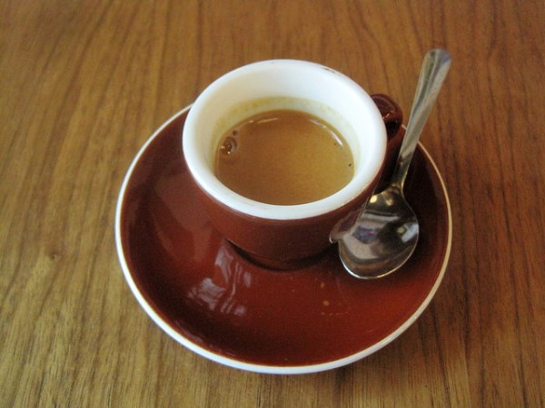

*This article was originally posted on November 15, 2012.*

I did it. I went an entire month without coffee. No coffee and no decaf either. I didn’t even consume coffee ice cream. And somehow I survived, although at times I didn’t think I would make it. You see I have had a very strong relationship with coffee.

Even before *INeedCoffee* was launched in 1999, I consumed a lot of coffee every single day. With the exception of four days in 1997, I have been consuming an average of 4-5 coffees a day for over twenty years. Whenever someone is shocked at how much coffee I consume, I can always point to others who drink way more than I do. Even my caffeine consumption today is half of what it was 10 years ago.

### Addiction and Motivation

But coffee addiction is still an addiction. I explained my concern on my blog in a post titled [Caffeinated Delusions](https://criticalmas.org/2012/09/caffeinated-delusions/).

> Is comparing current caffeine usage to past caffeine usage a useful metric? That question has been bothering me for a while. This week I conceded that it is wasn’t. **The fact remains that I am equally addicted to caffeine albeit at a lower level than before.** My addiction might even be greater, because today I am consuming espresso that is far better quality than just a few years ago. The strides I’ve made in my home roasting and shot pulling at home have improved a lot recently. By collecting more data and interviewing the best baristas in Seattle, my home espresso quality has improved more in the past 9 months than in the first 9 years I was making coffee. Every month or so my coffee tastes better than it did before. This is making my addiction stronger.

People ask me why I decided to take an entire month off coffee. That same post sums up my thoughts at that time.

> I need to know who I am without caffeine. This isn’t going to be easy. Tuesday morning I woke up after a perfect night of 8+ hours of deep sleep. I decided I would wait a while before making coffee. I should have been ready to take on the world without caffeine, but I couldn’t. My head wanted coffee. Even though I was fully rested, I was mentally paralyzed. That is when I knew I had to do a real detox, but this one will require more planning, because I need to break the addiction at every level.

I had done other health experiments in the last four years. I’ve tested how my body responds to eliminating and reintroducing dairy, gluten, fermented foods, chocolate, and sugar. Those experiments were highly beneficial. I learned I had a gluten intolerance. Removing it from my diet was highly beneficial, as I lost 25 pounds effortlessly, reduced my headaches, and cured a skin issue in the process. The one test I hadn’t done was caffeine and coffee.

### Coffee Taste Deconditioning

Countless articles on different strategies used to cut back or eliminate coffee. My favorite is another *INeedCoffee* article titled [Accelerated Caffeine Detox](/accelerated-caffeine-detox/), but I had more than caffeine addiction. Not only was I addicted to caffeine, but I was addicted to the taste of coffee – more specifically, I was addicted to the taste of espresso. Not just any espresso, but some of the best espresso in the world. In addition to my home-roasted espresso blends, by living in Seattle I had access to some of the best espresso in the world. To be successful on my quest to go a month without coffee, I’d have to not only address the caffeine addiction but the taste itself.

Enter Seth Roberts. In 2007, he wrote a book called The Shangri-La Diet. This book tackles fat loss by addressing how much reward we place on the flavors we are exposed to. Instead of counting calories or carbs, you consume certain food combinations with weak flavor profiles to *decondition* yourself from foods with a high food reward. Flavors that are stronger, more frequent, and more predictable end up increasing the body’s fat setpoint. Because espresso, when made properly, has a higher flavor signal than brewed coffee, I decided to create my coffee taste deconditioning plan.

For the 10 days leading up to my detox, I decreased my espresso intake and increased my brewed coffee intake. I was still getting caffeine and tasting coffee, but the flavor signal was weaker. Then I purposely started making defective espresso shots. I’d pull shots too fast, so they tasted thin. Or I’d slightly over-roast my coffee and brew it while it was too fresh. Another thing I did was pull the shot before the temperature of the machine had risen to where it was supposed to be. The result was that I was consuming espresso with a weakened flavor signal.

The coffee taste deconditioning strategy worked. It allowed me to gradually lower my caffeine levels while reducing the quality of the beverages. This made cutting back and eventually going the full month much easier.

### The 2 Goals

My goal was to go all of October 2012 without coffee or decaf; during that month, I would also go 15 days with zero caffeine. At the start and end of the month, I would allow myself some tea, mostly green tea. I exceeded my caffeine goal by going 21 days without caffeine, including chocolate.

Many websites say caffeine is out of the body in 3 days, so going longer provides no additional benefit. Although it may be factually true that caffeine has left your body, that doesn’t mean your addiction is cured. When I did my 100-hour caffeine-free experiment in 1997, I was back to drinking massive amounts of coffee within a week. The reason for the longer test is not just to address the physical symptoms, but the psychological ones as well. And I would learn that those were the toughest to deal with.

### One Depressing Month

Most people ask if I had headaches the first day. I didn’t, because I gradually lowered my caffeine intake over two weeks. Caffeine headaches are nothing compared to the complete collapse in my mood. For a good chunk of the month, I was extremely sad. It was like a death in the family. During the depths of this period, I realized that I had been using coffee to avoid feeling down. And I had been doing that multiple times a day for two decades.

From the post [Medicating Mood With Caffeine](https://criticalmas.org/2012/10/medicating-mood-with-caffeine/) on my blog:

> This month my mood has been terrible. Things are slowly getting better though. Prior to the experiment I was consuming 3 or 4 espressos a day plus a few mugs of tea. These beverages were all high quality and tasty. I would spread out my enjoyment of these drinks from morning to early afternoon. Last week a thought came to me that these experiences were little *pockets of joy*. No matter how I was feeling at the moment, I could always rely on caffeine improving my mood.
> 
> Going caffeine free has removed all these *pockets of joy*. Turns out I am not a happy camper. In addition to having great love for coffee and tea, I now can see that my habit was also my unconscious way of dealing with feeling down. The fact that coffee can improve mood is well known. My concern now is that my addiction to coffee has kept me from addressing the root causes of my low mood.

I had another odd side effect of going caffeine-free. Instead of getting better sleep, I started waking up in a near panic at 3 AM on a near-daily basis. I’d be dead tired and unable to fall back asleep. Only in the last week has this gotten better.

  
*Photo by Michael Allen Smith (free to use [CC 3.0](https://creativecommons.org/licenses/by/3.0/))*

### My Journey Is Not Yours

This month, I received a lot of negative feedback. Many people saw me as a traitor to the coffee cause. I was bombarded with links to health studies that glorify the use of coffee. Of course, I didn’t read them because I recognize that the response to caffeine is highly individual and changes over time. How a group of strangers responds to 5 cups a day holds no relevance to me. Plus, I drink coffee for the taste.

Thankfully, I did have a few supportive friends. Three talked me down from the ledge when I was ready to throw in the towel.

### Returning To Coffee

My first espresso was on November 1st at 6:30 AM. My heart raced for almost four hours. I thought I had broken my system, but over the next week, I was able to drink one coffee every other day. Now, I am restricting myself to a single coffee or espresso a day, with some days when I have no coffee.

  
*Returning to espresso.*

Although there isn’t a clear consensus on adrenal fatigue, I suspect I had some adrenal damage. About halfway through the experiment, I learned about the herbal adaptogens ashwagandha and rhodiola. Those herbs, in addition to vitamin B5 (pantothenic acid), have a long history of restoring and healing adrenals. Several days after I began taking those supplements, I began to feel better, and my sleep quality improved.

Going a month without coffee was extremely tough but a highly rewarding experience. I learned a lot about myself, and I’m now getting by with far less caffeine than I used to. For the first time in my coffee-drinking life, I no longer needed coffee. I plan to do a monthly detox once a year going forward. The next time, I’ll do it in the summer. Going without coffee in Seattle in October wasn’t the best timing.

### Resources

[Accelerated Caffeine Detox](/accelerated-caffeine-detox/) – An effective way to quickly lower caffeine levels without the pain of going cold turkey.

The Shangri-La Diet: The No Hunger Eat Anything Weight-Loss Plan, by Seth Roberts, inspired my coffee taste deconditioning strategy. My review of the book is [here](https://criticalmas.org/2011/08/flavor-signaling-and-the-shangri-la-diet/).

[RHR: Adrenal Fatigue, Glutathione Status, and Rheumatoid Arthritis](https://chriskresser.com/adrenal-fatigue-glutathione-status-and-rheumatoid-arthritis/) – Podcast by Chris Kresser. One of the topics is the use of herbal adaptogens that have been used successfully to treat adrenal fatigue.

[Caffeinated Delusions](https://criticalmas.org/2012/09/caffeinated-delusions/) – The blog post detailing my motivation for the month without coffee experiment.

[Medicating Mood With Caffeine](https://criticalmas.org/2012/10/medicating-mood-with-caffeine/) – Blog post about my concerns about using coffee to elevate my mood continually.
