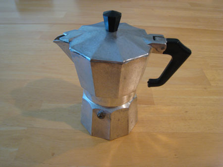

This all started with some coffee, some leftover ingredients, and sheer boredom. It culminated in a new tradition. One which I hope to pass on to guests, to friends, and of course, to family. Many of my compatriots already know both my passion for fine specialty coffees and my love of cuisine and the culinary arts. It is my desire that, through this piece, you the reader might also become acquainted with how I have melded the two together and ended up with a new tradition.

Alongside my love for cooking and coffee, I also indulge in, and perhaps to too great a degree, a love for chocolate. These three passions lead me to a new after-dinner treat; one that pleases the senses as well as sharpens the home chef’s culinary skills. And this is exactly what I look for in new foods: something simple and yet challenging; something that, when shared with others, makes for a wonderful experience for the chef as well as the guests.

Simply, it is a light chocolate and egg white cake dipped into espresso. The two tastes complement each other as they combine the simplicity of the two to make the simplicity of one. One act that can only be had from two distinctive parts. There is much joy found at the end of a wonderful meal, where an individual can sit and relax, and partake of two of the most common after-meal traditions: coffee and dessert.

### From My Family to Yours

And like all traditions, it has the leeway to evolve into more if you so desire. Traditions tend to have a greater significance when coupled with a particular event. For my household, this new tradition is perfect for those times when close, personal friends are over because they know how much I love coffee, and how I much I enjoy baking. They share in the taste and the significance to the host. It doesn’t need to stop there. As it is a very easy tradition to learn from, it becomes all that much easier to pass it along to the guest. Imparting them with the tradition, for them to take to their homes and for their own personal enjoyment. And, hopefully, they might pass their version along to others.

### The Coffee

To start, we need coffee. While I could wax poetically about the proper brew, grind, and tamp I need only reinforce that one can not truly live this experience without a good coffee. Does this mean that you must go out and buy a fancy new home espresso/cappuccino machine? No. Can you get by with a wonderfully strong pot of drip/pour-over coffee? I wouldn’t suggest it. Instead, I stress the importance of Italian espresso from a stovetop espresso machine.

### Stove Top Espresso

Found in the kitchens of Italians, adorning the stove top, is a coffee pot. This simple pot implores a bottom vessel for holding water, a fluted filter for holding coffee, and a top portion with a built-in screen that screws onto the bottom vessel. Add coffee, add water, apply heat, and in a few moments, you have made stovetop espresso. It works on the principle of energy expansion and mass transport. The water, as it is heated in the bottom vessel, expands into a gas. The gas pushes the heated water up the flute and into the bed of coffee. It, too, expands and brews as it is continually forced upward into the upper chamber.

  
*The Stovetop Espresso Maker*

And while it is not truly espresso, it is a great way to make a richly aromatic, and robust brew. Dark roasted coffees and blends for espresso lend themselves well to this device. They are readily had both at specialty retailers and on the Internet. Look for names such as Bialetti and Mr. Moka.

I particularly enjoy the coffee from a stovetop espresso machine because it seems to make many different blends of coffee always end up very rich and aromatic. And because it uses a larger volume of water for brewing, your demitasse is somewhat larger than a shot of true espresso from a pump-driven machine.

### The Cake

Once you have conquered the espresso, you can turn to the cake. This is a variation between a sponge cake, a torte’, and a brownie. I call it *Rotondo Luce Torta di Cioccolata*, in Italian, or, *Round, Light Cake of Chocolate* in English. Its simplicity is paralleled by the dessert itself.

### Ingredients

-   4 egg whites
-   2 tablespoons powdered sugar, sifted
-   4 tablespoons baking flour, sifted
-   2 tablespoons unsalted butter (do not use margarine)
-   2 ounces unsweetened dark baking chocolate, finely chopped
-   1/3 cup granulated white sugar

### Step-by-Step Directions

1.  In a glass or stainless steel mixing bowl, whisk or beat on high with a mixer the 4 egg whites until they stiffen. While continuing to beat, gently add the powdered sugar a little at a time until thoroughly incorporated and the whites form stiff peaks. This is the beginning of a simple meringue. Next, gently fold in the flour, one tablespoon at a time. Take care not to break down the whites. Set aside and chill for five minutes.
2.  While the meringue is cooling, prepare the chocolate sauce. In a heavy-bottomed saucepan, over a low flame, melt the butter, chocolate, and sugar together until thoroughly melted. Stir rapidly off of the heat to cool.
3.  Prepare a shallow cake pan. Lightly cover the bottom and sides with a non-stick cooking spray. Gently dust with flour or unsweetened baker’s cocoa.
4.  Remove the meringue and, while folding with even strokes, add the sauce quickly but gently. It incorporates fully but leaves small, lighter streaks within. Immediately fill the prepared pan.
5.  Cook in a pre-heated oven, at 325 degrees F, for 25 – 35 minutes. Test regularly for doneness with a toothpick or cake needle. The cake is finished when it begins to pull away from the sides of the pan or when the needle runs clean.

Times

-   Prep. Time = 10 minutes
-   Bake Time = 25-35 minutes
-   Total Time = 35-45 minutes

### The Presentation

The presentation is key to this newfound tradition. Each person is served a thin slice of the warm cake with his or her shot cup of coffee. They are then allowed to dunk the cake into the coffee. This is the final step to ensure proper exposure to the treat. Alone, the cake is dry and airy. The coffee was rich and strong. Together, they are sweet and moist yet bold and robust. Hence, a compliment and balance of tastes, textures, and flavors.

This tradition lends itself well to follow with a hearty meal, and on cooler days. However, I would argue, that it would be acceptable for any day. It might also be served as a stand-alone dessert with a sweet, heavy liquor.