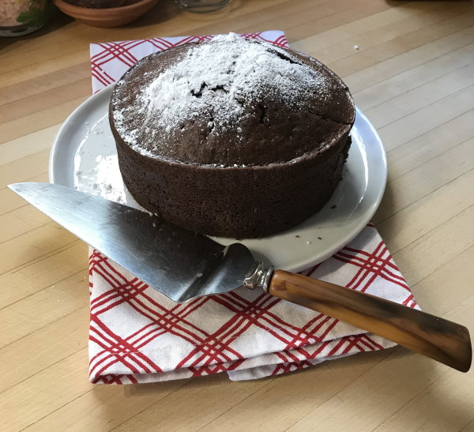

We are now a small family of two (2), my hubby and me. Not needing or wanting a large chocolate cake; this smaller cake was my adaptation/revision of mom’s WWII vintage recipe. A much larger recipe comes with an interesting World War II history. Prompted by the fact that there WAS rationing in the United States, much innovation in our kitchens was born out of need. Today’s young folks have no concept of the war; even if you didn’t fight, you were affected by it each day you lived.

Many staple grocery items were unavailable, or rationed, particularly eggs, butter, and meat. Most families received government-issued ration books which they filled with stamps, and the books were used to procure rationed items as available. My job as a kid was to paste our accrued stamps into the ration books.

Other rationed items were products like steel, and luxuries like silk. Silk was used to fabricate parachutes. Many women, I’m sure missed their sheer silk stockings, which were replaced by cotton ones. Families saved steel cans, crushed them to make stacks which we tied up in piles, then delivered them to be recycled and re-processed for war use. Planes and tanks were being built in our factories around the clock, 24/7. We all contributed in our own ways to the war effort.

Since butter was rationed, margarine came into being. Margarine was used for public consumption. I remember crushing and mixing a “flavor” pill into some saturated-fatty mix; Crisco, perhaps? Crushing and mixing in the colored flavored pill stained the fat mix an ugly, yellow-orange! Most staples were reserved for military purposes. Our troops got first claims on many foods and grocery items. Eggs, too, were at a premium, unless you were friends with a local farmer who had laying hens. Sometime during the war, dried eggs and powdered milk were introduced.

Since butter and eggs weren’t available for luxurious cakes, clever housewives used ingredients that were readily available during that time, and the Screwball/Wacky cake was born out of necessity! Cook’s Illustrated attributed the Wacky recipe to Mrs. Donald Adam of Detroit, MI., who submitted the recipe into a contest sponsored by Time Magazine in the 1940s.

Cooking oil was substituted for butter and eggs. Baking soda and vinegar were used as the leavening agent giving the cake a fleeting lift. My addition of coffee to this recipe was inspired by the fact that I despise dumping leftover coffee and I used it as a substitute for the cup of water used for the cake’s liquid ingredient.

Hopefully, you’ll enjoy a slightly different flavor the coffee adds to the Screwball treat. Here’s how!

### Ingredients

For a serving size of 6.

-   1½ cups all-purpose flour
-   3/4 scant cup sugar
-   1/4 cup natural cocoa powder, not Dutch-process
-   3/4 teaspoons baking soda
-   1/4 teaspoon table salt
-   5 tablespoons vegetable oil
-   1 tablespoon distilled white vinegar
-   2½ teaspoons vanilla extract
-   1 cup water OR 1 cup cold strong-brewed coffee
-   1/2 tablespoon Espresso Powder dissolved in coffee (Optional)
-   confectioners’ sugar, for dusting (Optional)
-   cooked milk frosting (see below)

### Directions

#### #1 Wacky/Screwball Cake

Heat oven to 350℉ Adjust oven rack to the middle position. Coat 8″ square baking pan with nonstick cooking spray. An 8” round baking pan may also be used. I seldom use spray anymore due to the residue left on pans, even after washing. I’ve adopted the use of LOL soft butter with canola oil. Works well and there’s no detectable background taste!

#### #2 Vitamix Revised/Adaptation

Place oil, coffee, vinegar, vanilla extract, and espresso powder into the Vitamix container and secure the lid. Select Variable 1 or the Purée program. Start the machine, slowly increase to its highest speed, and blend for 1 minute; or start the machine and allow the Purée program to complete. Now add the sugar and salt. Pulse till combined.

#### #3 For the Dry Ingredients

I prefer to mix the dry ingredients; flour, cocoa powder, salt, and baking soda in a small bowl. Whisk the mix, then add to the blender container securing the lid. Remove the lid plug and insert the tamper. Select Variable 6 and Pulse 10-12 times, using the tamper to press the ingredients toward the blades. Pour batter into the prepared pan. *(Optionally, you can sprinkle pecans or chocolate chips atop the batter).*

I prefer to stay with the basic batter. Bake for 25-30 minutes, or until a toothpick inserted in the center comes out clean. Cool in pan, then dust with confectioner’s sugar, if desired. *(Tightly wrapped, cake will keep for 3 days at room temperature.)*

A good frosting/topping similar to one from Martha Stewart can be used, see [Cooked Milk Frosting](https://www.marthastewart.com/1514932/cooked-milk-frosting).

Serve and enjoy!

### Resources

[Espresso Carrot Cake Recipe](http://ineedcoffee.com/espresso-carrot-cake-recipe/) – A coffee-based cake recipe.

[Cold Brew Coffee Cupcakes With Mocha Buttercream Frosting Recipe](http://ineedcoffee.com/cold-brew-coffee-cupcakes-with-mocha-buttercream-frosting-recipe/) – Use cold-brew coffee as an ingredient for making cupcakes.