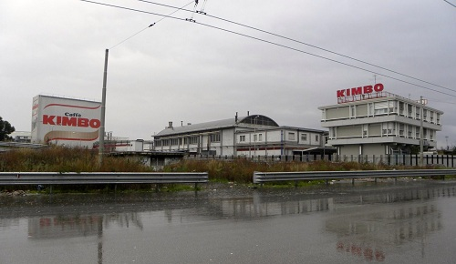
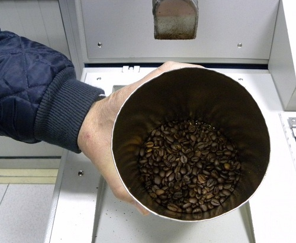
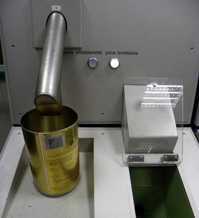
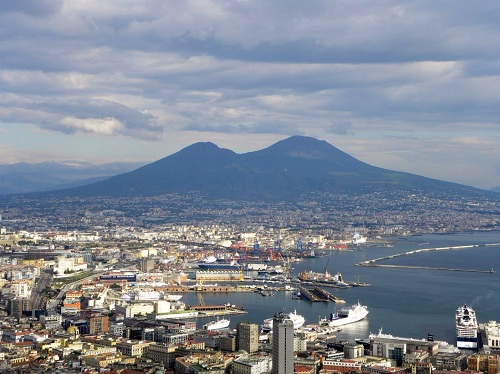

Coffee aromas saturate the air along the freeway next to Melito, a town ten miles outside of Naples. A little beyond the off-ramp, a security guard monitors the gate to **Cafe do Brasil*‘s* roasting factory (also known by one of its brands, Caffe Kimbo). Like most roasters, the factory is located in a suburb where transport vehicles can easily travel to their destination points. But with more than six hundred coffee roasters throughout Italy, blends are proprietary and fierce competition makes most companies shy about opening their doors.

*Cafe do Brasil*, however, is the second-largest retail seller of coffee in Italy and the number one international exporter in the south. The company has an external relations department headed by Dottoresssa Signora Marizia Rubino, the daughter of Francesco Rubino – one of the three brothers who established the roasting plant. She agreed to give me a tour of **Cafe do Brasil*‘s* factory, first welcoming me into the company’s slick administrative offices where pastries spread along a table and a hot demitasse of cafe was offered immediately.

*Cafe do Brasil* traces its roots back to the three Rubino brothers – Francesco, Gerardo, and Elio – who in the 1950s began to roast coffee beans in their father’s pastry shop and sold their blends in paper bags. Their successful roasting techniques contributed to the reputation of the south’s dark bittersweet blends. Soon, they created the company name, *Cafe do Brasil*, which gave an exotic aura to their roasts.

  
*The *Cafe do Brasil* Factory in Melito*

While coffee originated in the Middle East, coffee historians traditionally give the year 1615 as the date when Venetian merchants brought the beverage to Italy, thus introducing the dark brew to Europe. But the Campania region knew about coffee far before this date. Medieval physicians from the *Schola Medica Salernitana* between the tenth through thirteen centuries collected a compendium of dietary recommendations called *The Code of Health of the School of Salernum*, in which coffee was mentioned twice. One Latin hexameter says:

> “Coffee to some gives sleep, to some unrest; Headache relieves, and stomach when oppressed; Will monthly flow and urine too procure. Take it slow-roasted, each grain picked and pure.”

Written evidence of coffee use in Campania vanished for centuries thereafter. Only at the end of the eighteenth century did coffee re-emerge as an important cultural ritual in Naples when Vincenzo Corrado wrote a treatise specifically dedicated to the brew. A celebrated Neapolitan gastronome, Corrado published *Il credenziere di buon gusto* in 1773, which listed no less than eleven ways of making the beverage. At this time, caffettiere ambulante or wandering coffee peddlers also popularized coffee as a drink for everyone. Yelling *“Vui vulite o’ caffettiere!”* they set up tables along the street replete with small burners, cups, saucers, sugar, and a bottle of rum.

But coffee roasting, grinding, and boiling remained predominantly an art passed down by parents in the home. Only in the 1960s did a grand split occur with the invention of the tin can. Roasted coffee could now be preserved for longer periods and shipped over wider distances, so people began to buy already roasted beans from a store. *Cafe do Brasil* became one of the forerunners of this trend, establishing its Melito factory in 1963.

  
*Fresh Roasted Beans*

While the legacy of the *caffettiere ambulante* can be seen today, with cafe bars on every block offering a mere counter to sip-and-go, more than seventy percent of coffee drinking in Italy still takes place in the home. *Cafe do Brasil* specifically meets this market need, their brands are a near-ubiquitous sight at any grocery store.

Signora Rubino takes me from the administrative offices past massive trucks, many filled with sacks of raw beans. She explains that Interkom, a company located in downtown Naples, goes abroad to acquire the beans and then sells them to various roasters. *Cafe do Brasil* exclusively blends and roasts the coffee.

At the far end of the complex, we enter a warehouse rumbling with wall-to-ceiling machinery. Hidden from the naked eye, coffee beans whisk through long tubes into silos, scales, and roasting machines. In the middle stands the ‘brain’ of the warehouse – a trailer brimming with hi-tech computers. Here, several operators in white coats control the roasting process. They first remotely tell the machines to separate the raw beans into a number of different silos. Operators can distinguish between 101 and 117 different qualities of beans, and their skill lies in blending them together. Once they have a blend ready, they send the beans to a scale where they are weighed. Operators then wait for one of four roasters to open and tell the computers to drop the beans inside. *Cafe do Brasil roasts approximately 400 kilograms of beans every eight minutes at temperatures ranging from 200-220 degrees Celsius.*

Inside the computer trailer, raw beans chink through a metal tube where operators can physically see and touch a sample of raw beans they plan to roast. A few minutes later, the same beans clank in an adjacent tube, giving operators the chance to evaluate the quality of the final product. The roasted beans are then transferred through tubes into other silos for maturing, a process that takes anywhere from a few days to a maximum of seven days.

Once mature, the beans move on to the packaging side of the warehouse, where assembly-line equipment automatically pulls and folds large Kimbo labels on a turnstile to create coffee bags. A machine drops coffee grinds inside the packages and then clamps down to vacuum-seal them. Next, a conveyor belt sends the packages to a monster mechanical arm that lifts them onto a palette. From there, a bright yellow robot drives up, digs a fork into several palettes, and transports the coffee to trucks waiting outside.

  
*Quality Control Machine Inside Computer Trailer*

When we return to the administrative offices to talk about coffee quality and taste, Signora Rubino explains that *Cafe do Brasil* supports two different brands – Caffe Kimbo and Caffe Kose. Each brand has its own blends that range from the fragrant taste qualities of *Aroma Espresso* to the milder acidic tones of *Caffea Arabica*. Their best-selling *Macinato Fresco* has a nutty aroma with a bittersweet taste.

According to the company website, the Macinato Fresco is made up of beans from Brazil. But when I ask what kind of beans *Cafe do Brasil* specifically uses, Signora Rubino explains that the company buys beans that come from many different parts of the world. What’s more, when beans are roasted they give off more than eight hundred flavors and aromas. The roasting process, therefore, is complex.

  
*Naples and Mount Vesuvius*

But *Cafe do Brasil* surely wants to maintain the reputation given to southern Italy of making dark semi-sweet coffee? Signora Rubino answers no. Their company doesn’t want to be known for creating one strong flavor, but rather they strive for an equalization of many flavors and aromas, balancing astringency, acidity, and sweetness together.

So what is the roast recipe for any one of their blends? Aaah. Now that’s proprietary. Only the nose and palette can truly ascertain. But the delight, for a coffee lover, lies in the guessing.