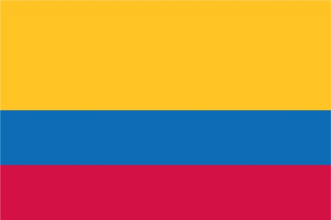
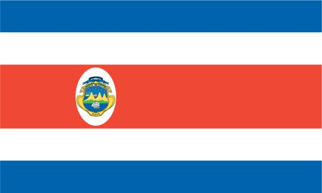
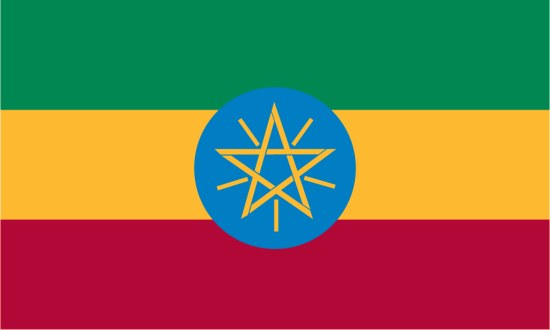
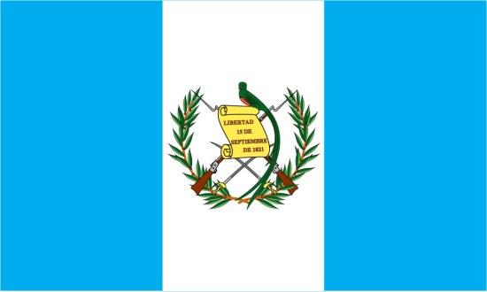
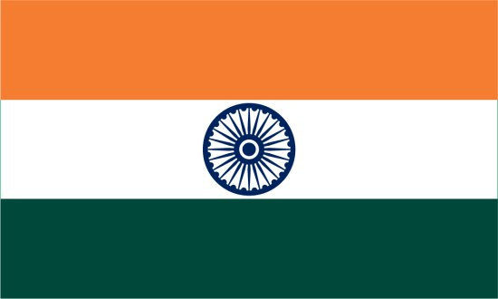
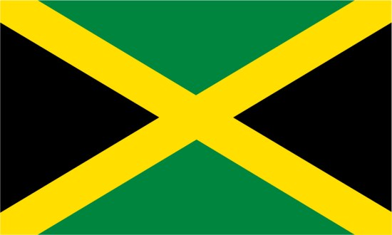
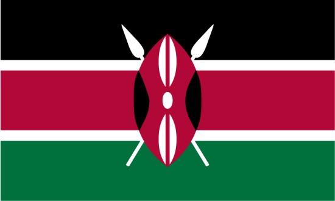

You’ve heard the routine before, whether it’s from a stand-up comedian or just a friend who remains entrenched in the pre-Starbucks coffee world. Their mantra is a yearning for the old days when options were fewer and a coffee drinker’s choice was between regular or decaf. They cry out, “I just want a large coffee!”

The option is still there, folks. Even at Starbucks, the torchbearer of coffee’s New School, you can still get a large, unadorned cup of coffee for less than two bucks. Mr. Angry 21st Century Coffee Drinker will have only one problem here: At many coffee houses, plain ol’ coffee is offered in the form of a Coffee of the Day/Week. Perhaps you’re like me and just accept the daily offering. After all, there’s usually a manageable number of coffees to choose from.

*Front Porch Cafe* in Kill Devil Hills, N.C. is typical of many coffeehouses, offering a choice of four coffees each day – a house blend, a single-source coffee, a light roast, and a decaf. For those who consider decaf out of the question, it is tempting to take the path of least resistance and buy what is available.

However, when I began buying coffee by the pound and brewing most of my morning cups at home, I knew the time had come to learn about the characteristics of coffee beans throughout the world. Commitment to a pound of beans sustaining me for the next two weeks required some informed decision-making. Learning a bit about major world coffee beans doesn’t hurt for the regular Coffee of the Day customer either – we might as well know what we’re about to sip, right?

In the name of informed coffee consumption, it’s time to explore the differences between the taste of beans from major coffee-producing regions.

### Location, Location, Location… and Other Factors

First of all, any consumer of global coffee varieties should be aware that the origin of the beans is not the only factor in the coffee’s taste. In some situations, it will not even be the most noticeable factor.

The roast of the beans will be a major factor in the taste of your coffee. French Roast and many Starbucks coffees are made of beans that have been roasted to a dark color, giving the coffee an intense taste. It is a roaster’s task to bring out a bean’s characteristics through an appropriate roast level.

The brewing method is another major determinant of how a coffee will taste. Several of us at INeedCoffee prefer the [French Press](/press-pot-tutorial/) method of coffee-making. This holds especially when the aim is to distinguish between the nuances of taste in different coffee beans. Other methods may produce a “cleaner” coffee with less sediment, but no other method will convey the unfiltered impact of a coffee bean’s flavor than a French Press.

Furthermore, differences in bean taste will usually be more evident in the absence of any creamer or sweetener. While I often enjoy sugar in my coffee, I find a pressed, unenhanced cup is the best way to experience a bean’s truest nature.

“Every stop on the way from the coffee plantation, how the coffee is harvested, processed, and stored will affect the end result,” said Paul Manning, the owner of *Kill Devil Coffee Roasters*, housed at Front Porch. “Of course, the roasting process ultimately determines many of the final characteristics, but you will never get good results if the raw materials (unroasted beans) are not up to the task”

Sure enough, the region still matters. Different countries – and sometimes different regions in the same country – can produce coffee beans whose flavor cannot be imitated anywhere else. Below are some of the most popular types of coffee beans, and some general characteristics of the beans from these regions.

### Colombian Supremo

Perhaps the first nation that jumps to a coffee lover’s mind, Colombia remains a coffee-producing giant in both quantity and quality. Colombian Supremo takes moderation to excellence. Colombia’s best beans are moderate in acidity and sweetness and moderate to full in body. “No quality is extreme,” says coffee author Kenneth Davids

  
*Colombia*

### Costa Rican

Rich and full-bodied, Costa Rican coffee has a smoky trace evident to many of its drinkers. “Guatemalan and Costa Rican coffees… have wonderful distinctive acidity,” said Manning of two of Central America’s best coffee countries.

  
*Costa Rica Flag*

### Ethiopian

For Americans who came of age during the USA For Africa era, there is a pop understanding of Ethiopia as a barren desert with no agricultural capacity. Premium coffee drinkers know better. Ethiopian coffee is my personal favorite, with a rich and sometimes spicy taste that is perfect for a French Press. Ethiopian coffees run the gamut of tastes, and Davids says they are now among the world’s most varied and distinctive beans.”

  
*Ethiopia Flag*

### Guatemalan

Guatemala’s coffees tend to be rich and flavorful, in part from the volcanic soil that nourishes much of the country’s crops. “Guatemalan coffees generally have a relatively high degree of acidity and often taste of chocolate,” says *SmelltheCoffee*. Many coffee aficionados also note a smoky taste to the Guatemalan bean.

  
*Guatemala*

### India

Indian coffee is not a common find with roasters or at coffeehouses, but some aficionados hope that will change. “Indian coffees are under-represented in the coffee market: they are good balanced, mild coffees,” says *Sweet Maria’s*, praising the coffee for its “pronounced body, low acidity and subtle spicy notes.”

  
*India*

### Jamaican Blue Mountain

Jamaica’s finest coffee tends to be expensive, but if your favorite coffeehouse offers it by the cup, be certain to try it. “It has almost perfectly balanced aroma, body, acidity, and flavor,” says *Green Mountain Coffee*. Like Kona (see below), Blue Mountain has some inferior imitators piggybacking off its good name.

  
*Jamaica*

### Kenya AA

The ‘AA’ so often associated with Kenyan coffee refers to the bean’s size, the largest on a scale that also includes ‘A’ and ‘B.’ As for the taste? “Kenyan coffees are generally very mellow and often have a citrus taste. …A top quality medium-bodied coffee that is very popular in Europe,” says *SmellTheCoffee.*

  
*Kenya Flag*

### Kona

You are unlikely to find Kona as a *Coffee of the Week* offering but can instead find it at gourmet shops or from specialty roasters. True Kona is “medium-bodied, fairly acidy, with some subtle winey tones, very richly flavored and overwhelmingly aromatic when fresh,” says Davids. Like Jamaican Blue Mountain (see above), some inferior coffees sometimes purport to be Kona, and it is worthwhile to find out whether you are drinking the real product. Be especially wary of coffees that are “Kona blends” or “Kona-style,” both allowing for the possibility that little or none of the coffee is true Kona.

### Mocha Java

Often an all-purpose synonym for coffee, Java is an area of Indonesia producing a light-bodied coffee bean. Davids notes a “low-toned richness” in Java coffee, high in acidity, and “quicker to finish” than other Indonesian coffees.

### Sumatra

Sumatra is the way to go for those who prefer dark and full-bodied coffees, says Manning. There is a wide variety in tastes of Sumatran coffee, often depending on its “wash,” but *Sweet Maria’s* describes a typical Sumatra as earthy, musty, and natural.

### Conclusion

Elvis Costello once said, “Writing about music is like dancing about architecture.” Anybody who writes about the taste of coffee runs up against the same limits – reading some fundamentals never hurts, and it’s good to have some basic knowledge when buying whole beans. But there are limits to how far the written word can convey the differences that exist between the coffees of the world.

In the end, it’s best to get away from your computer and begin tasting these coffees yourself. Better still, try two or more coffees back-to-back, to gain a true appreciation for the differences in taste. Coffee Cupping is a method designed specifically for this purpose. Perhaps your favorite coffeehouse will let you try small samples if it serves multiple coffees of the day – it can’t hurt to ask. The global economy has been good for coffee gourmets, who have many more choices than they did two decades ago. The number of options can be intimidating, but some knowledge combined with tasting experience will make it easier for anybody to navigate the world of coffee flavors now available.

### Resources

[Coffee Cupping: A Basic Introduction](/coffee-cupping-a-basic-introduction/) – INeedCoffee article

Front Porch Cafe/Kill Devil Roasters (NOVEMBER 2019: site down)

Smell the Coffee (JUNE 2011: site down)

Lucid Cafe (JULY 2018: site down)
