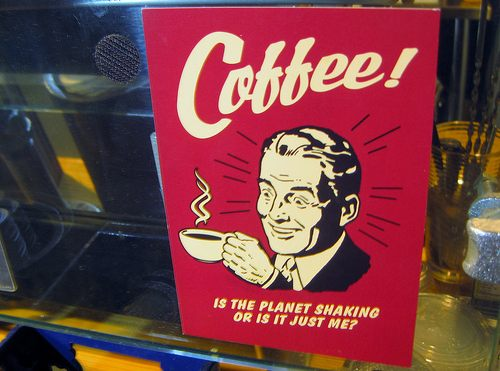

How much coffee is too much? 5 cups a day? 10 cups a day? Perhaps there is no limit? We are all different. Some of us can handle more, some less. As a proponent of quality coffee, I believe that flavor must always come first and caffeine second. When our love for caffeine exceeds taste, we may yield to the dark side of cheap, gut-wrenching coffee to get our fix. Do you want to give up a good Kenyan or Puerto Rican coffee and end up on the street drinking 3-hour-old coffee from the lobby of a tire store? Of course not. How can you tell if you are at risk?

Although I’m not a scientist, I do believe I can detect if you are consuming too much with a single question:

> *When you are drinking a mug of coffee, do you ever start to think about that NEXT cup you are planning to have?*

If the answer is YES, then this should set off a warning that maybe you are consuming too much. If the great coffee in your mug doesn’t have your undivided attention and instead, you’re off dreaming of the next mug, then, in my opinion, the quest for caffeine has exceeded the quest for quality coffee. An alcoholic doesn’t savor the taste of that first 40oz malt liquor. It is merely a pit stop on the path to drunkenness. Good coffee should never be the pit stop.

  
*If this describes you, it may be time to cut back on the coffee.*

If you just realized that you have been cheating on your beans with a caffeine fling, have no fear. It happens to us all from time to time. There is a way to restore peace to your coffee relationship: DETOX. Short for detoxification, it simply means you will bring back the focus on why you drink good coffee in the first place. Cutting back on the quantity of coffee you drink will shift the balance back to the bean and will upset the caffeine monkey on your back.

Detox is rarely easy and will likely be uncomfortable. Ending a caffeine addiction can bring headaches and constipation. There are also health reasons to detox having to do with adrenal support, but that isn’t the focus of this article.

### Different Techniques

There are two major schools of thought on how to best detox, as well as a third customized method I’ve developed. One is cold turkey, and the other is called fading. I’ve done both many times and found problems with both. Along the way, I developed my own method, which I’ll explain last. Let’s examine the three methods.

#### 1- Cold Turkey

If anyone had seen the Frank Sinatra movie The Man with the Gunden Arm, they would have understood what it means to go cold turkey. Sinatra’s character was kicking heroin, not caffeine, so there probably won’t be a need to have a loved one lock you in a closet for the weekend, although some of you may want to retain the services of that loved one just in case. Cold turkey programs work best if there is a start date, end date, and exit strategy.

This is the quickest and most painful method of detox and, in my opinion, the least effective. The problem is that although you kicked it for 3 days or so, your body needs a longer period to adjust. I’ve had cold turkeys where I return to pre-detox quantities in less than a week. In other words, it takes a lot of effort and doesn’t stick very long. In conclusion, do not plan on being productive during a detox. You will spend every waking moment wishing you had some caffeine to lift the dark cloud in your head.

#### 2- Coffee Fading

Coffee fading is cutting daily coffee consumption by 1/2 a cup. Gradually, you can work down to zero or a tolerable level. This method is pain-free but does require planning. You need to measure current consumption and then keep track of every beverage throughout the day. If you drink 10 cups daily and the goal is to get down to zero for 3 days, then this can take 22 days to complete. Do you want to plan every beverage for 22 days? It’s pain-free, requires extensive planning, and requires a longer time.

I like coffee fading better than cold turkey, but not by much. It just takes too long to go through the entire process. To resolve the differences and develop a better way, I came up with our third technique, which I called Accelerated Coffee Fading.

#### 3- Accelerated Coffee Fading (ACCELERATED DETOX)

Instead of decreasing by a measly 1/2 cup a day, you reduce your consumption by 50% daily. Once you go below 1 cup of coffee, drop to zero the following day. Accelerated Coffee Fading is less painful than cold turkey or as long and tedious as traditional coffee fading. The body also has a longer period to adjust to lower caffeine levels than cold turkey. I’ve also included a “pull-out” strategy. Resume your target level by incrementing at no more than a 50% increase daily.

### Summary

Using the ACCELERATED DETOX, one can bring coffee consumption back to a level where the beans are the primary love in half the time as traditional coffee fading without the pain and misery of going cold turkey. Although this article deals with quality coffee, you could use it for any addiction you wish to tackle, be it sugar or soap operas.

### Resources

[Pre-Surgery Caffeine Detox](/pre-surgery-caffeine-detox/) – INeedCoffee article.

[The Decaf Diaries](/the-decaf-diaries/) – An essay on moving to decaf coffee.
