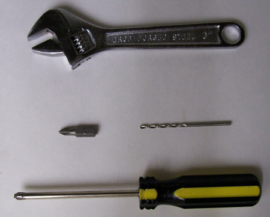
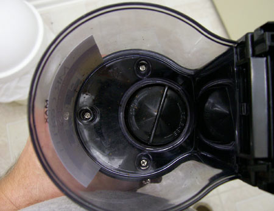
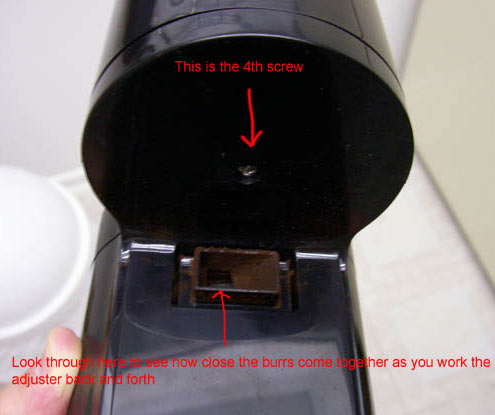
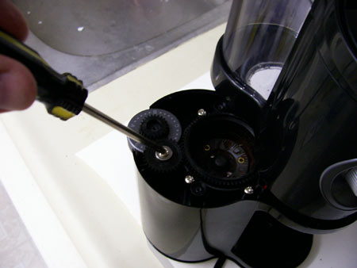
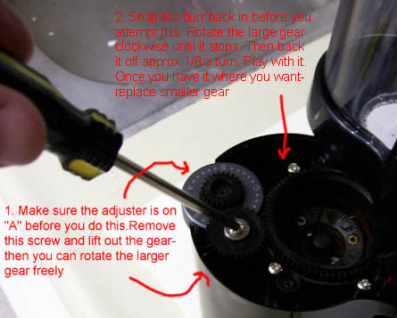
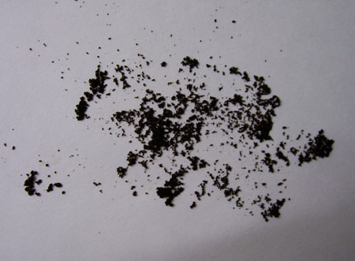

I’ve been a whole-bean coffee drinker for many years and I am also very picky when it comes to coffee. No swill for me! I am also mechanically inclined and love to take things apart.

After reading reviews of burr grinders and agonizing over the prices (did I also mention that I prefer to spend more on coffee than equipment?) I decided on a cheaper model- the Mr. Coffee Burr Mill Coffee Grinder – BMX3. The price was right and despite the wildly fluctuating reviews, I knew I could make this thing work right or have my money back from Target.

When I got it home and got it out of the box I pulled the coffee catcher out and looked at the burrs. By dialing the coarseness wheel back and forth I could immediately recognize that the space between the two wheels would produce either a ridiculously chunky coarse grind at “E” or an acceptable drip grind at “A”. I wanted a better range to get an “espresso” grind.

If you possess the minimum ability to use a Phillips head screwdriver, small adjustable wrench, and maybe a cordless drill you can adjust this grinder and have the fine grind you want.

  
*A 3/32 drill bit worked well*

### Step By Step Overview

Inside the hopper, there are three small rubber grommets/plugs covering three screws. I was able to easily pop one of them off but had to bust out the cordless drill and extract the other two. I lightly pressed the small drill bit and slowly drilled as the grommets extracted on the drill bit.

  
*These 3 screws must be removed – this is after the little rubber plugs were extracted.*

Next, I removed the top 3 screws as well as the single screw on the underside where the top of the catcher goes. It was tricky since I had to get a Phillips hex bit for the cordless and back the screw out with a small adjustable wrench to grip it. I had to do it this way since only a very short screwdriver will fit and alas, I didn’t have one that size.

I lifted the whole top part and placed it slightly to the side, as much as the wiring would allow. This exposes a large gear and a small gear. I turned the selector all the way to “A” and then removed the small screw holding the small gear. I did scratch a mark on the large gear and small gear so I could return it to the original alignment if necessary. I then lifted off the small gear.

  
*Once you have the top lifted away, this is what you’ll see.*

Then I turned the large gear to the right until it stopped. I worked it back and forth peering up through the opening on the underside to see how close the two burrs (wheels) came. I believe about one 1/8th of a turn back to the left by the large gear is about right though closer is certainly possible. I may fine-tune it but this produces a pretty fine grind.

I then replaced the small gear being careful not to displace the positioning of the big gear. Then I put it back together in the order I took it apart.

Bean test. I ground a couple of tablespoons each at “A” through “E” and was quite satisfied with the results throughout the range. “A” was quite fine and all of the grinds were consistent.

  
*These grounds were at an “A” setting and they are as fine as any espresso grind.*

I must stress that this was a snap to do. Don’t let yourself be intimidated.

As for the pros and cons, the machine is space-efficient; tidy, it doesn’t spray coffee grounds everywhere since the collector fits real snug; it’s quick and relatively quiet. It does tend to kick grounds up into the hopper when it has emptied itself of beans. I suspect it will need frequent cleanings, but the top burr twists out quite easily so this is not a problem.

There is some static but that is unavoidable due to the laws of physics and will occur to some degree in any electric coffee grinder. If the motor craps out it will be returned to Tar-zhay’ at once. However, I suspect this is a cleaning issue. I also suspect that if you try to grind a whole pound of beans without letting it rest between hopper fills there will be a problem with the motor.

Remember, it’s not an industrial or commercial-type device! For the price and the ease of adjustment, I think it’s a hell of a deal.

**UPDATE January 2012:** An INeedCoffee reader has informed us that the Mr. Coffee Burr Mill, model BVMC-BHM23, is significantly different than model BMX3 and this tutorial will not apply.