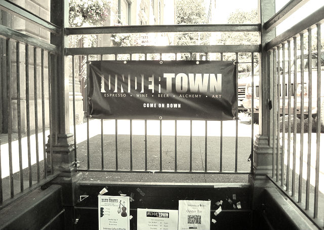

One of the main reasons for starting a business is to make money. If you want to make some real money with the coffee retail business, you must follow the steps that will lead to that goal.

### Location

This will be the most important factor in your success or lack of it. You may have the best coffee in the world, but if the prospective customers can’t see you, or your access is not convenient, your chances of success will be greatly reduced. Some espresso bars gross $2000-$3000 a day, 70% of this revenue coming from espresso-based drinks, and the owners of these establishments put in their pocket (or purse) about $25,000 a month in profits!

If you have an excellent location, and assuming that you do everything right, you can expect to gross anywhere from $20,000-$30,000 in your second month of operation and end up the first full year with over $500,000 and reach over one million on your third year. Assuming that your rent is $3000-$8000 per month, this should leave you with 30%-40% of your sales after the break-even point. Therefore, if your rent is $3000 and you gross $20,000 your break-even point will be approximately $12,000 and your earnings about $3000-4000 from the $20,000. You can figure how much you will make from $500,000 a year or more.

*Undertown Coffee – Port Townsend, WA*

The locations with the best probability of success are, in order:

1.  Next to colleges and universities, on a commercial *walking* street
2.  Downtown business district, in a large office building
3.  Neighborhood commercial *walking* streets
4.  Heavy foot traffic tourist areas with great visibility
5.  Airports and large medical facilities (for carts and kiosks)
6.  Strip Malls
7.  Inside shopping malls

Don’t forget to check with zoning and Restaurant Health Inspection Departments and make sure that they will allow you to open and operate such a concept on that location. This is especially important for the drive-thru locations.

### The Design

Besides an attractive visual design, your espresso station must also be designed for speed and efficiency of service so your customers don’t have a long wait. There have been times when I had to wait ten minutes to get served my latte, with only a few people ahead of me. Slow, sloppy service like that may reduce the number of drinks that you sell in a given time period, reflecting directly on your revenues. It will also upset your customers, which will also affect your revenues.

### Marketing

If your menu is meaningless and confusing to a new customer, the customer will end up asking for the most familiar item, “house coffee”, and you won’t be able to develop an espresso drink customer base. Think about the price difference between a cup of house coffee and a latte! That difference is almost pure profit. I believe that one of the best ways to build your coffee business is by developing an effective, customer-friendly espresso drink-based marketing program. By achieving that you will make more money for yourself and be in a stronger position against your competition.

After twenty-seven years in this business, I have come to the conclusion that the single most important factor besides the location- for the success of an espresso operation is whether the owner, the CEO, or the person responsible for the overall project is an espresso-based drink consumer himself or herself, and understands what a properly prepared drink should taste like.

Unfortunately, properly prepared espresso drinks are hard to find in most parts of this country. So when a prospective CEO or a future franchise owner of a bagel shop, for instance, has his or her first “espresso experience” at a place that has no clue, and that first sip proves to be unpleasant or indifferent, these CEOs never develop a taste for espresso and are probably wondering what all that excitement is all about.

With such a mindset, espresso-based drinks won’t be on the priority list of many owners and espresso drinks will represent only a minor part of their revenues. Most of the coffee sold will be of the “regular” type. This will result in lower revenues, lower customer satisfaction, and the failure of providing the customer with a compelling reason to return on a daily basis.

### Taste

If your customers do not like the taste of your espresso-based drinks because of faulty preparation techniques, they either won’t order it again or won’t come back. Unfortunately, most of the espresso served in this country has no relation to the real thing, and the only way it can be consumed is by drowning its thin, overheated, bitter, flavorless, overpriced taste in some fancy flavored syrup. By the way, the taste of an espresso-based drink has more to do with the way it is prepared than with the coffee or equipment being used. I had some tasteless cappuccinos prepared with $11.00 a pound coffee with a $10,000 machine, and some excellent ones made from $5.00 a pound and a $3000 machine.

You may be surprised to know that most of the espresso operations in this country do not understand how to properly prepare espresso-based drinks. By “properly”, I mean good-tasting drinks made fast. Though taste is subjective, most of the customers, when tasting the same coffee, prepared with the same machine, but one cup made “right”, and the other made following the training guidelines of the operation, will taste the difference and prefer the “right” cup 95% of the time.

What is the use of blending and roasting the best coffee in the world if it becomes unpalatable during the preparation stage at the retail level, and the only way it can be consumed is by drowning its bad taste with flowered syrups?

### What it takes to be successful

To succeed in the coffee bar business, you must make coffee drinks your main product; from these, espresso-based drinks should account for at least 50% of your total sales. Espresso-based drinks account for over 65% of their total gross sales in many of the most profitable and successful coffee bars.

You can brew around 50 cups of regular coffee from the same pound, and sell it at $1.00 a cup. That is around $45.00 gross profit! Add the cost of a paper cup, lid, sugar, cream, and that brings the cost to around 25 cents per cup. You make 75 cents a cup.

Now, let’s go a step further: suppose that most of the coffees sold are espresso-based drinks, you would still pay from $5.50-$7.00 a pound for the beans and produce, on the average, around 60 shots from a pound at a cost of around 12 cents for a single shot. Add for the cup, milk, etc., and that would bring the cost of a cappuccino or latte to around 35 cents. But your sale price per cup, on the average, would be around $2.00. You make $1.65 a cup! That would make an enormous positive impact on your bottom line!

### Sample Statements

Here are actual statements (rounded) from two of my past stores:

Example 1:

Opening cost (1981):

Large office & retail complex in a business district (San Francisco)

Operating Cost:

$42,000 total build out from shell

Size:

630 square feet

Opening Cost:

$42,000 total build out from shell

Hours of operation:

7 AM – 5 PM, Mon-Fri.  
Sat & Sun doing one-third of normal sales

Bean usage:

120-150 pounds a week

Cost of cappuccino/latte:

$1.10 (1986)

Sell Price: (1986)

$150,000

Food cost

$6600 22.1%

Labor

$6860 22.8% (2 FT, 1 PT)

Rent

$3000

Paper, Supplies

$1800

Phone

$100

Insurance

$350

Maint & Repairs

$200

Utilities

$500

Refuse

$150

Misc.

$200

Total operating Expenses

$19,760

Profit before depreciation, taxes, repayment on loans, etc.

$ 10,240. (month)

As you can see, 85% of my gross sales was from espresso-based drinks.

Example 2:

Location:

Next to a University in OR

Rent:

$3,000 (month)

Size:

1800 square feet

Build Out Cost:

$95,000 (1994)

Rent:

$2500 in 1986, ($4100 when sold)

Bean usage:

130-250 pounds a week

Hours of Operation:

M-F 6:30 AM – 6:30 PM  
Summer business is one-third to half of normal

Sales when sold:

$290,000 yr.

Net Income: (to owner)

$55,000 yr.

### How Much Investment?

Here are rough estimates of how much capital you will need to open your business.

-   Fully Equipped Cart or Inside Kiosk: $10,000-$30,000
-   Fully Equipped Drive-Thru: $25,000-$120,000
-   Coffee House/ Bar: $50,000 and up

Let me be more specific about coffee houses: all the equipment (espresso machine, grinders, refrigerators, ice machine, sinks, etc.) that you will need to operate a coffee/bar house will be approximately $18,000, the rest will be used for remodeling costs, furnishings, signs etc. I opened stores from $17,000 to $120,000 for myself and from $63,000 to $187,000 for my clients. I served as a consultant to clients that opened coffee bars/houses ranging in total initial investment from $50,000 – 187,000. Considering that Starbucks invests around $325,000 to open a store, my clients did OK!

Your start-up investment to open a coffee bar may vary greatly with the chosen location. Though the cost of the equipment will remain the same, around $18,000, the remodeling costs may go from $30,000 to $250,000 or more, depending on the quality of the location and the surrounding stores. Obviously, if you are opening in a prestige location the landlord will demand a sizable investment to make the store look good, comparable to the adjacent stores. They won’t even talk to you unless you can show them that you have enough capital to develop such a project.

### Resources

[Starting Your Own Coffee Franchise](http://ineedcoffee.com/starting-your-own-coffee-franchise/) – INeedCoffee article