The Aerobie AeroPress is a single-cup coffee brewing system that is excellent for traveling or as a solution for quality office coffee. The system is priced between $25 and $30, which I find reasonable. In addition to the core brewing system, you will get 350 AeroPress filters and a holder for them.

The device shares similarities with several other [coffee brewing methods](http://ineedcoffee.com/coffee-brewing-guide/). It uses a plunger to force water through the coffee, which will be familiar to [French press](http://ineedcoffee.com/press-pot-tutorial/) users. The pressurization in the plunging action is similar to that of an espresso machine. Let me be clear: this is neither an espresso machine nor a press pot. Compared to other brewing methods, I find the richness of flavor comparable to French press coffee, while the smoothness is more like a Cafe Americano.

This AeroPress brewing system makes coffee by forcing water through the coffee under pressure. The result is a concentrated brew of coffee that you can then use for different purposes. These instructions focus on brewing the coffee and then diluting it with hot water to *normal* strength.

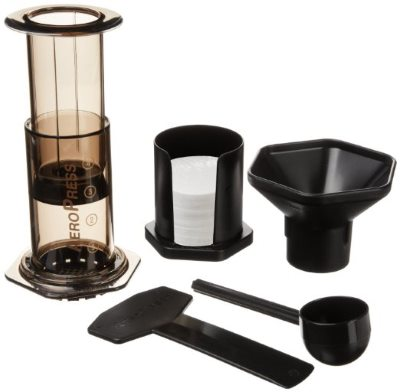

*Aeropress Coffee and Espresso Maker  
*

### #1 Insert Filter

Select one of the round AeroPress filters and place it into the bottom of the black filter cap.

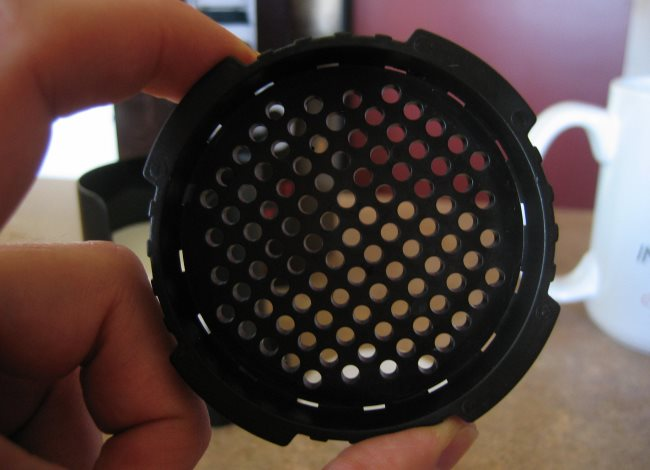  
*AeroPress filter cap*

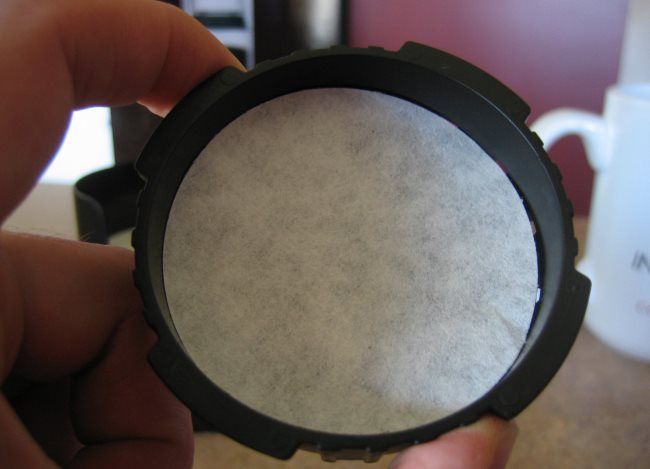  
*AeroPress filter*

At this point, you should rinse the filter. This will help the filter stay in place and minimize the chance of any paper-residual flavor entering the coffee.

### #2 Twist Filter Into Place

Place the filter into the bottom of the brewing chamber and twist it into place. Now, place the brewing chamber, filter side down, and on top of the mug that you will be drinking from.

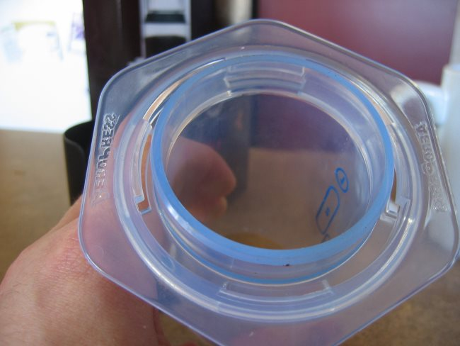  
*AeroPress brewing chamber*

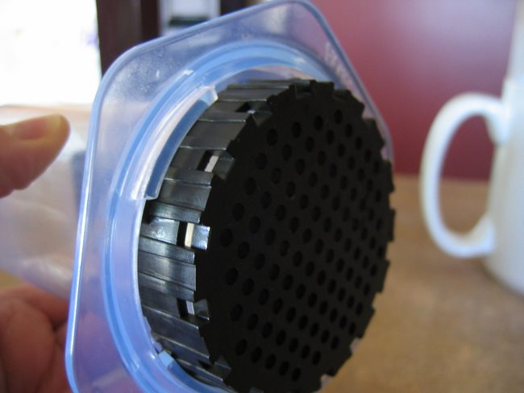  
*AeroPress twist filter*

### #3 Add Coffee

Using the scoop that came with the AeroPress, measure two scoops of coffee for a 16-oz mug. You’ll want to experiment a bit with your grinder and taste preferences when selecting the grind, but in short, a grind between espresso and drip is a good target to shoot for. See our [Coffee Grind Chart](http://ineedcoffee.com/coffee-grind-chart/) for a visual explanation.

If you misplace your Aeropress scoop, two scoops equal 20-22 grams of coffee.

A funnel comes with the AeroPress to help you get the coffee into the brewing chamber without causing too much mess. While this is definitely a convenience, it isn’t absolutely necessary. In either case, get that coffee into the chamber.

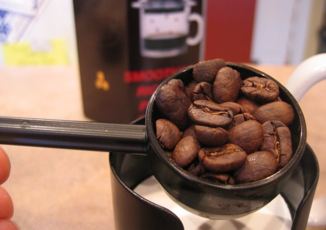  
*AeroPress coffee scoop*

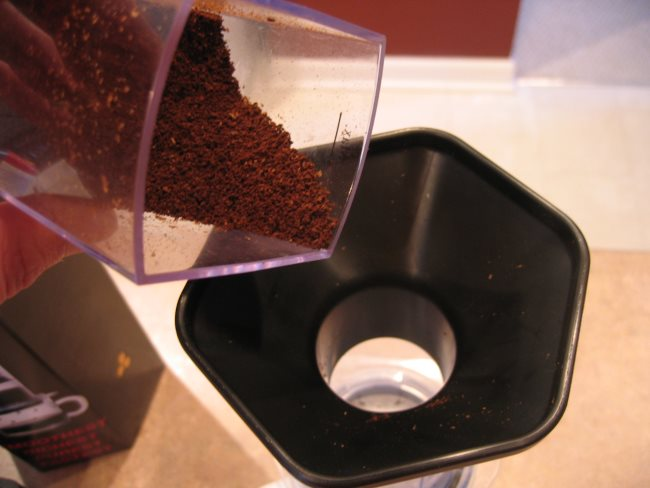  
*Pour coffee grounds.*

### #4 Heat Water

The AeroPress instructions indicate using water at a temperature between 165 and 175 degrees F. Feel free to experiment a bit to see what works for you. I actually found that water just off the boil worked great for diluted coffee. Make sure to heat enough water to reconstitute your mug to 16 oz.

### #5 Add Water and Stir

Use the markings on the cylinder to determine how much water to pour into the brewing chamber. Since we are making diluted coffee, we will use the top of the markings as a guide.

Add just a portion of the water at first so that the grounds can swell a bit, then give it a good stir with the included stirrer so that the grounds settle back down a bit—similar to preparing French press coffee.

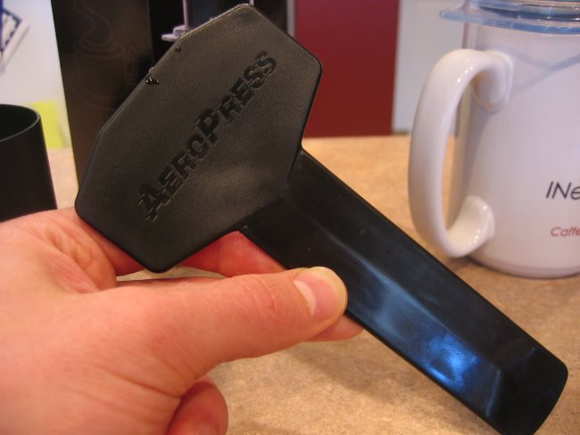  
*AeroPress coffee stir*

Add the remaining water so the brew is at the top of the number 2 oval. Let the water steep for about 10 more seconds, and give the brew another quick stir.

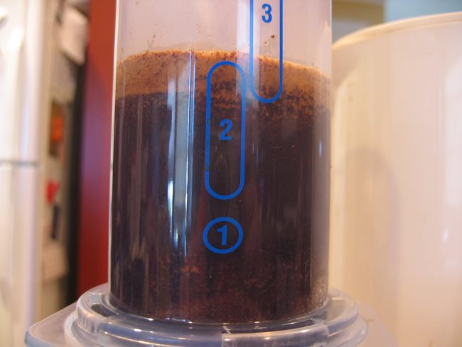  
*Add water to AeroPress and stir with the paddle.*

### #6 Plunge

After a total brew time between 45 and 90 seconds, place the plunger into the chamber and apply a steady amount of force to move the plunger downward. Make sure you plunge all the way down until the plunger just begins compacting the coffee at the bottom.

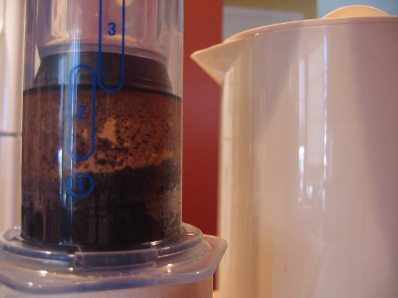  
*AeroPress plunge*

### #7 Remove AeroPress and Add More Water

Remove the brewing unit from your mug and reconstitute the brew with your remaining hot water.

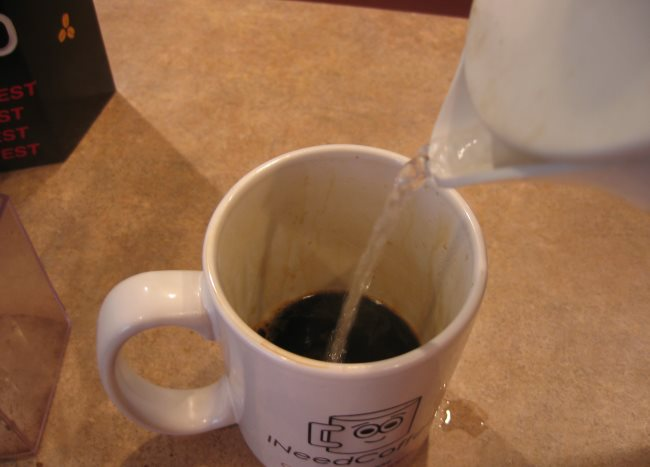

*Add hot water to AeroPress brewed coffee.*

### #8 Serve and Enjoy!

Enjoy your AeroPress coffee!

### Cleanup

Remove the filter cap from the AeroPress brewer and push the plunger the remaining way over a compost bin. This will eject the coffee grounds, which now resemble an espresso puck. Once this is complete, rinse the AeroPress so it is ready to use again.

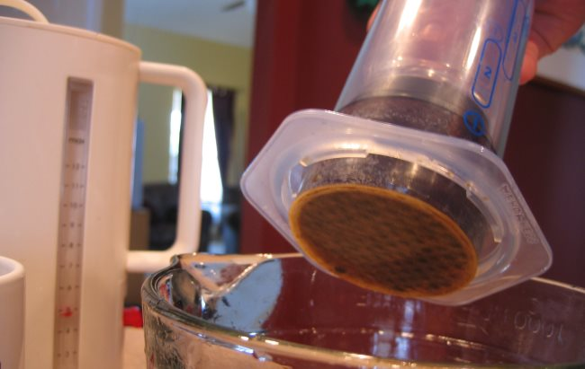  
*AeroPress filter after brewing*

### Resources

[The Upside Down AeroPress Brewing Tutorial](http://ineedcoffee.com/upside-aeropress-coffee-brewing-tutorial/) – Our detailed tutorial explores other variables you can manipulate when making coffee with an AeroPress.

[Large Mug Hack](https://www.youtube.com/watch?v=4rDzPLz7YjM) – A short video showing how to make AeroPress coffee into a wide mug.