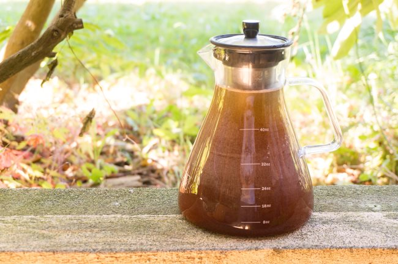

One of the great things to happen in home coffee brewing in recent years has been the innovation in cold-brew coffee gear. What do I mean by innovation? After all, a cold brewer doesn’t require power or need to maintain a specific temperature. It is simply a vessel for letting ground coffee contact water for 12-24 hours. The innovation is making this process easier to start and clean up.

Back in the day, the only non-DIY (do it yourself) option for cold brew coffee was a big old Toddy plastic bucket with that weird pad-like filter that needed to be cleaned and then replaced after every 10 or so uses. And it was fine for the time, but things are better now. Today, you can purchase cold brew coffee makers that are glass, use metal filters, and are both easy to set up and easy to clean up.

*The Cold Brew Coffee Maker* from Alkani is the latest example of a cold-brew coffee maker that gets it right. The brewer uses a sturdy glass container that serves as both the brewer and the pitcher to store the brewed coffee. Along the side, you have volume markings indicating how much coffee is in the pitcher once the brew is complete. The Alkani has a thin metal filter with a handle, which makes it easy to remove once the brew is complete.

### Step-by-Step Tutorial for the Cold Brew Maker by Alkani

Let me show you how easy it is to make cold brew coffee with the Alkani.

#### #1 Grind Coffee

There is no need for scales. Just grind 1 to 1.25 cups of coffee medium-coarse to coarse. See our [Coffee Grind Chart](http://ineedcoffee.com/coffee-grind-chart/) for a visual explanation. I found that 1.25 cups is enough to fill the metal filter. I’m using a lighter roast. Darker roasts might take a few more beans, as coffee expands and becomes lighter in weight during the roasting process.

#### #2 Place Filter Into Cold Brewer

A metal ring with a rubber edge serves as a collar to hold the filter up during brewing. Make sure it is in place. Once it is in place, lower the metal filter into the coffee maker.

*I placed my AeroPress funnel over the Cold Brewer to prepare for the next step.*

#### #3 Add Ground Coffee to Filter

This is the hardest step since you need to aim the grounds into the opening, but it isn’t hard. Just get a funnel. I discovered that the AeroPress funnel is the perfect size for loading the cold brew filter with coffee grounds. If you don’t have an AeroPress funnel, you can roll up a piece of printer paper and hold it together with tape.

#### #4 Slowly Add Water Until the Grounds Are Covered

Slowly add water over the grounds. I do not use the markings on the brewer’s side for guidance. I’m filling the brewer so the water line is high enough to cover all the ground coffee. If you are using 1.25 cups of coffee, that means to the top. Using less ground coffee, you won’t need to fill the brewer with as much water.

#### #5 Wait 18-24 Hours

Let the coffee brew sit for 18-24 hours. I use my kitchen counter, but you could also place it in the refrigerator.

#### #6 Completing the Brew

When you remove the filter, some coffee will leak, so do this step at your sink. Place the filter in your sink and serve or store the finished coffee in the refrigerator. Later, you can empty the coffee grounds into a compost bin. The only step left is to clean your equipment so it is ready for the next brew.

### Alkani vs Home and Above (Battle of the Cold Brew Coffee Makers)

I like the *Alkani Cold Brew Coffee Maker*. It is similar to the *Cold Brew Coffee Maker* from Home and Above, which was covered in the post [An Easy Guide to Making Cold Brew Coffee](http://ineedcoffee.com/easy-guide-making-cold-brew-coffee/). There are a few differences:

1.  Alkani uses a thicker glass with a fatter bottom, which makes it more stable on the counter.
2.  Home and Above uses a thicker, more sturdy metal filter.
3.  Both units have a slight opening that exposes the coffee to the air, but that opening is very small for both. If this concerns you, place a plastic bag or wrap over the opening during brewing. Also, because both units are not watertight at the opening, resist the urge to shake the brewer to accelerate the brewing, or if you do, cover the top and agitate it slowly.
4.  If you use the container to store your coffee, the Alkani will take up more space horizontally (wider), and the Home and Above will use more space vertically (taller). I don’t use either for storage; I transfer the coffee directly to Mason jars.

Shortly after publishing the tutorial on the *Cold Brew Coffee Maker* from Home and Above, a bag of groceries tapped my brewer, and it tipped over on the counter, rolled, and then crashed to the floor. Glass was everywhere. I believe that had that happened to Alkani, it would not have tipped over and rolled onto the floor because the weight is mostly in the base. (The brewer was empty at the time)

The metal filter from Home and Above is thick and more sturdy, but it doesn’t impact the quality of the brew. I have used that filter since I brew directly into a Mason jar.

I like both brewers, but I prefer the thicker bottom-heavy design of the Alkani.  If I wanted a brewer that occupied less space on the counter and in the refrigerator, I’d give the edge to Home and Above.

If I could provide one improvement idea to either cold brewer, it would be to develop a cover to protect the glass. It could look and function similar to the one used to protect the glass on the [Eva Solo Coffee Brewer](http://ineedcoffee.com/eva-solo-coffee-brewing-tutorial/).

### Resources

[Cold Brew Coffee is Not Rocket Science](http://ineedcoffee.com/cold-brew-coffee-is-not-rocket-science/) – The basics of cold brew coffee.

[An Easy Guide to Making Cold Brew Coffee](http://ineedcoffee.com/easy-guide-making-cold-brew-coffee/) – Article and tutorial on the Cold Brew Coffee Maker from Home and Above.

*Brewing photos by Joseph Robertson of Extracted Magazine, a digital coffee magazine published for iOS and Android.  
*