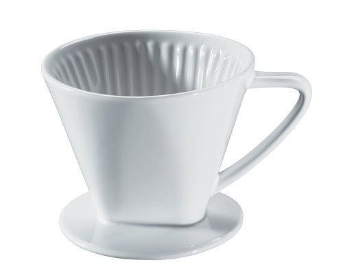
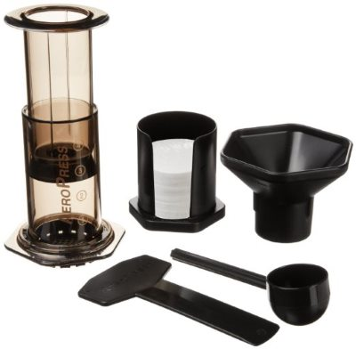
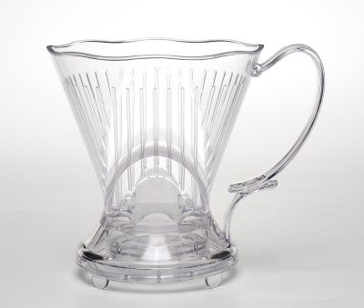

You do not want a *Keurig Coffee Maker*. Is making coffee really that hard? I don’t think so. If you are considering buying a *Keurig Coffee Maker*, please read this article. I have faith in you, and I think you can handle a simple coffee brewing method that will yield a much better-tasting cup of coffee.

With the brewing method alternatives described below, you won’t be using stale pod coffee. You can seek out whatever coffee you want and grind those beans before brewing. You will discover that your coffee’s quality will be much better. A *Keurig* is probably an acceptable option for the lobby of a tire store but for your kitchen? No. You can do much better.

Here are three ways to make a single cup of coffee that are better than the Keurig.

### #1 Porcelain filter (aka Dripper)

Put ground coffee into a paper filter. Set the filter in the ceramic holder over a mug. Pour hot water and wait. This coffee brewing style is straightforward and has a much smaller footprint than the Keurig. It is also much cheaper, at less than $20. Several different shapes and colors are available for this coffee brewing style.

  
*Porcelain Pour Over Coffee Filter*

### #2 The AeroPress

The AeroPress makes a great cup of coffee. Penny for penny, the AeroPress may be the best coffee brewer one can buy. For step-by-step guidance, read [The Upside Down Aeropress Coffee Brewing Tutorial](/upside-aeropress-coffee-brewing-tutorial/).

*AeroPress Coffee and Espresso Maker*

### #3 The Clever Coffee Dripper

If you would like the rich taste of a French Press but don’t want to deal with the cleanup, a Clever might be for you. Like a French Press, you control the steeping time, but unlike a French Press, it has a filter that makes for easy cleanup. For more information, see our [Clever Coffee Dripper](/clever-coffee-dripper-review/) article.

*Clever Coffee Dripper*

### Conclusion

Making coffee isn’t rocket science. Buying an ugly pod machine that promises ease and delivers mediocre coffee is unnecessary. Get one of the three alternate brewing methods in this article and take control of your coffee brewing. You’ll save money, and your coffee will taste much better.
