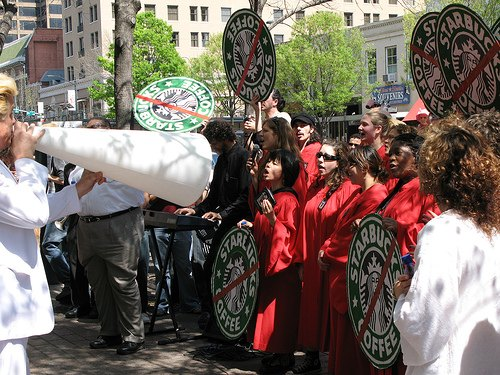

Bill Talen, who is better known as Reverend Billy, is now running to be the next Mayor of New York City. Some longtime INeedCoffee readers will recall that in 2002, Reverend Billy went after coffee giant Starbucks. He delivered sermons in Manhattan on the *ruthlessness* of Starbucks Coffee. From *Reverend Billy’s Starbucks Invasion* by Bill Talen:

> When Starbucks’ scouts enter a new neighborhood, they listen for the laughter. They find where culture is still original, not corporatized, and that is their opponent and prey, for Starbucks is a jealous God. They approach the landlords of the community, whether it’s a diner or a restaurant or a bar. They offer far more than the traditional tenant can afford, because Starbucks arrives with its Nasdaq funny money. They arrive from a completely different economy, and evict the business that native residents have built for years. This is a famous Starbucks tactic and has been repeated throughout the country and abroad. It is a kind of bombing. It is violent. READERS. DO I HAVE A WITNESS? STOP THE BOMBING!!

  
*[Reverend Billy / What Would Jesus Buy](http://www.flickr.com/photos/canarypromo/422816266/) by Mason Wendell*

Reverend Billy is now going after Wall Street and banking bailouts. Since New York is home to this crisis, Billy has decided to run for Mayor as a member of the Green Party. The election will take place on Tuesday, November 3rd, 2009. From his platform page on the *Reverend Billy Talen for NYC Mayor* website:

> As Mayor of New York, Reverend Billy Talen will continue the work he has done for more than a decade as a champion of local ingenuity and neighborhood know-how. United as he already is with the city’s many communities, his administration will be the connecting force reaching out to all New Yorkers, to create a city that is sustainable, just and free; defending public space, self-determination, and the right for every New Yorker to earn an honest, independent living.

As a friend and contributor to INeedCoffee, we wish him the best of luck.

RESULTS: Reverend Billy finished 4th in the Mayoral election with 0.8% of the vote.

### Sources

[Billy Talen](http://ineedcoffee.com/by/billy-talen/) – Contributor page on INeedCoffee.

[Reverend Billy’s Starbucks Invasion](https://www.utne.com/community/reverendbillysstarbucksinvasion/) – Utne article by Bill Talen

[Reverend Billy Photos From Austin Starbucks Rally](http://www.flickr.com/photos/canarypromo/sets/72157600003247375/) – Photo set taken by Flickr user Mason Wendell (March 2007).

[Full List of NYC Mayor Candidates For 2009 Election](https://en.wikipedia.org/wiki/New_York_City_mayoral_election,_2009) – Wikipedia

*Bill Talen aka Reverend Billy Announces His Candidacy for Mayor of New York* – March 2, 2009 story on the campaign announcement.