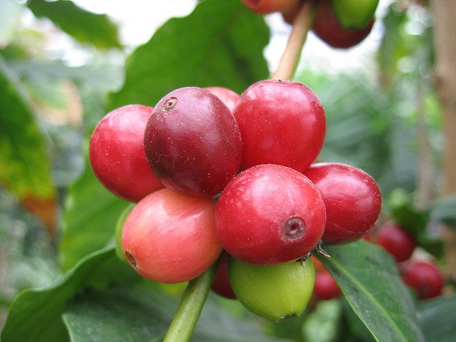

Though my research on coffee revealed over 30 species of the genus, the major commercial coffee beans come from Arabica and robusta trees.

Arabica (Coffea arabica), named for the Arabs, is the better and more expensive of the two. These trees grow in semitropical climates near the equator, both in the western and eastern hemispheres, at high altitudes. Because ripe Arabica cherries (unroasted beans) fall to the ground and spoil, they must be carefully monitored and picked at intervals, which increases production costs.

  
*[Arabica coffee beans](https://www.flickr.com/photos/andreasbalzer/169092459/) by Andreas Balzer*

Robusta trees (Coffea canephora), which are grown exclusively in the eastern hemisphere, also thrive in equatorial climates, but at low altitudes. Their cherries require less care since they remain on the tree after they ripen. Robusta beans have twice the caffeine of Arabica, but less flavor. Some supermarkets carry Arabica, but most of their brands are robusta. Coffee shops generally use Arabica beans, but because their brews are so strong, I don’t enjoy them. I had always been satisfied with the various Maxwell House roasts and blends, until I bought my first bag of Arabica beans, ground them, brewed them, and drank the elixir.

To describe the taste of Arabica is difficult without using trite words like smooth and mellow. It has a round taste that is both rich and delicate, with good acidity. This does not refer to an actual degree of acidity, but to the sharp and pleasing taste that is neither sour nor sweet. The difference was evident in my first cup, probably because I had been drinking robusta for years. I was sold, high cost or not, and now I only buy Arabica.

In fairness, although most robusta coffee is of a lower grade and inferior to Arabica, there is a premium crop that is the top of the line for robusta beans. Premium robusta is primarily used in specialty espresso blends and is never found in canned coffee. Though it only constitutes 5-15% of the blend, it is used because these beans add body to the taste and make a nice crema in the shot of espresso. This additional body distinguishes the blend in a cappuccino or latte. Premium robusta should only be used for espresso and not other brewing methods.

Surprisingly, I have found 100% Arabica coffee in Kroger decaffeinated and Eight O’Clock regular, both in bags of whole beans. If your coffee is Colombian, it will probably say Arabica on the side or back of the package, since this country produces nothing else. Guatemala, El Salvador, Tanzania, and Kenya also produce all Arabica beans.

Once when I was a salesperson, a customer asked if we had leather handbags. After our discussion, I stated, “So, you really like leather purses, huh?” She asked, “Have you ever had a leather purse?” I tentatively said that I wasn’t sure and she replied, “Well, once you’ve had one, you will never want anything else.” I purchased a leather purse because of her conviction, and she was right.

So, I state with conviction that once you try well-brewed Arabica coffee, you may never want robusta again. It invades the tongue and palate with a delightful taste and divine aroma. You will be encouraged to close your eyes and savor the flavor, just as I describe in my poem [Heavenly](/heavenly-coffee-poem/ "coffee poem").
