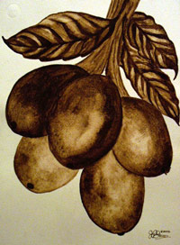
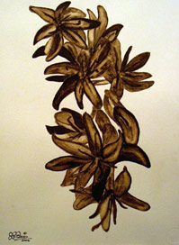
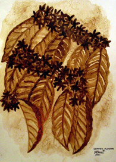
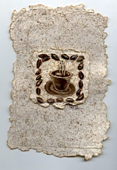
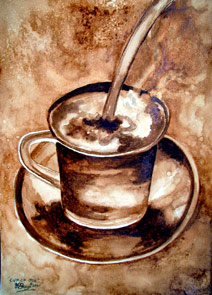
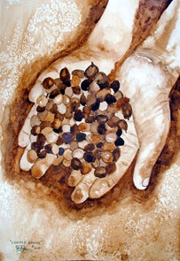
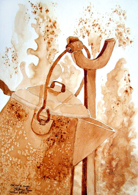

Below is a collection of coffee greeting cards from the Art of Farr Gallery. They were made using the paper of used coffee filters. The artwork was created using using coffee and coffee chaff as a painting medium.

  

 

