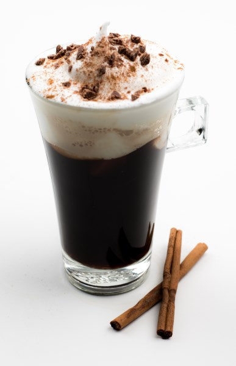

This is a perfect drink on a chilly autumn morning.

### Ingredients

-   Whole cloves
-   Cinnamon bark (whole cinnamon)
-   whole green cardamom
-   Brown sugar (if desired)
-   Whipped cream
-   Shaved Chocolate and cinnamon sprinkle
-   Coffee

  
*Autumn-Holiday Coffee*

### Directions

1.  Brew a pot of your favorite coffee, a little too strong.
2.  In a small pan, add 1.5 cups of water, 4-7 cloves, 1/2 inch cinnamon bark broken up, 4-7 whole cardamom -split the tips, and 1-3 teaspoons of sugar.
3.  Heat up to a boiling point for 3-4 minutes.
4.  Mix the coffee and the spice mix.
5.  Pour into cups, top with whipped cream, and sprinkle with chocolate and cinnamon.
6.  Add more sugar if desired.

This also makes a great drink with some Tia Maria or Mozart-liqueurs for a more adult evening drink.
