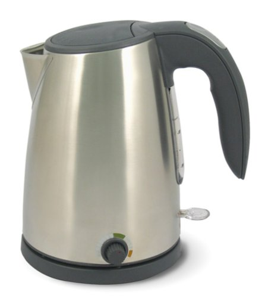
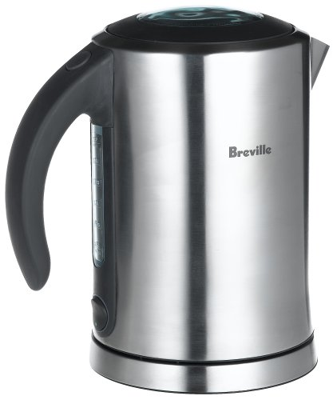
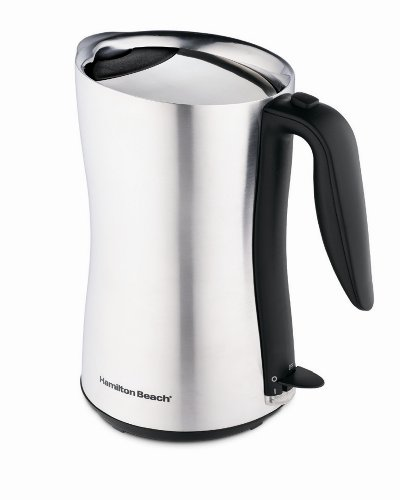

***This article is a few years old now. A lot has changed since then.***

I might have been the last person to get this memo:

> Hot Water + Plastic = Bad

Why is this bad? There are at least two reasons:

1.  Imparts bad taste to beverages
2.  Estrogens

I will confess that I’ve never tasted any *plastic-like qualities* in the tea or French press coffees I’ve made using my trusty [plastic electric kettle](/extending-the-life-of-your-bodum-cordless-electric-kettle/). However, I’ve learned that the best tasters in both tea and coffee can taste the plastic. They use stainless steel electric kettles to heat their water. **If it were just a taste issue and I was happy with the taste of my beverages, I would still be using a plastic kettle.** Estrogens are a different story – they motivated me to research stainless steel kettle options.

In the book *The Warrior Diet*, author Ori Hofmekler lays out the case against dietary and environmental estrogens. I won’t cover his book here; you can find my review, Revisiting The Warrior Diet, on my personal site. What Ori said about plastics grabbed my attention. He stated that compounds in plastic called plasticizers can be estrogenic and carcinogenic (EX, bisphenol A). When I started going through all the different types of plastic, which were bad and less bad, my head started to spin. I didn’t understand the chemistry, but I knew what I had to do to minimize estrogenic exposure – **I decided to replace my plastic kettle with a stainless steel one.**

I did some research and found three affordable stainless steel electric kettles, each with its own benefits.

The 30-ounce *Adagio Teas 3 UtiliTEA* runs for about $50. It has three different temperature settings and is ideal for a tea drinker. Black teas require a hotter brew temperature than oolongs. Green and white teas require even lower temperatures. I emailed the company and asked if the hot water made any contact with plastic. They responded:

> There is a plastic view window in the utiliTEA; otherwise the rest of the kettle is made of brushed stainless steel.

  
*Adagio Teas 3 UtiliTEA Variable-Temperature 30-Ounce Electric Kettle  
*

The *Breville SK500XL* runs about $70 and can heat almost 58 ounces of water. I also emailed them to see if the hot water and plastic made contact. They responded:

> There is a plastic volume gauge that is exposed to hot water on the kettle.

  
*Breville SK500XL Ikon Cordless 1.7-Liter Stainless-Steel Electric Kettle  
*

The *Hamilton Beach 40898 Cool Touch Tea Kettle* costs about $60 and can heat 64 ounces. Hot water and plastic do not contact this kettle, as this model does not have a plastic window for the user to see the water level.

### And The Winner Is?

It was tough to decide between the three models. I liked Adagio’s three temperature settings because I am a tea drinker who favors oolong and green tea. The Breville had some great comments and a stable base. In the end, I went with the Hamilton Beach Cool Touch. It has the largest capacity and no plastic contact. Having a plastic window gauge is not important to me.

  
*Hamilton Beach 40898 Cool-Touch Cordless 8-Cup Electric Kettle  
*

My full review of the [Hamilton Beach Cool Touch Tea Kettle](/the-hamilton-beach-cool-touch-tea-kettle-review/).

### Resources

[Revisiting the Warrior Diet](https://criticalmas.org/2009/04/revisiting-the-warrior-diet/) – My review of Ori Hofmekler’s book.
