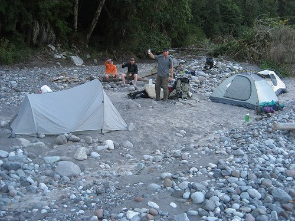
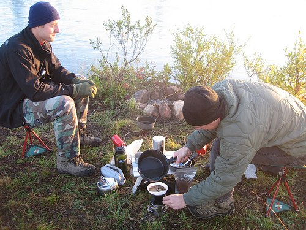

As an avid backpacker and backcountry enthusiast from the caffeine-soaked streets of the northwest, I have searched high and low for an easy way to make great coffee away from the conveniences of home. Coffee-making gadgets range from the ineffective to the bizarre, but mostly they’re just bulky and heavy.

There’s no use whittling away ounces by moving to an alcohol stove or shortening up your sleeping pad if you’re just going to throw in a three-pound coffee pot. So it would seem that the backpacker trying to lighten his or her load is left with some kind of instant coffee concentrate or the age-old cowboy method.

Well, for anyone who gags at the thought of instant crystals, or thinks that tossing your elegantly roasted, carefully ground beans into a vat of boiling water is akin to throwing a seasoned, aged, filet mignon into the microwave, I have great news. There is another way.

While trying to avoid the weak flavor of freeze-dried crystals or liquid concentrate on the one hand and the additional weight of a coffee-making gizmo on the other, I stumbled across two outstanding ways of brewing cafe-quality coffee, no matter how far off the grid your travels take you.

  
*Backcountry Coffee Camping*

First, for the easiest, hassle-free delicious cup of mountain jo, the pour-over drip technique wins the prize. To achieve great coffee, simply put ground coffee in a cone (the O.D. Compact Dripper from MontBell weighs in at 0.14 oz), place it over your camp cup, pour water just off the boil over the top, and a few minutes later, you have a steaming hot cup of perfectly extracted coffee. For clean-up, all you have to do is scatter the wet grounds across a wide area and rinse the cone with a splash of water. This works best for one or two morning sippers.

  
*Making Coffee While Camping*

For a group or those that need a Venti to get going in the morning, the Press-Bot from ventureDesignworks (weighing only 2 oz) and a 32 oz *Nalgene* are all you need. With a half cup of coarse-ground coffee in the bottle (it’s probably best to use a BPA-free bottle since hot water is what causes the bad stuff to leach out), slip the Press Bot in and lock the plunger flat. Next while holding the plunger filter at a diagonal, pour water just off the boil in until the grounds and water reach the top, then screw the top on.

After five minutes, slowly push the plunger down to separate the grounds from the steeped coffee. Now you’ve got 32 oz of fabulous coffee to serve your whole party or keep for yourself. The Lexan bottle also keeps your second cup amazingly hot, even at altitude. This clean-up is even easier. If you don’t need that bottle for the way down, just screw the cap on and toss it in your pack. If you want to re-use the *Nalgene* for more water, sling the grounds over a wide area and rinse the remaining sludge with a splash of water.

Both of these methods will yield you coffee worthy of a specialty cafe for less than twenty dollars and a few extra ounces.