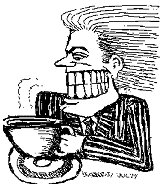
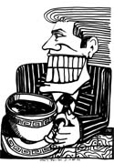

*This article was written in December 2000, when the 2nd version of INeedCoffee was launched.*

INeedCoffee, like many websites, is considered by its creators to be a perpetual work in progress. Change is a constant, and those of you who have visited for some time now have certainly noticed changes in content, functionality, and appearance. However, as INeedCoffee unveils its new look, one element remains unchanged: the masthead is still a creation of Bob Therrien, better known to the world as BadBob.

  
*INeedCoffee Bad Bob v1 (April 1999 – December 2000)*

*  
INeedCoffee Bad Bob v2 (December 2000 – April 2003)*

Does Bad Bob’s style look familiar to you? If so, you may well have seen some derivative of “Screaming Man”, a cartoon he drew for the Advocate, an alternative weekly newspaper in New Haven, Connecticut. BadBob was born in Georgetown, Connecticut, and has moved “in and out of Connecticut” through the years. However, a contracting job brought him out to Colorado in the mid-1990s, and there he has remained ever since, now living in Broomfield, Colorado.

### A Rocky Mountain Relocation

“When I first got here, I was out of shape; fat, even,” BadBob explains. “Now I can’t imagine leaving \[Colorado\]… I do rock climbing and kick-ass hikes on trails where you run down using the same muscles you use for snowboarding.”

“I’m 100 years old, but I’m free climbing on the Flatirons,” he says, adding that he is often able to cruise past many of the younger hikers. BadBob has also taken up snowboarding and golf, rounding out a near-complete adaptation to the classic image of an outdoorsy Colorado lifestyle.

### Artistic Evolution

In his new environs, Therrien’s professional and artistic lives have evolved along with his recreational life.

Bad Bob’s day job consists of mechanical engineering and technical illustration, and while he no longer cartoons on a regular basis, he continues to draw close relatives of Screaming Man and insinuates that there may be more cartoons to come.

Cartooning is but one of his artistic interests, and his more recent efforts have been in other endeavors, recently including “murals, ink drawings, and watercolors. Paintings are taken from pictures I’ve taken.”

Not content to confine himself to the visual arts, Therrien also obeys a lifelong passion for music. He plays guitar and sings for different permutations of musicians, usually dubbed the BadBob Band.

“I’ve been playing music all my life,” Therrien says. “I played in a punk band in the day of punk, and I was in a lounge band in the ’70s.” While the lounge band did travel, BadBob and his fellow musicians were eventually bogged down in dead-end gigs in Maine and Alabama. He recalls, “We sucked, so I guess we deserved it!”

### Coffee Credentials

So what has drawn INeedCoffee to seek Bad Bob’s artistry twice over? Is it a coincidence that the favorite cartoonist of several caffeine junkies is himself a caffeine junkie? It turns out that Bad Bob’s coffee-drinking credentials are as serious as they can get.

One need only see a cartoon adorning Bab Bob’s personal website to know exactly where the artist stands on the issue. Several coffee drinkers adorn the site, most notably a gun-toting, Screaming Maniac, who demands of his target, “What part of ‘no decaf’ don’t you understand?”

Bad Bob’s life, to a less violent degree, is indeed reflective of his art. “Yes, I’m a frequent coffee drinker,” he says. “I drink many kinds of coffee; I’m not a snob at all..I try to find many sources of caffeine; not just coffee.”

When asked if he views it as a luxury or a legal drug, Therrien says: “I like to think of caffeine as a legal drug, because I’m addicted to it. I have to have it.”

### The Perfect New Look

INeedCoffee is proud to once again have Bad Bob’s work adorning its site. It is abundantly clear why: Bad Bob’s style, be it his artistic style, lifestyle, or style of caffeine intake, makes his Screaming Coffee Man a perfect symbol for coffee devotees and the information they can find on INeedCoffee. So log on, pour yourself a cup, and when the caffeine begins to kick in, scream right along with Bad Bob’s new coffee character.

### Resources

[The Caffeine](/the-caffeine/) – 2 poems by Bad Bob.

[Robert Therrien Jr.](https://sites.google.com/site/bobjtherrien/home) – Official site.
