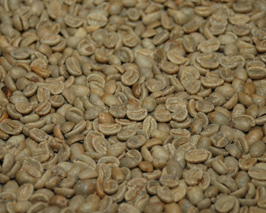
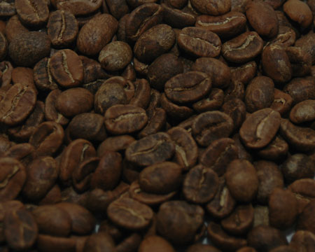
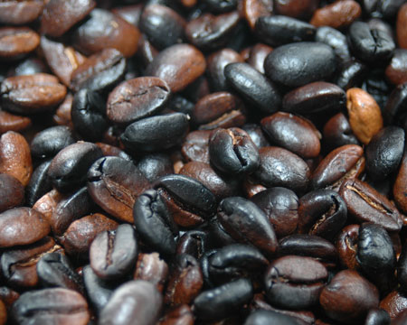

I have been meaning to try roasting my own beans for quite a while, but the one issue that frightened me the most was “smoke.” It’s mentioned in all the roasting articles here, so there seemed no way around it. I’m from Texas, so we’re used to cooking outdoors. So, I simply replaced the oven and stove in the basic roasting recipes with my Weber gas grill. Here was my logic: it’s gas, it’s controllable heat (three burners with separate controls), and it has a visible thermostat. Most importantly (especially to my wife), it’s outdoors, so smoke becomes less of an issue.

I had some Colombian Supremo beans I had purchased online, so this weekend, I decided it was time to roast.

  
*Green Coffee*

I followed the [Home Roasting Coffee with the Whirley-Pop Popcorn Popper](http://ineedcoffee.com/stovetop-roasting-with-the-whirley-pop/) article and just placed the Whirley-Pop on the gas grill, rather than the stove. This produced a fairly light roast after about twenty minutes. I heard the first crack but never heard the second. I don’t think the heat was enough to roast the coffee much more than that. This also took a lot longer than I thought it would which is probably a temperature issue, as well.

  
*Roasting Coffee*

One drawback of this method is that you have to keep the lid of the grill open all the time. Since the gas grill needs the lid closed to generate higher temperatures, this is an issue.

After I declared the roast “done”, I moved the beans to a metal colander and shook them to cool and remove the chaff.

The next day, I decided to try the [Home Roasting Coffee in an Oven](http://ineedcoffee.com/home-roasting-coffee-in-an-oven/) method, replacing the oven with the grill. I used a pizza pan as in the recipe, got the grill up to 500 degrees per the thermostat, placed the tray on the grill, and closed the lid.

I adjusted the three burners to keep the thermostat at 500 degrees during the roast. At about six minutes, I heard the first crack. I would check the beans each minute after that, boosting the gas after I closed the lid to get the temperature back up to 500.

After about twelve minutes, I declared the roast “done”. I used a pair of pliers to remove the pizza pan from the grill and poured the beans into a metal colander for cooling (and to remove the chaff as before.) My wife helped with this step – it would be very useful to have a helper along for this part. Pouring hot beans off a round pan into a colander can be tricky.

  
*BBQ Coffee*

Warning to pet owners – coffee is harmful to dogs, so make sure you pour the beans into the colander and remove the chaff somewhere where they aren’t, in the case of any spills. I went out on our driveway to pour the beans into the colander and shake it to cool.

In both cases, I waited about an hour to remove the beans from the colander and placed them in an air-tight container to wait for grinding and brewing.

The pizza pan produced much richer coffee than the popcorn popper, but I am fairly certain that’s because the heat was so much higher and it reached the second crack stage. You could see oil on the beans from the pan, but not so much from the popper. Both made very good coffee, but I prefer the pizza pan method’s flavor. (I think the next time, I will remove the beans at about ten minutes to compare the outcome.)

So, if you don’t want to fill your house with smoke, and you have a gas grill and a perforated pan, I recommend barbequing your beans!