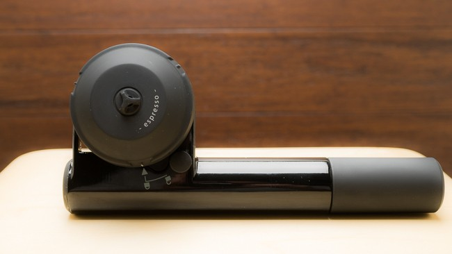
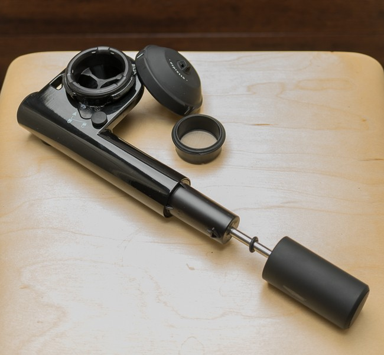
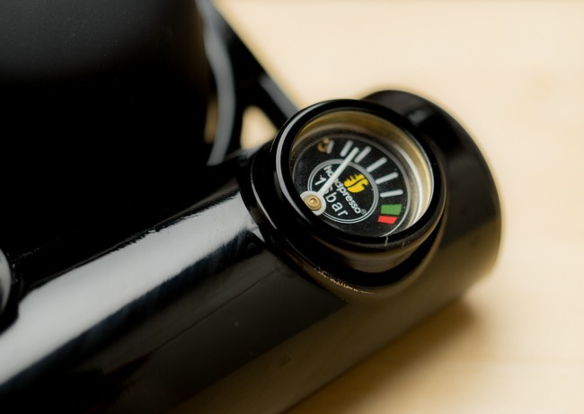
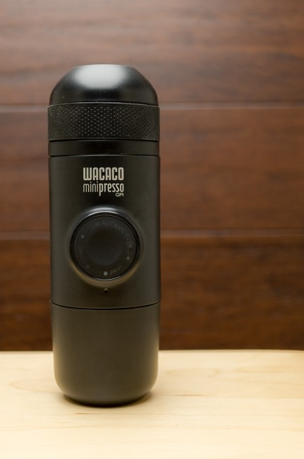
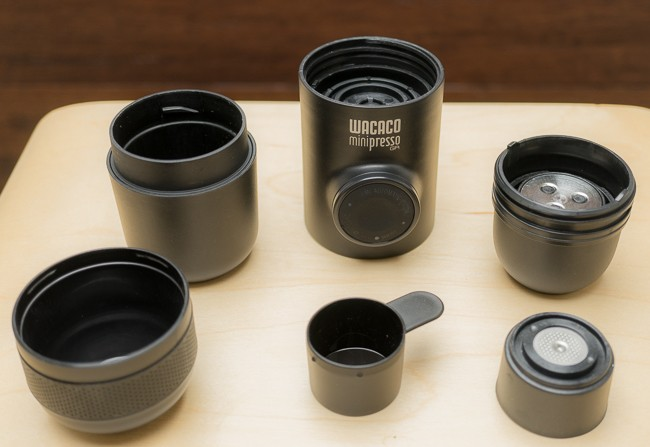
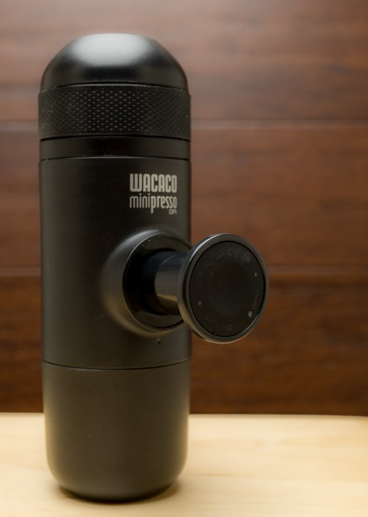
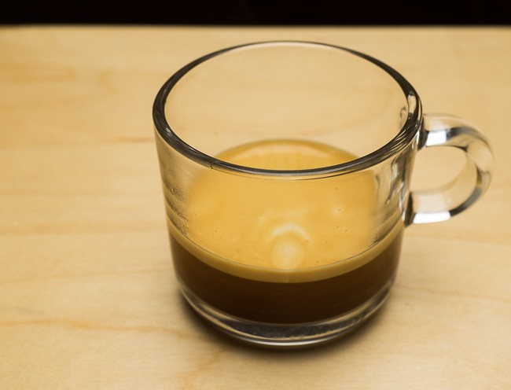
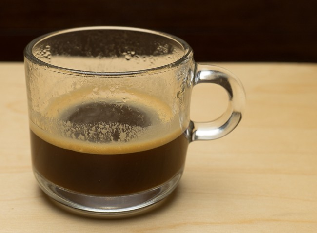
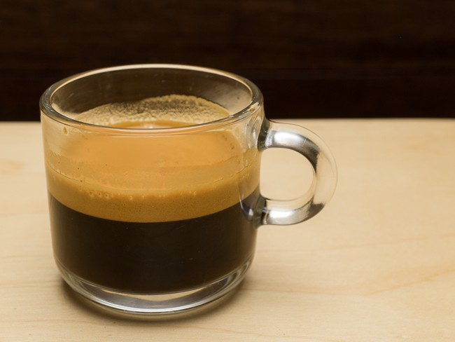

The 21st century has arrived, and now you can take espresso to work, camping, travel, or anywhere on the go. These hand-powered portable espresso makers promise a very small footprint without the need for electricity or cartridges, all at a very reasonable price. Add hot water and some finely ground coffee, and you are ready.

Both the Handpresso Wild Hybrid and Wacaco Minipresso GR units work on human power to make enough pressure to produce espresso, but can they produce the same quality as a commercial espresso machine? And how do they compare to each other? Read on to find out.

### Handpresso Wild Hybrid

The Handpresso Wild looks somewhat like a small bicycle pump, which consists of 3 parts: the main body, coffee basket, and a locking cover. It produces a maximum of 232 PSI (16bar) and has a 2-year warranty. The dimensions are approximately 8.5 x 4 x 2.75 inches (220 x 100 x 70 mm) and weighs about 17 ounces (480g). The Handpresso Wild Hybrid has a street price of about $120.

*Handpresso Wild Hybrid*

There is a .25oz (7g) filter basket that you fill with finely ground coffee, and the end of the pump is used as a tamper.

There is also a water chamber that holds 1.7oz (50ml), which you fill to the line with hot water, placing the basket in between the water chamber and lid, which is locked by twisting it shut.

*Handpresso Wild Hybrid has just three parts*

You add pressure to the chamber by pumping it up several times until the pressure gauge indicates you are in the correct range. The pressure is maintained until you are ready to release it with a switch, which pushes the water through the coffee and into the cup.

**NOTE:** *The unit does support E.S.E. pods, but that was not tested as part of this review.*

*The Handpresso Wild Hybrid provides 232 PSI (16bar) of max pressure and a nice gauge for visual confirmation.*

### Wacaco Minipresso GR

The Minipresso GR looks a lot like a small thermos, which consists of 6 parts: the main body, coffee basket, water chamber, locking cover, coffee scoop, and lid/cup combo. It produces an average of 116 PSI (8bar) and has a 1-year warranty. The dimensions are approximately 7 x 3 x 2.5 inches (175 x 70 x 60 mm) and weighs about 13 ounces (360g). The Minipresso has a street price of about $60.

*Wacaco Minipresso GR  
*

There is a .25oz (7g) filter basket that you fill with finely ground coffee and tamp with the bottom of the scoop.

The coffee scoop is also nice because it allows you to measure the exact amount of coffee needed, and also seals perfectly with the coffee basket so that you can simply place the two together, and flip them over to fill the basket with minimal mess.

*Wacaco Minipresso GR has six parts that fit together in a streamlined shape*

There is also a water chamber that holds 2.3oz (70ml), that you fill to the line with hot water, screwing it underneath the main body which locks it in.

Unlike the Handpresso, the Minipresso does not allow you to “pre-pump” the unit with pressure. Instead, each pump forces water through the coffee and into the cup. The pump piston lever locks in place when not in use, which maintains its svelte shape.

*The Wacaco Minipresso GR’s stout piston lever provides the pressure needed for espresso.*

### Comparison

Both the Handpresso GR and Minipresso GR produce a decent cup of espresso with some crema. In my tests, I used a lightly roasted Ethiopian Harrar about 4 days off the roast.

The flavor was respectable in both cases, and I would say I preferred the flavor from the Handpresso, even though it produced less visible crema.

The resulting coffee temperature from the Minipresso was a little lower than that from the Handpresso, but I did not preheat the unit. Wacaco recommends a preheat cycle, but this involves running hot water through the unit, and I didn’t want to go through that process.

*Espresso from the Wacaco Minipresso GR*

*Espresso from the Handpresso Wild Hybrid*

*Espresso from the Izzo Alex Duetto III*

The Minipresso has more plastic parts, and they are a little thinner. The Handpresso uses a lot more metal, and the plastic it does use seems to be thicker. However, both units are well-made and have a solid feel. I expect either unit would hold up well and survive normal abuse like dropping them or overseas traveling.

The Handpresso shape is not very streamlined and feels a little imbalanced. You cannot store it upright, and it requires more room to store than the Minipresso.

If I were taking one of these hiking or on a road trip, I would probably opt for the Minipresso because of the shorter, more bullet-like shape, and the ability to place it easily in a cup holder or bottle holder in a backpack. If I were taking this in luggage or regular camping, I would likely take the Handpresso because of the slightly better flavor, ability to store the pressure, and only having 3 parts to keep track of.

### Tamping and Cleanup

The Handpresso works best when [tamping coffee](/espresso-tamping/) using the end of the pump handle, and the Minipresso with the bottom of the scoop. Considering the small basket size of each, these tamping implements are more than adequate.

The cleanup on the Handpresso was very simple. Emptying and cleaning just the coffee basket was all that was needed most of the time, with an occasional rinse of the locking cover. With the Minipresso, I felt I had to clean inside the main body, lock the cover, and empty/clean the coffee basket every time.

### Conclusion

Neither unit produced quite the quality I get out of my Prosumer Izzo Alex Duetto III, but then again, that is a $2500 machine that uses electricity and has a fairly large footprint.  I would have been thrilled to have either one of these on a previous trip to the UK, where finding decent espresso was hit or miss.

The **Wacaco Minipresso GR** is good for those who value:

-   A lower price point
-   A smaller, more streamlined shape and balanced feel
-   An included cup for an all-in-one package

The **Handpresso Wild Hybrid** is good for those who value:

-   Better flavor
-   Higher max pressure
-   Easier cleanup
-   The simplicity of just three parts
-   Ability to use ESE pods

*Disclosure: INeedCoffee was sent some of these products at no cost, which did not affect its review.*
