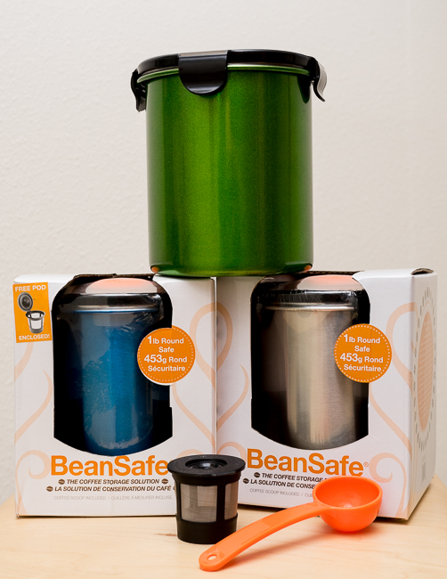
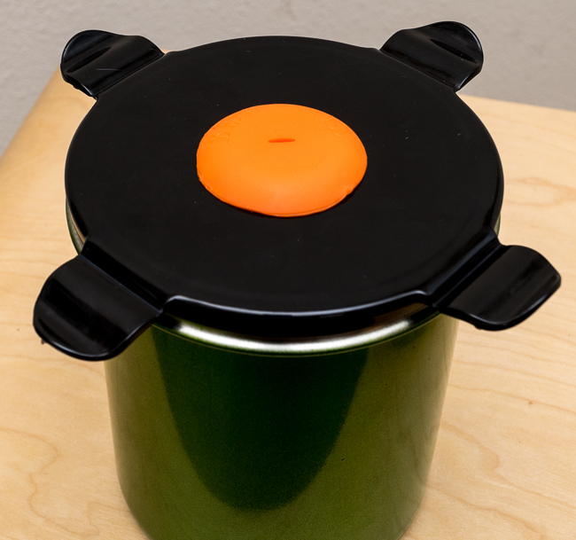
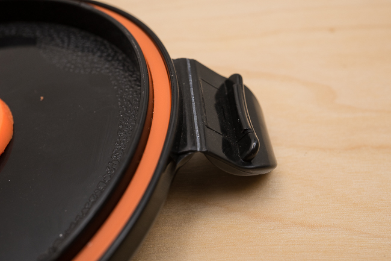

***UPDATE September 2020:** The BeanSafe Coffee Storage Container is no longer available for sale.*

Freshly roasted coffee deserves proper storage. When coffee beans are roasted, they release a lot of CO2, especially for the first few days. Ideally, you want to let the CO2 out but also keep the oxygen from coming in. Oxygen, along with light, heat, and moisture, is an enemy of fresh coffee.

### Introducing BeanSafe Coffee Storage Containers

BeanSafe Coffee Storage containers provide a one-way valve and otherwise airtight storage solution to keep your coffee beans fresh. Although they can also keep out light and, to some degree, moisture, most containers can’t really do much about heat. If the room you are storing your beans in is hot, eventually, your beans will be too. But practically speaking, I have not found this to be a problem.

BeanSafe Coffee Storage Containers hold 16 ounces of coffee with room to spare and are available in the following colors and materials (all lids are BPA-Free polypropylene):

#### 304 Food Grade Stainless Steel

-   Basic Stainless Steel with a black lid
-   Basic Stainless Steel with a white lid
-   Blue with a black Lid
-   Green with a black Lid
-   Purple with a black Lid
-   Red with a black Lid

#### BPA-Free polypropylene

-   White with white lid
-   Black with black lid

All containers, lids, and valves are dishwasher-safe. BeanSafe does not recommend removing the silicone valve; instead, it recommends placing the entire lid and valve together in the dishwasher.

### BeanSafe vs. Friis

I am comparing the BeanSafe coffee storage containers to my trusty Friis Coffee Vault storage containers. The Friis has served me well, but they have two main issues. The valves are meant to be replaced, and although they include extra replacement valves, this is an added cost over the life of the container, since replacement is recommended every 2 months. The other problem is with balance. When you open the hinged lid to fill it up with coffee beans, it almost always tips over. The BeanSafe seems to address both of these issues.

The BeanSafe valve system is a piece of specially shaped silicone rubber with a hole in it. Inside, there is a glass bead that is just heavy enough to cover the hole but light enough so that as CO2 builds up, it temporarily pushes the bead out of the way to let the CO2 out and then returns to its position to keep oxygen out. Although this does mean that the container must remain level to be effective, they claim that the “Valve…never needs replacement.” While I never believe statements like that, I do think the valve should last for years, likely only if the silicone degrades or becomes malformed.

I tested some freshly roasted coffee whole beans in both my Friis and the BeanSafe. Although I don’t have a way to measure the CO2 levels being expelled or any oxygen coming in, the coffee tasted very good coming out of both containers over the period of about 7 days. I ground beans fresh out of both containers on Espresso, Drip, and [Cold-Brewed Coffee](/cold-brew-coffee-is-not-rocket-science/) methods, and they tasted excellent and were not discernibly different between the Friis and the Bean Safe.  I wanted to see if I could record a video of the glass bead rise and fall, but the top exit slit was too small to see inside. I would have to cut the silicone away in order to do this, and I didn’t want to ruin such a beautiful product. Perhaps I will do this in the future as an experiment.

### Included Extras and Ground Coffee

The Stainless Steel color, as well as the Black and White BPA-Free polypropylene containers only, include a scoop. The color versions include an orange coffee scoop and a DIY reusable Keurig K-Cup compatible coffee pod, which are nice extras.

The reusable K-Cup compatible coffee pod is a great way to save money on those expensive replacements, and increase the quality of your coffee over the mediocre pre-packaged K-Cups you get at the grocery store.

Also, BeanSafe says that you can store ground coffee if you wish. Friis does not recommend this, as their design has the potential to clog the valve. Although I did not test storing ground coffee, sometimes you must grind ahead of time for short trips like camping or weekend getaways, and it is nice to know the BeanSafe valve will handle that.

### Concerns

One area of concern I had right away was the plastic clips on the lid. Putting the lid on and off just 3 times, which also meant I was bending the clips back and forth, resulted in plastic stress to the clips (see photo). Over the years, I have owned many products that have a similar design, and I do not expect this part to last too long, but BeanSafe tells me that they have been tested “400,000 times for durability”, so only time will tell how well they hold up.  They do recommend that you treat the clips gently for a longer life.

I would also like to see container manufacturers put some sort of soft anti-skid material on the bottom. Metal containers can slide around easily on a tile kitchen counter, and the metal on tile sound hurts the ear. It’s not a big deal, but it would be a nice touch. I would also like to see a way to securely store the scoop with the canister.

### Conclusion

At approximately $25 street price for food-grade stainless steel and $20 for BPA-free polypropylene, the BeanSafe Coffee Storage Containers are an affordable, aesthetically pleasing alternative to other products on the market. They make a great upgrade if you are currently using non-valved storage for your coffee.

### Resources

*The BeanSafe Coffee Storage Container is no longer available for sale.*

[How to Store Coffee Beans (Tips and Recommendations)](/how-to-store-coffee-beans-tips-and-recommendations/) – Our article on storing coffee beans.
