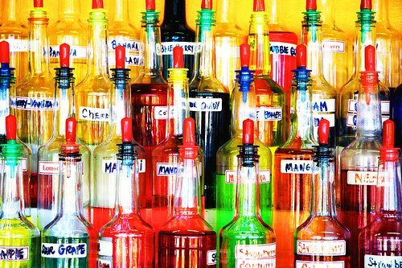

Among the many variables that contribute to the taste of specialty coffees, flavorings are perhaps the most controversial. Many companies offer beans that have been pre-flavored – rendering many of the original attributes of the beans indistinguishable from the added flavors. When you purchase pre-flavored coffees you cannot be sure that underneath it all, you have actually received the best beans available.

Our philosophy and our recommendation are that if you desire to flavor your coffee, you should do so with the many quality syrups that are available. Add these syrups -such as vanilla, chocolate, mint, and others, after the coffee has been brewed and poured into the cup. Pre-flavored coffee is made with potent oils, which will permanently stain your coffee maker.

You may find though, that these syrups are not available in quantities suitable for home use. Another alternative we would suggest is the use of natural spices and fruits. Cinnamon, nutmeg, nuts, and even orange zest can be ground with the beans before brewing. Begin with minute amounts and then, after trial and error, increase the amounts incrementally if needed.

  
*Photo of flavor syrups by Keo 101 (inactive Flickr user)*

However you flavor your coffee, do so gently so as not to overwhelm the subtle characteristics that originally appealed to you. Recognize as well that not all beans tolerate all flavors. Central American coffees, for example, are generally well balanced and amenable to most added flavorings. Heavier Indonesian coffees and others work best with stronger flavorings like chocolate or liquors. Again, be respectful of the beans you buy; don’t drown them in syrups and spices.

### Resources

[Naturally Flavored Coffee](http://ineedcoffee.com/naturally-flavored-coffee/) – INeedCoffee article on natural ways to flavor your coffee.

[Coffee Brewing Guide](http://ineedcoffee.com/coffee-brewing-guide/) – Our collection of coffee brewing tutorials.