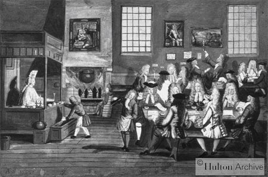
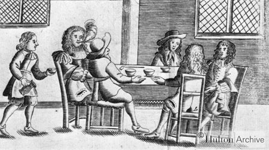
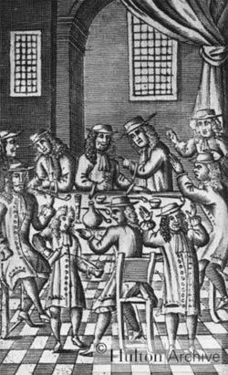

### The era of English coffeehouses

For almost 100 years, coffee was the hot beverage of choice in England, and, unlike the English family’s tea of the last 200 years, it was not consumed at the breakfast table or indeed at any other time or place in the home. Instead, from about the mid-1600s through the mid-1700s, men (and just about all pictures from the period show only men in coffeehouses) drank their coffee in London’s coffeehouses while they transacted business, discussed politics and shared literary works in progress. By 1700, there were probably over 2000 coffeehouses in London or one for every 300 inhabitants.

The diary of Samuel Pepys (1633-1701), which reveals so much about Restoration London (not to mention intimate details of his own life), also testifies to the importance of its coffeehouses. Even though London’s first coffeehouse did not open until 1652, less than 10 years later, coffeehouses had become the favored social venue for Pepys and other members of the Restoration elite. Indeed, in just the second week of his diary entries (which began in January 1660), Pepys reports meeting friends and discussing politics in coffee houses. Coffee houses, along with the theater, became an integral part of Restoration London’s social scene. When in 1667, King Charles II’s celebrated mistress, Nell Gwyn, appeared in a comedy entitled *The Coffee-house*, Pepys found the performance sold out. Ten days later, Pepys and his wife were invited to a special performance of the play at the home of the Duke of York, the King’s brother and Lord High Admiral. Pepys reported it to be “the most ridiculous, insipid play that ever I saw in my life.” \[15 October 1667\]

An important official in the bureaucracy of the Royal Navy (thus the connection with the Duke of York), Pepys met frequently at coffee houses to review the Navy’s finances and draw up contracts. He also visited coffee houses to enjoy the company of other movers and shakers (including the poet John Dryden and the composer Henry Purcell \[father of the more famous Purcell\]) and to discuss topics ranging from the war with the Dutch Republic to James Harrington’s political theory to the reproductive systems of insects. On one occasion, he left a coffee house after a long discussion of the booming Restoration economy only to return shortly thereafter with a friend, “and there drunk more till I was almost sick” (23 January 1663)

As Wolfgang Schivelbush has noted, for people to gather over a stimulating rather than intoxicating beverage marked nothing less than a revolution in European foodways. In 1674, an anonymous poet favorably compared coffee with the more traditional English beverage of choice:

> *When foggy Ale, leavying up mighty trains  
> Of muddy vapours, had beseig’d our Brains,  
> Then Heaven in Pity . . .  
> First sent amongst us this All-healing Berry (quoted in Schivelbush, 34)*

Not everyone agreed that coffee was a blessing for England. Because, at this time, nearly all coffee was imported from the Ottoman Empire, some saw the coffee bean as a “Mahometan berry” that would undermine not only traditional English ale but also Christian values. One pamphleteer argued that the coffee craze was damaging the English economy by lowering demand for grain, the chief ingredient of ale and beer. He also complained that too many shopkeepers and tradesmen were neglecting their businesses for coffee shops, “where, meeting friends, they have sat talking three or four hours, after which, a fresh acquaintance appearing, and so one after another all day long, hath begotten fresh discourse, so that frequently they have staid five or six hours together.” In 1674, some London wives echoed this concern in a petition that complained of the hours that husbands wasted in coffee houses. In addition, they warned, coffee caused impotence and “made men as unfruitful as the deserts whence that unhappy berry is said to be brought.” \[quoted in Shelley\]

A 1673 pamphlet entitled *The Character of a Coffee-House* compared the appearance and flavor of coffee to “Pluto’s diet-drink, that witches tipple out of dead men’s skulls.” The typical coffeehouse, the author alleged, “stinks of tobacco worse than hell of brimstone.” \[The pictures below invariably show the patrons of coffee houses with tobacco pipes.\] The beverage itself was served in filthy pots and dishes, the landlord only occasionally “scraping off the contracted soot”, which he then simply substituted for ground coffee, “their taste and virtue being so near of kin, he dares defy the veriest coffee-critic to distinguish them.” Above all, the author condemned coffee houses as dens of subversion, where the social classes promiscuously mingled and spread the rumors published in gazettes and pamphlets, where “every little fellow in a camlet \[a kind of outerwear\] takes upon him to transpose affairs both in church and state, to shew reasons against acts of parliament, and condemn the decrees of general councils.”

It was precisely such fears that led the government to suppress coffee houses by royal proclamation in 1675. However, the suppression seems not to have been enforced because the number of coffeehouses continued to grow over the 1670s and 80s.

Of course, coffee houses had their defenders as well as critics. *Coffee-Houses Vindicated* (1675), served as a brief for the defense against *The Character of a Coffee-House*. Far from being unhealthy, the author asserted, coffee serves as an “incomparable remedy to dissolve crudities, comfort the brain, and dry up ill humors in the stomach.” It can prevent or cure “all cold drowsy rheumatic distempers whatsoever, that proceed from excess of moisture,” which excess, of course, can hardly be avoided in England. And although, the author acknowledged, Englishmen might at first find the taste strange, “this drink has nothing in it of nauseousness, nor any taste but what, familiarised by a little use, will become pleasant and delightful.” It was also more economical to visit a coffeehouse than an alehouse. At the latter, the proprietor pressured the customer to keep paying for pots of ale, whereas in the coffeehouse, “for a penny or two, you may spend two or three hours, have the shelter of a house, the warmth of a fire, the diversion of company . . . and all this without any grumbling or repining.”

Just as the author of *The Character of a Coffee-House* focused above all on coffee’s potential to subvert the government, family, and industry, so his protagonist responded by praising the social virtues of the coffee house, as opposed to the tavern or alehouse: “Where can young gentlemen, or shop-keepers, more innocently and advantageously spend an hour or two in the evening, than at a coffee-house? Where they shall be sure to meet company, and, by the custom of the house, not such as at other places, stingy and reserved to themselves, but free and communicative…”

He also rejected his opponent’s depiction of coffee house patrons as idle and coarse. Rather, he argued, the coffee house had already raised the level of public discourse: “as you have here the most civil, so it is, generally, the most intelligent society; the frequenting whose converse, and observing their discourses and deportment, cannot but civilize our manners, enlarge our understandings, refine our language, teach us a generous confidence and handsome mode of address…”

This defense of the coffee house celebrates new “middle-class” virtues of sobriety and refined sociability. It also argues for the unique compatibility of coffee with the booming commercial economy of Restoration London. Here too, the author asserts the advantages of the coffee house over the tavern. Virtually all business negotiations, he noted, seemed to be conducted “at some public house.” It can be disastrous for businessmen to conclude contracts “at taverns or alehouses, where continual sippings, though never so warily, would be apt to fly up into their brains and render them drowsy and indisposed for business.” “A dish or two of coffee”, by contrast, is “so far from causing, that it cures any dizziness or disturbant fumes.” Thus, the businessmen “dispatching their business, go out more sprightly about their affairs than before…”

The link between coffee and business became even stronger than the author could have imagined. The famous essayist Richard Steele (1672-1729), the editor of *The Tatler*, listed its business address as the Grecian coffee house. In the late 1600s, a coffee house owned by one Edward Lloyd became a meeting place for merchants, ship owners, ship captains, insurance brokers, and others involved in overseas trade. Because so many of his customers came to hear the latest business news, Mr. Lloyd began publishing the news in his own periodical. Soon, he was making more from his newsletter than from his coffee. Insurance brokers, in particular, found his services so useful that they began meeting their clients at his coffee house, and soon they were renting booths in his shop. Even after Edward Lloyd’s death in 1713, insurance brokers continued to meet at the coffee house. By 1774, Lloyd’s had become a corporation owned by brokers and underwriters and had moved its quarters to the Royal Exchange.

By then, of course, tea had begun to supplant coffee. For a crucial century, though, the growth of England’s commerce and the emergence of a large, politically aware middle class in London are intimately connected with coffee and coffee houses.

### Sources

*The Character of a Coffee-House* (1673), in *Coffee-Houses Vindicated* (1675), in Edward Potts Cheyney, *Readings in English History* (1908) and in Paul Halsall, *Internet Modern History Sourcebook* www.fordham.edu/halsall/mod/modsbook.html (site down December 2014).

Lloyd’s, “Historical overview” and “Brief history and chronology” www.lloyds.com

Thomas Babington Macaulay, *The History of England from the Accession of James II*, Vol. 1, chapter III

Samuel Pepys, *Diary*, The Project Gutenberg Etext of Diary of Samuel Pepys, produced by David Widger

Henry C. Shelley, *Inns and Taverns of Old London* (1909) Project Gutenberg’s Inns and Taverns of Old London, by Henry C. Shelley

Wolfgang Schivelbush, *Tastes of Paradise: A Social History of Spices, Stimulants, and Intoxicants* (1980; English translation 1992)
