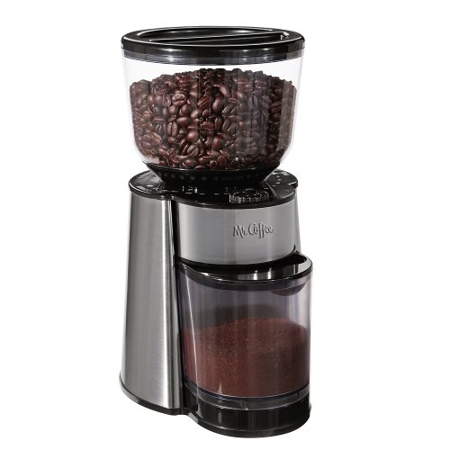
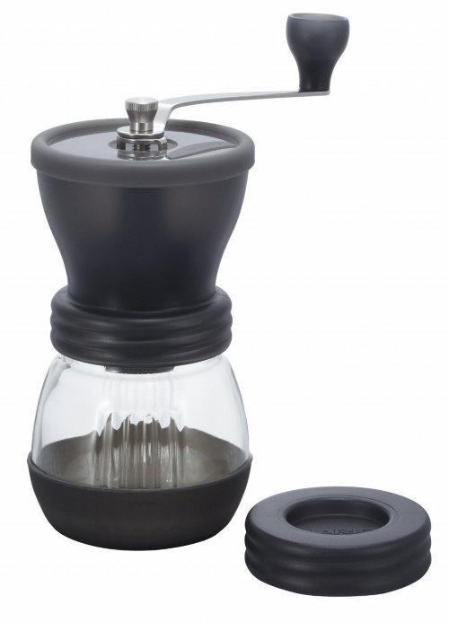
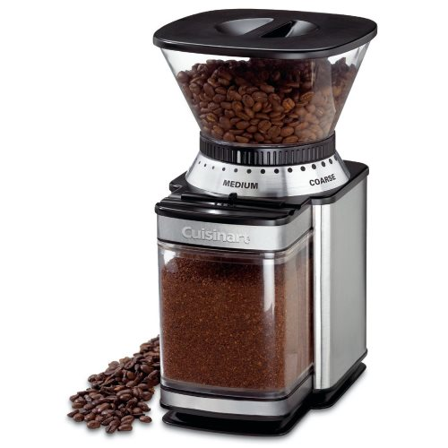
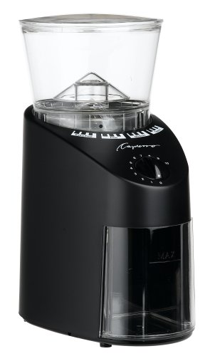

Is it possible to get a good coffee grinder for under $100?

Not a great coffee grinder, but one that is just good enough to get the task done and not fall apart after a few months of use. I think it can be done. Going from purchasing pre-ground coffee to grinding your own coffee is going to elevate the quality of your home-brewed coffee tremendously. Buying a coffee grinder is well worth the investment.

This collection of recommended coffee grinders is for the budget coffee drinker who is not yet ready to commit to a more expensive model.

### Blade vs Burr Coffee Grinders

Before we break down the best coffee grinder options, I need to cover the two different types of budget grinders.

1.  **Blade grinders are also known as spice grinders.** The beans are aggressively and unevenly chopped in the top chamber. How long you hold the button down determines the grind size. It is very inexact.
2.  **Burr Grinders are also known as burr mills.** Unlike the blade grinder, the coffee beans do not enter and exit from the same chamber. Burr grinders use two revolving abrasive surfaces to reduce the size of the coffee bean as they pass. The size is determined by how far apart these two surfaces are. The beans enter the burr, are ground, and once the proper size, the grounds exit the grinder.

Blade grinders cost around $20 USD. Burr grinders start around $25 and can go into the thousands for a high-end commercial grinder.

### The Problem With Blade Grinders

Many coffee drinkers buy a blade coffee grinder when they first begin grinding their coffee at home. Some coffee beans will be broken into larger chunks, some into smaller chunks, and some pulverized into coffee dust.

**You do not want a blade coffee grinder.** When you go to brew your coffee, the larger pieces will be under-extracted and the smaller pieces over-extracted. This can result in a bitter coffee and if you do your best to avoid grinding too small, you risk having a weaker coffee. In many cases, preground coffee from a commercial grinder is going to be better than a blade grinder. It is a trade-off between freshness and proper extraction.

Another issue with Blade Grinders is that in some households it does double duty as a spice grinder. This means unless you really clean the grinder thoroughly, you could get some unpleasant flavors the next time you brew. Do you really want to do a spit take of cardamon at 6 AM?

### Hand Coffee Grinders

Many hand coffee grinders are priced about the same or a little higher than blade coffee grinders. They do a better job than blade coffee grinders. The bad news is you have to grind the coffee yourself. Your own muscle power. It isn’t hard to grind your own beans with a hand grinder, but it does take time and can be tedious. Most people I’ve talked to hate it at first, but after a week they don’t even think about it.

I like hand coffee grinders for the office or for traveling. However, first thing in the morning, I prefer the convenience of electricity.

I think hand coffee grinders are fine for making one cup at a time, but if I were making a full pot of coffee daily (or a few times daily), I’d advise getting an electric burr grinder.

### The Best Coffee Coffee Grinders Under $100

#### \[$30 – $40: Mr. Coffee Automatic Burr Mill Grinder\]

If you really want to go budget on an electric burr grinder, there is the classic Mr. Coffee Burr Grinder. It does an admirable job with medium and coarse grinds but fails at the finer grinds. However, if you are comfortable with pulling apart appliances, the Mr. Coffee can be modified to grind for espresso. See the tutorial [Adjusting the Mr. Coffee Burr Mill for Espresso Grind](/adjustable-mr-coffee-burr-mill/) for more details.

The Mr. Coffee Burr Mill grinder doesn’t have a reputation for lasting a long time, but given the price point, that is to be expected. This would be a good first grinder for someone very tight on money. A word of warning: these devices can be loud.

*Mr. Coffee Automatic Burr Mill Grinder  
*

#### \[$35: Hario Skerton Ceramic Coffee Mill\]

Hario makes a lot of great coffee equipment, and their hand burr grinder is no exception. The Hario Skerton is the gold standard for hand burr coffee grinders. I’ve seen many other knock-off hand grinders enter and exit the market, but not the Hario. And although it might be a little inconsistent for French Press, it can handle most brewing methods like a champ.

Unlike an electric grinder which has settings, you will be responsible for getting your grind size just right. This will take some time and practice. Be patient and remember it is only $35. If you are frequently switching between brewing methods that require different grind sizes, you may want to buy two and then set the burrs perfectly, and then leave them alone.

*Hario Skerton Ceramic Coffee Mill  
*

#### \[$45-$50: Cuisinart DBM-8 Supreme Grind Automatic Burr Mill\]

At the time of this article, the Cuisinart is the #1 Best Selling Burr Coffee Grinder on Amazon. This makes total sense. With 18 grind settings, it can grind for most brewing methods.

The Cuisinart is known for excelling at coarser grinds, so if French Press is your go-to brewing method, this might be the right grinder for you. Cleaning this grinder regularly is advised to prevent jamming and extend the appliance’s life.

The Cuisinart also comes with an impressive 18-month warranty.

*Cuisinart DBM-8 Supreme Grind Automatic Burr Mill  
*

### \[$100: Capresso Infinity Burr Grinder\]

The Capresso Infinity Burr Grinder is technically $99.95, so it is still under $100. The Infinity has 16 grind settings: 4 each for extra-fine, fine, regular, and coarse. The Infinity is the most sturdy of the sub $100 burr grinders on this list.

There are reports of the grinder jamming with darker roasts when ground fine or extra-fine, but this is the best-built coffee grinder under $100.

*Capresso 560.01 Infinity Conical Burr*

### Beyond $100

What do you get when you spend more than $100 on a coffee grinder? A few things.

-   More consistent grind sizes when coarse.
-   The ability to grind fine enough for espresso or Turkish coffee.
-   It is better built and will usually last longer.

### Which Budget Coffee Grinder is Best?

If you make just a cup or two at a time and don’t mind spending a minute or two hand-grinding, get the Hario Skerton. It is also the best choice for traveling, camping, and kitchens short on extra electrical outlets.

If money is tight, go with the Mr. Coffee Burr Mill, especially if it is on sale.

The Cuisinart DBM-8 Supreme Grind Automatic Burr Mill is a good grinder at an excellent price. It has a long track record, too. If you prefer to be closer to $50 this is your best burr grinder.

Capresso Infinity Conical Burr is sturdy and makes less noise than many other grinders. It will likely outlast the other electric grinders on this list.

The Capresso Infinity Conical Burr is the most sturdy of the bunch, makes less noise, and will produce the most consistent grind. If you have $100, get the Infinity.

### Resources

[Coffee Grind Chart](/coffee-grind-chart/)—Once you have your grinder, this article will help you find the right grind size.

[Ground Rules for Grinding Coffee](/ground-rules-for-grinding-coffee/) – Some tips on operating a coffee grinder.

*Prices for this article were collected in December 2017 and are in US Dollars.*
