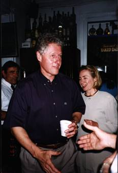
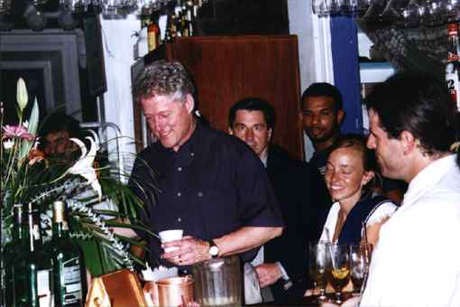
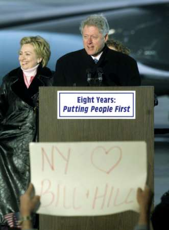

On the weekend of the U.S. presidential transition, odds are that you have had your fill of Clinton Administration retrospectives. Clinton himself has often seemed obsessed with his historical legacy, while his many detractors have long seemed equally obsessed with making sure that his legacy is a stained one. Although Clinton ran for president as a moderate “New Democrat,” he has always managed to be a polarizing figure, and you have plenty of company if you have an extreme opinion of him as a president or a person.

But love him or hate him, if you are a coffee lover, you have something in common with Clinton; he belongs to our coffee-drinking ranks. This weekend, Caffeine Nation’s most notorious citizen will vacate his home of the last eight years at 1600 Pennsylvania Avenue, Washington, D.C. We at INeedCoffee hope that you can forgive us for adding our retrospective two cents’ worth — it may be a somewhat restricted perspective through which we review Clinton’s presidency, but there is plenty of coffee-related material for us to work with.

  
*Bill Clinton with a cup of coffee.*

### Maxwell White House

The departure of a president causes a bureaucratic exodus of sorts, as out with the president go numerous executive appointees, advisers, and other White House personnel. While some Clinton underlings have stayed aboard through the eleventh hour, others have long since moved on to other lines of work.

Among those long gone is George Stephanopoulos, who joined the Clinton campaign at the age of 30 in 1991, and served as White House Communications Director and Special Assistant to the President after Clinton’s election. Stephanopoulos chronicled the thrills and agonies of working for the Clinton campaign and White House staff in his autobiographical **All Too Human**. The book is rife with references to coffee, as Stephanopoulos is a Coffee Achiever in his own right, by his own admission scarcely able to function in the morning until the second cup of coffee. Perhaps this is why he had a keen eye for the coffee-drinking habits of Clinton, saying:

> I knew the President’s morning routine as well as I knew my own. After stretching on the patio, Clinton would walk through the pantry for a bottle of water and a cup of coffee, then cool down by puttering around his desk or flipping through the newspapers on \[secretary\] Betty\[ Currie\]’s credenza.

Few journalists have Washington insider credentials that can rival those of Bob Woodward, who with his tag-team partner Carl Bernstein was primarily responsible for exposing the Watergate-related corruption of the Richard Nixon administration in the early 1970s. Woodward’s 1994 book **The Agenda** is an often unflattering look at the 1992 Clinton campaign and the early days of the Clinton White House, during which the President, First Lady, and White House staff receive rude awakenings as to the realities of unleashing their budgetary agenda on a resistant Washington establishment. When Clinton wants to call a few exclusive advisers to a strategy meeting, he chooses the solarium as the location, described in the following passage from **The Agenda**:

> The meeting was to be held in the White House solarium, a sun parlor or summer room with bays of glass windows on three sides, perched on top of the White House. Calvin Coolidge’s wife had called a smaller version of the room the “sky parlor,” and President Nixon had called it the California Room. During the 1992 transition, President Reagan had told Clinton that the solarium was his favorite White House room. He had recovered there from his bullet wound after the 1981 assassination attempt, Reagan had explained. For Clinton and his longtime advisers, the room most resembled the informality of the basement of the Arkansas Governor’s Mansion. A kitchenette and a large, PTA-sized coffeepot substituted for servants.

The factual Clinton seems to prefer access to a vast coffee reservoir; the fictional Clinton had a similar craving for coffee. I speak, of course, of Jack Staton of the novel Primary Colors. Soon after its publication in 1996, Primary Colors kept the world guessing for months as to the identity of its then-anonymous author, later revealed to be Joe Klein, a frequent writer for the New Yorker. Before Klein confessed to the act, however, it was still obvious that the book was the work of a true insider in the 1992 campaign, and the book, despite its claim to be “a work of fiction and. . . \[n\]one of these events ever happened,” was based in very large part Clinton’s road to victory in the Democratic primary and employs only the slimmest of artistic licenses. Stanton, a charismatic southern governor running in the presidential primary who withstands periodic bimbo eruptions and draft-dodging allegations, is a flimsily disguised Bill Clinton. And like the real-life figure he so resembles, Stanton is a coffee drinker. Observe the following exchange between Stanton and Henry Burton, the book’s narrator, and Stanton’s campaign aide:

> “Henry, they are going to kill me with trash,” Stanton said the next morning, his face blotchy and reddening, about to blow. “We gotta stop this.”

> He looked at me as if it were an assignment: Stop this. Turn back the tide. He looked awful, as if he’d been up all night. He had a cup of coffee in one hand and a doughnut in the other. He inhaled the doughnut. Two bites.

### Coffee With the Constituency

For President Clinton, drinking coffee did not always signify another day at the Oval Office. He often got his coffee to go and had it on the road. Several news reporters saw fit to mention when Clinton ordered coffee during his travels about the United States. While we do not know what caliber of coffee he drank in the White House, the following excerpts from a May 1999 [article](https://web.archive.org/web/20140407130307/http://onlineathens.com/stories/051299/new_0512990009.shtml) by Russ Bynum of the Associated Press are evidence that Clinton had at least the occasional taste for the gourmet.

> ATLANTA — The downtown market where President Clinton sampled gourmet coffee and sweet-potato cheesecake Tuesday had a hard time five years ago attracting anyone but vagrants with its grimy floors, leaky plumbing and nasty stench…

> Clinton used his brief Atlanta trip to talk about a new package of economic incentives aimed at luring investors and big businesses to both inner cities and impoverished rural areas. The president perused rows and rows of vendors selling everything from watermelons and bananas to cow’s feet and ox tails. He sipped Cameroon Boyo coffee at the Kaffee Shop and tried a bite of sweet-potato cheesecake at Sonya Jones’ bakery.

> ‘Boy, that’s great,” Clinton said after tasting the dessert.

In the same month as this Atlanta trip, a much more tragic occasion brought Bill and Hillary Clinton to Littleton, Colorado, to offer comfort and solace to the grieving family members of the students who had been killed. A [Denver Post article](https://extras.denverpost.com/news/shot0521d.htm) by Michael Booth describes the Clintons with coffee in hand during these emotional times.

> The president came to the table with nothing more than a cup of coffee and his famous capacity for sympathy, but for the families of Columbine shooting victims, Bill Clinton’s patented bear hug and reflective gaze were welcome consolation.

> President Clinton and first lady Hillary Rodham Clinton spent a few minutes Thursday with each of 12 families of slain Columbine victims, walking from table to table for sit-down chats during a private audience at Light of the World Catholic Church…

> Setting down cups of coffee when arriving at each table, the Clintons signed Columbine memorial books created by a secretary at Bear Creek Elementary School.

  
*President Clinton enjoying a cup of coffee.*

### Grande Jury Testimony

Even the consummate insiders of the Clinton White House seemed frustrated by their inability to completely understand Clinton. Says Woodward:

> Stephanopoulos couldn’t pretend to discern the real Clinton. Clinton was uncomfortable with unanimity of opinion from his advisers, and he often liked contradictory things.

There is one person, however, who could very credibly claim to know Clinton intimately: former White House intern Monica Lewinsky. While lower on the totem pole than most salaried White House employees, Lewinsky seemed well attuned to Clinton’s tastes and cravings. While Lewinsky’s book, Monica’s Story, was not consulted for this article, the report compiled by Independent Counsel Kenneth Starr is a telling and thoroughly researched work that offers further insight on the subject. The following excerpt from the *Starr Report* describes some of Lewinsky’s gifts to her coffee-loving boss.

> When he testified to the grand jury, President Clinton acknowledged giving Monica Lewinsky several gifts, stating that ‘it was a right thing to do to give her gifts back.'(190) He acknowledged giving her gifts on December 28, 1997,(191) just three weeks before the civil deposition. During the criminal investigation, the President has produced seven gifts that Ms. Lewinsky gave him. He testified to the grand jury that Ms. Lewinsky had given him ‘a tie, a coffee cup, a number of other things I had.'(192) In addition, the President acknowledged that ‘there were some things that had been in my possession that I no longer had, I believe.'(193)

### An Ongoing Salute to the Outgoing Chief

Through his presidency and throughout his life, Bill Clinton embodied many of the traits we might associate with a coffee drinker. He has always been a restless, driven, Type-A personality. Astute observers and insiders have given us plenty of evidence of Clinton’s coffee-drinking tendencies and his drive to stay wired, whether on the campaign trail or discussing policy strategy with advisers in a White House room. He will be succeeded by a man who, by all appearances, is far less the busybody type than Bubba Clinton.

The White House, to be certain, will continue to be populated by many java-guzzling subordinates. Still, we at INeedCoffee predict that the aroma of freshly brewed coffee is much less likely to waft through the Oval Office in the upcoming four years. No longer obligated to salute William Jefferson Clinton as the Commander-In-Chief of the U.S. Armed Forces, INeedCoffee instead salutes him for his many lasting credentials as a Coffee Achiever.

  
*President Clinton – Coffee Achiever*