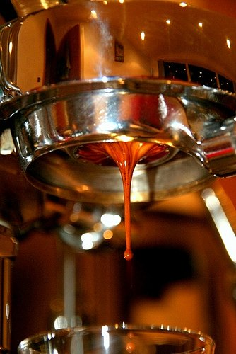

In 2008, a law in Seattle forced restaurants with ten or more outlets to post the calorie, sodium, and carbohydrate count of all the food and drinks on their menu. I stopped at one of these 10+ places and saw that they listed a simple espresso as having five calories. Huh?

For years, I was under the impression that coffee and its younger brother, espresso, had no calories. Well, they did until you started mucking around with them by adding sugar, dairy, and whatnot. It turns out that coffee has trace calories caused by the **natural oils** in the beans.

From the article *How Many Calories in Coffee?* by J. Foster:

> The coffee bean has oils in it (which is why a barista often needs to clean their espresso machine to prevent an oily build up). Sometimes a really bad coffee can be due to the oils in it becoming rancid (this often occurs from dark roasts, which cause a subsequent release of oils – if the beans are stored for a long time the oils may go slightly rancid).

This explanation implies darker roasted coffee and coffee going stale would have more calories than a fresh lighter roast. Interesting.

  
*Photo [Espresso](http://www.flickr.com/photos/33589600@N00/2381294626/) by Flickr user Dave\_1979*

Just how many calories are we talking about? I searched a few sites, and the number of calories for an espresso varied between 1 and 5. A mug of brewed coffee was between 2 and 9 calories. Because I tend to put more authority behind websites with a cleaner design, I will use the numbers over on *CalorieKing*.

> Espresso, unsweetened has 1 calories, 0.1g of fat and 0.0g of carbs in each shot (1 fl.oz).

> Brewed, Percolated has 2 calories, 0.0g of fat and 0.0g of carbs in each serving (6 fl.oz).

Did you notice something odd with those numbers? The oil-rich espresso has 0.1g of fat. Fat has nine calories per gram, which yields a calorie count of 0.9. Round that up to 1.0. That makes sense. However, *CalorieKing* lists brewed coffee as having no fat, yet it has more calories. Digging further into the data, I noticed that brewed coffee has 0.3g of protein. Protein has four calories per gram. This would give the brewed coffee 1.2 calories. That is some conservative rounding. Espresso is listed with no protein.

Lessons learned:

-   Espresso has trace calories from the fat of the coffee oils.
-   Brewed coffee has between 1 and 2 calories from trace amounts of protein.

The good news for calorie counters is that picking up and drinking that beverage will burn off that calorie. So there is no need to put it into your food log. 🙂

### Resources

[In Seattle, Menu Labeling Is “In”, Trans Fat is “Out”](https://www.cspinet.org/new/200707201.html) – News release explaining the Seattle (King County) calorie labeling law.

[How Many Calories in Coffee?](https://healthyeater.com/how_many_calories_in_coffee) – Diet-Blog post by J. Foster.

Espresso, unsweetened Calories – CalorieKing (2023: page was throwing 500 server errors)

Brewed Coffee, unsweetened Calories – CalorieKing (2023: page was throwing 500 server errors)