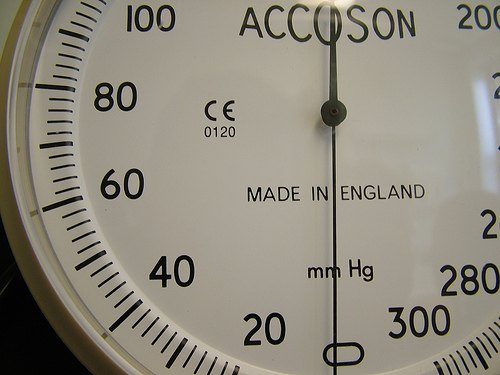

There have been some irresponsible articles written over the years, that assure the reader that drinking coffee will not raise your blood pressure. And if you are interested in lowering blood pressure, you may be one of many that should consider the effects of coffee on blood pressure.

This article will try to be as informative and balanced as possible, though some aspects of this issue are in fact uncertain. None of the information contained in this article should be taken as medical advice. As always, you should consult your doctor regarding any changes you are contemplating in your diet or behavior before delving into an attempt to reduce blood pressure.

### Caffeine and High Blood Pressure

We all know coffee contains caffeine. But what is the relationship between caffeine and blood pressure? We have all heard that caffeine is a stimulant, but what does that really mean? What does a stimulant do in the body at a real-world level? Well, it can cause jitters, nervousness, and yes, high blood pressure – *for some*. But there are so many scenarios and variables to consider. For instance, are you a long-term coffee drinker or an occasional? Are you male or female? Do you have a family history of high blood pressure? Do you already have signs of high blood pressure?

Most studies show the amount of caffeine in two American cups of coffee (about 8 ounces each) *can* raise your systolic blood pressure from 3 to 14 mm Hg and diastolic blood pressure from 4 to 13 mm Hg, at least in the short term. One study does show much lower numbers, but an increase is associated nonetheless.

  
*[Photo](http://www.flickr.com/photos/topgold/1396378277/in/photostream/) by Bernand Goldbach*

### Studies in Coffee and Caffeine

One 12-year study of 155,000 women showed some very interesting results. While drinking caffeinated cola was associated with an increase in blood pressure, drinking coffee did not produce the same results. The study went on to suggest that those women who drank caffeinated coffee actually may have had a *reduced* risk of high blood pressure.

We do know that, in general, those who don’t normally consume caffeine usually have a sharp temporary rise in blood pressure shortly after consuming caffeine. How this happens could be from one or more causes. One common view is that caffeine narrows the blood vessels by blocking the hormone that normally keeps them open – adenosine. Caffeine can also stimulate cortisol and adrenaline to be released, which can cause a direct increase in blood pressure.

However, some recent research would suggest that long-term, regular coffee drinkers actually develop a tolerance to caffeine, and their blood pressure is not increased substantially over the long term, though this seems to be a minority view.

### Caffeine Intake

Some doctors recommend against caffeine just before physical activity, which already raises your blood pressure naturally. Some doctors also suggest limiting caffeine intake to about 150-200 milligrams per day. See this chart for some coffee drinks (and other caffeinated beverages) and their corresponding caffeine content:

8 oz. of Drip Coffee

110-180 mg

8 oz. of Brewed Coffee

75-140 mg

2 oz. of Espresso

100 mg

8 oz. of Iced Tea

50 mg

8 oz. of Brewed Tea

40-60 mg

8 oz. of Green Tea

15 mg

8 oz. of Hot Cocoa

15 mg

8 oz. of Red Bull

80 mg

12 oz. of Jolt Cola

70 mg

12 oz. of Pepsi Cola

40 mg

12 oz. of Coca Cola Classic

35 mg

### Not Just Blood Pressure

According to a 1999 Duke University Medical Center study of 72 regular coffee drinkers, those who drink four to five cups of coffee throughout the morning, not only have elevated blood pressure but also higher levels of two stress hormones – adrenaline and noradrenaline – lasting all day and into the evening. The body thinks that it is under stress the entire time. Both adrenaline and noradrenaline are useful for making decisions in times of stress but can be harmful to the heart if elevated over a long period of time. It can also weaken the immune system, and damage blood vessels.

### Conclusion

The evidence is mounting that caffeine and coffee do increase blood pressure. It seems what is up for debate is how much. If you want to lower blood pressure, reducing or eliminating coffee and caffeine can be a step that you and your doctor can discuss. If you have a caffeine addiction, also consult your doctor, as the cold turkey approach may not be good for all.

### Resources

[Does Coffee Raise Blood Pressure?](http://ineedcoffee.com/does-coffee-raise-blood-pressure/) – Another view on the relationship between coffee and blood pressure.

[Accelerated Caffeine Detox](http://ineedcoffee.com/accelerated-caffeine-detox/) – INeedCoffee article.