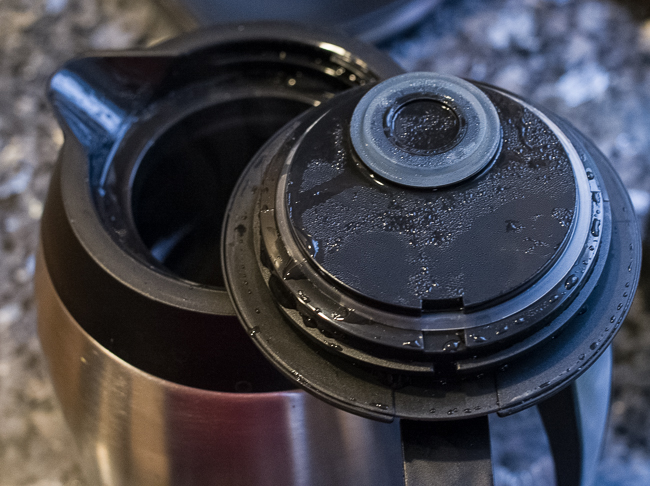
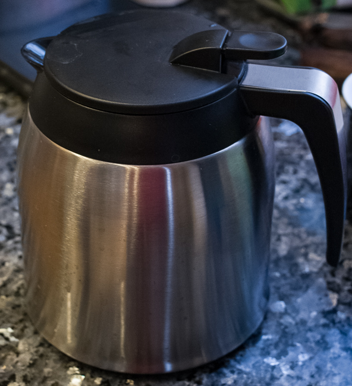
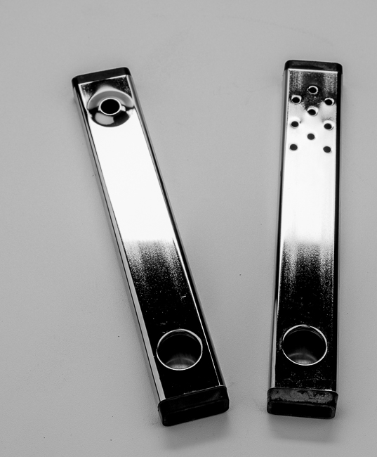
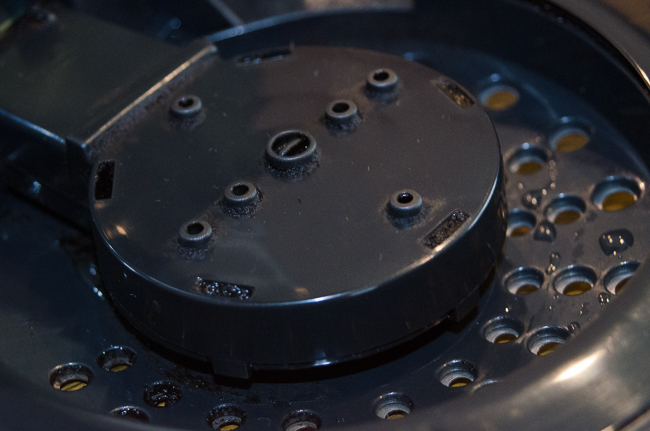
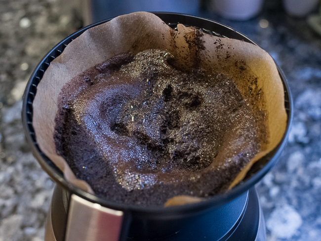
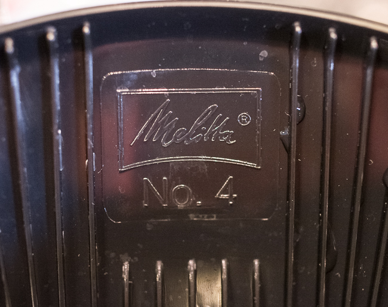
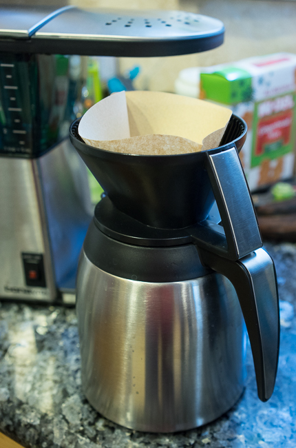
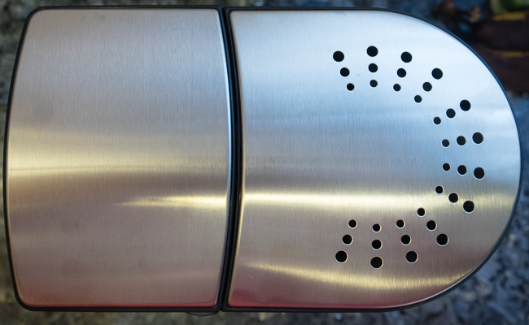
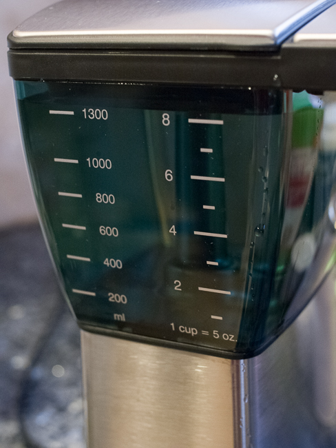
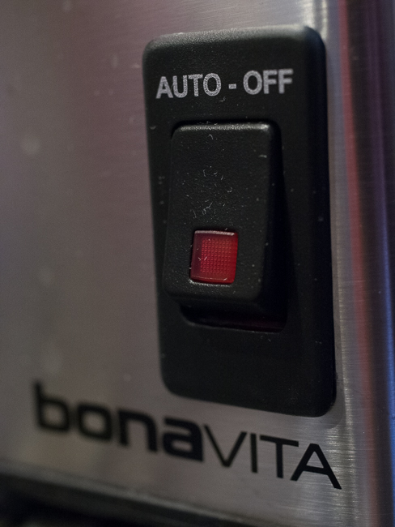

For a long time, the Technivorm Coffee Maker reigned pretty much king for the coffee geek who wanted a semi-automatic drip brewer. It brewed at the right temp for the right amount of time, had even saturation of the grounds, a thermal carafe, and was built like a tank. It was made in the Netherlands, and it was expensive. Like almost $300 USD expensive.

I owned a Technivorm Moccamaster Thermal for a few years and ended up getting rid of it in favor of something that was plumbed in, the Newco OCS-8, which I still have to this day. The Newco was one of the only other SCAA-approved brewers at the time. In any case, I no longer have the Technivorm to compare to the Bonavita side by side, but I have many years of fond memories and delicious cups of coffee.

Not too long ago, Bonavita came out with a very similar brewer, at roughly half the price. Many called it the “Technivorm Killer”. So at approximately $150, can the Bonavita Coffee Maker stand up to the $300 Technivorm?

***NOTE:** Both Bonavita and Technivorm make hot plate models with glass carafes, but we aren’t going to cover those. After all, cooking your coffee is almost a white-collar crime, not to mention a huge electricity draw.*

### Build Quality

The Bonavita build quality is definitely not as good as the Technivorm. The Bonavita feels a little cheap and plasticky in places, whereas the Technivorm is very solid with an all-aluminum body. Most differences are cosmetic, but the one internal difference is the copper heating element of the Technivorm, which presumably heats the water more efficiently and may last longer. As you will see below, it doesn’t seem to affect the temperature, so take it with a grain of salt. The Technivorm is produced in the Netherlands and designed by a Dutch company. The Bonavita is produced in China and designed by a German company.

### Thermal Carafe

The Bonavita 1.25 liter stainless carafe is glass-lined, holds temps really well, and the pour spout doesn’t drip much at all. The carafe has a lid that seals pretty well. However, you need to remove the lid to place the cone filter basket for brewing, and then remove the filter basket and put the lid back on. Kind of a pain. To pour, you must press a nicely placed lever.

***NOTE:** Bonavita does sell a model that is not glass-lined but looks almost identical. Make sure you get model BV1800TH, which has a glass-lined carafe.*

The Technivorm 1.25 liter stainless carafe does not require levers or unscrewing to pour. You just pour. However, it was not the best. I ditched it for 2 reasons: It gave off a distinct metal taste, and the pour spout dripped like crazy. I understand some of the included carafes are better now. I replaced the stock carafe with a Zojirushi Thermal Carafe and fashioned a little platform to raise the entire brewer up enough for the Zoj to fit under and activate the safety switch. Unfortunately, you cannot do this with the Bonavita, but I don’t think you will want to; it’s plenty good. If you are using the 1 liter Zojirushi, make sure you reduce the amount of water in the tank. Otherwise, it will overfill!

### Showerhead

The Bonavita showerhead has an interesting array of spray holes, and the saturation is good and even. But cleaning it can be a bit of a pain, as grounds eventually get embedded in all of the little crevices. It’s not bad, but it can take a little extra scrubbing and rinsing.

The Technivorm comes with a “bar” style shower head that saturates well, though not as good as the Bonavita. But because of the open design, you can stir all you want during brewing. When I got mine, it came with a showerhead that had just one hole, but they offered an upgraded showerhead with multiple holes, which I immediately purchased and used for the life of the machine. The multi-hole showerhead made the need to stir the grounds much less critical, but sometimes you do need to get in there and stir. Cleaning is really easy, as the small metal bar just lifts off, and there are no crevices to worry about. I understand now that the multi-hole showerhead is standard. I was able to find both Technivorm showerheads in a box somewhere, as shown in the photo below. I can only guess I bought spares.

### Brew Basket

The Bonavita brew basket is actually Melitta branded and accepts #4 cone filters. On the Bonavita closed design, if you want to get in there to stir the grounds during brewing, you can’t, as the design just doesn’t allow for it. Because of the more closed design, it also has vent holes to allow steam to escape, rather than collecting and going right back into the grounds. I’m not sure how much this matters in the final result, but it is nice to know they thought of that.

The Technivorm brew basket accepts #4 cone filters. The Technivorm is an open design with no top and has a cool little mechanical slider that can restrict the flow out of the bottom of the filter basket to be completely closed, half-open, or full. If you want, you can keep it closed at the start of the brew for 30-60 seconds, then move it to halfway for another 30-60 seconds, and then fully open for the remainder of the cycle. This really caters to the person who wants to stand there and tinker. I always left it full open and never used that feature, but it is worth noting for the nerds out there.

### Water Tank

Not much to say here. They both have see-thru water tanks with markings and simple lids. Just fill them with water and go.

### Power Switch & Brew Cycle

They both have power buttons and when pressed, they both begin brewing within about 30-60 seconds. The Bonavita soft switch will shut off the machine automatically after 15 minutes, and although the Technivorm will stop the heating elements from consuming power after the cycle is complete, you need to shut off the hard switch manually for it to be truly off.

The Technivorm has a clever little electro-mechanical safety switch that will stop brewing if the carafe is not in the right place, located down near the base. If using a 3rd party carafe, you may need to fashion a little something (like a little piece of foam, etc.) around the base of the carafe, so that it properly engages the switch.

### Brew Temperature

Neither of these units has a way to control the temperature. I have some old data from the Technivorm, and the water temps measured directly in the basket were right around 200F-202F (93C-94C). The Bonavita measures right around 201F-202F (94C). These are in line with SCAA standards, result in a great cup, and are one less thing for you to worry about.

### Brew Time

The brew time of both the Bonavita and Technivorm is right around 6 minutes for a full cycle, which is in line with SCAA standards. Again, one less thing to futz with.

### Taste

Because I no longer own the Technivorm, I could not do a side-by-side taste test, but you don’t forget years of drinking coffee from a single machine too easily. Both produced excellently and dare I say, comparable cups. The only thing you need to do is [dial in the grind](/coffee-grind-chart/ "Coffee Grind Chart"); everything else is common sense: good water, freshly roasted beans, and a pre-heated carafe.

### Misc

Both of these brewers are SCAA-approved.

Both of these machines are kept simple and are not uber-geeky models like the Brazen Brewer by Behmor, where you can adjust and even calibrate temps for elevation. There is something refreshing about simplicity done right.

### Some Differences to Consider

-   The Bonavita is half the cost of the Technivorm ($150 vs $300).
-   The Bonavita has a semi-closed brewing system, which means more work in day-to-day usage, longer cleaning, and an inability to see or stir the grounds during brewing.
-   The Technivorm’s open design allows seeing and stirring the grounds, as well as flow control. Geeks rejoice!
-   The Technivorm’s showerhead is easier to clean than the Bonavita.
-   The Bonavita has a far better carafe right out of the box. You may want a 3rd party carafe for the Technivorm to get similar performance.
-   The Technivorm is made in the Netherlands (Holland), and the Bonavita in China; if that kind of thing matters to you.
-   The Technivorm offers a 5-year warranty, while the Bonavita has a 2-year warranty.

If I was just dipping my toe into the world of better coffee, I would recommend that someone start with the Bonavita. I think it accomplishes nearly the same result as the Technivorm at half the price. However, I would suggest that for those who appreciate great build quality, a long warranty, or the ability to tinker, the Technivorm is a better choice, assuming the budget allows for it (and the 3rd party carafe you will probably want to buy).
