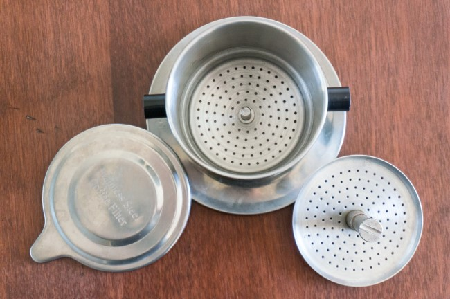
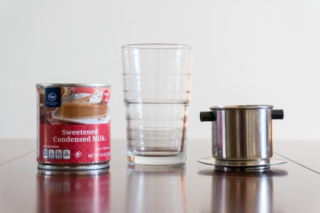
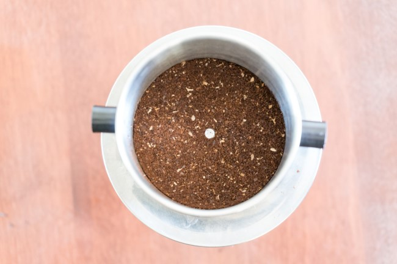
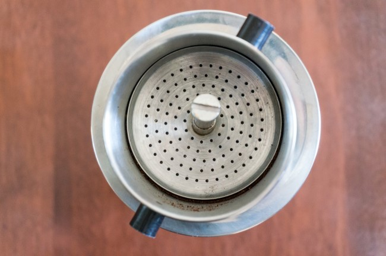
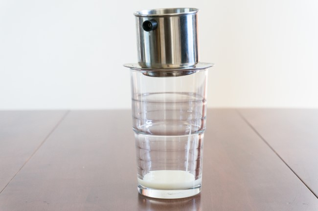
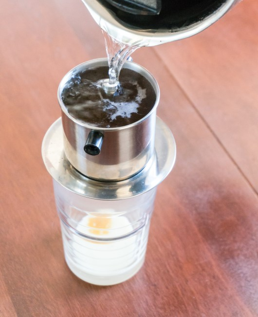
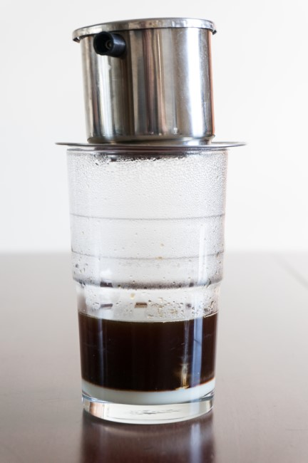
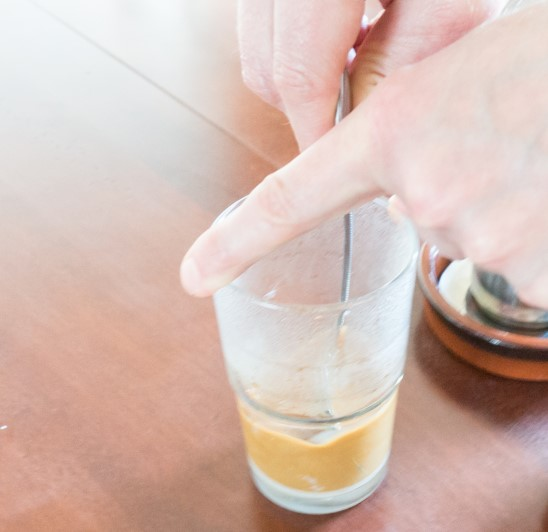
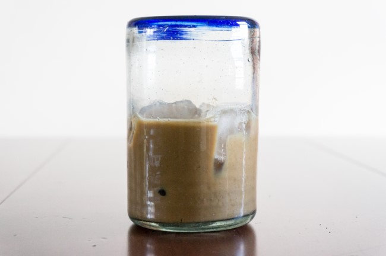

Vietnamese-style iced coffee (*ca phe sua da* or *cà phê sữa đá*) is super easy to make. All you need is a stainless steel filter, which costs around $7 USD online. If you live in a city with a Vietnamese grocery store, you will likely find them even cheaper.

Vietnamese coffee can be served hot, but we will brew an iced coffee that is both strong and sweet for this tutorial.

Although it is traditional to use dark-roasted coffee for this drink, I discovered it is perfectly fine to use a medium roast. However, light-roasted coffees should be avoided, as they tend to be overpowered by the sweetness of the condensed milk.

### What You’ll Need

-   Vietnamese Coffee Filter
-   Ground coffee
-   Sweetened Condensed Milk
-   Spoon
-   Glass or mug
-   Ice
-   (optional) fish sauce and a toothpick

*Vietnamese Coffee Filter Set*

### #1 Add Condensed Milk to Glass

You don’t need much, as condensed milk is very sweet. Start with just enough to cover the bottom, maybe 1/3 of an inch (~1 cm). You can always add more condensed milk later. Don’t add the ice yet. That is the last step.

### #2 Remove the Top Screen of the Filter

The coffee will go underneath the top screen, so remove it before adding coffee.

### #3 Add Ground Coffee to Filter

Add one rounded tablespoon of ground coffee. There are various opinions on the best grind level. Everything from French press coarse to espresso fine. How tight the filter is screwed on will also play a role. A medium grind is a good place to start.

Some variations of this recipe use chicory. This is optional. You could use a coffee such as Cafe du Monde, which has chicory in it, or you could add it yourself. If you mix in chicory yourself, you don’t need more than 1/2 a teaspoon.

### #4 Cover with Top Filter

Screw the top filter until it is snug. You may need to go a little tighter if you decide to use a coarse grind. More on that below.

### #5 Set Brewer Over Glass with Stand

The advantage of brewing in a glass instead of a mug is you can watch the brewing take place.

### #6 Add Hot Water

Fill the Vietnamese Coffee Filter with hot water. I usually boil the water and then let it cool for about 30 seconds before pouring it.

The water should take between 4 and 5 minutes to pass through the filter. You can tighten the top filter or use a less coarse grind if it goes too fast. If it goes too slow, either the grind is too fine or the filter is screwed in too tight.

There is also a lid you can place on top of the filter. I don’t use it. I prefer to monitor the progress of the brew so I know if I need to adjust the grind or the tightness of the top filter.

### #7 Wait for Brew to Complete

This is the easiest part. Just wait for the water to pass through the filter. For the first few brews, use a timer. The coffee will drip through the filter. Aim for between 4 and 5 minutes. See the advice in Step #6 if you are outside that range.

Notice how the coffee layers on top of the condensed milk.

### #8 Mix the Coffee and Condensed Milk

Stir the condensed milk into the brewed coffee. Some recipes call for adding additional sugar. I found the drink sweet enough, but let your palate be your judge.

### #9 (optional) Add Fish Sauce

Some places in Vietnam will soak the end of a toothpick with fish sauce and stir it into the coffee. I believe the reason for doing this is that a small amount of salt or salty flavor has been known to cut the bitterness. Darker roasted coffee, especially French Roast, tends to be more bitter. So by adding just a tiny amount of fish sauce, which happens to be salty, the heavily roasted coffee can taste smoother. If your coffee is not a dark roast, I would skip this step.

### #10 Serve With Ice

Mix the ice into the drink and enjoy!

### Resources

[Vietnamese Iced Coffee Brewing Tutorial by Inanimate Objects](http://ineedcoffee.com/vietnamese-iced-coffee-brewing-tutorial-by-inanimate-objects/) – Comic version of this tutorial.

[Condensed Milk](https://en.wikipedia.org/wiki/Condensed_milk) – A Wikipedia page describing how condensed milk is made using steam and sugar so it remains shelf-stable for years.

[Vietnamese Iced Coffee](https://en.wikipedia.org/wiki/Vietnamese_iced_coffee) – Wikipedia page.

*Title Photo by [Lee Aik Soon](https://unsplash.com/@aiksooon).*

*Brewing photos by Joseph Robertson of Extracted Magazine, a digital coffee magazine published for iOS and Android.  
*