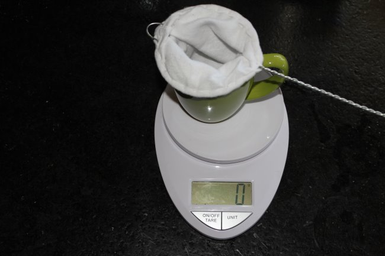
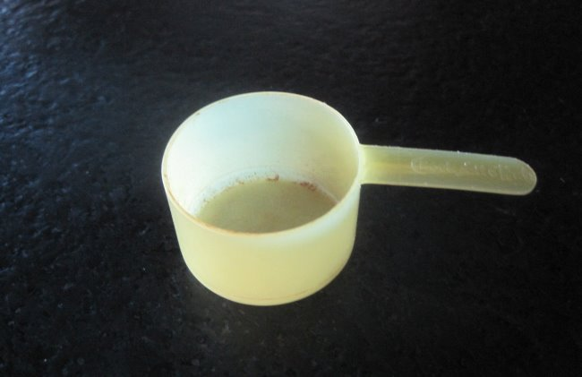
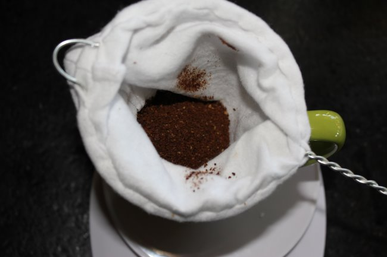
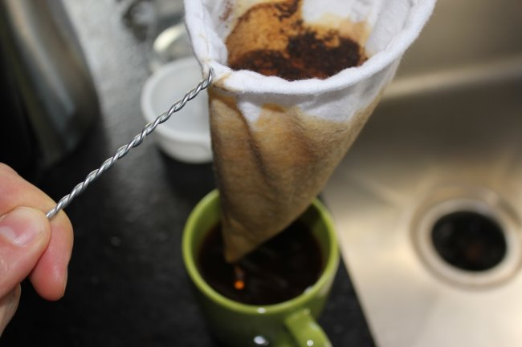
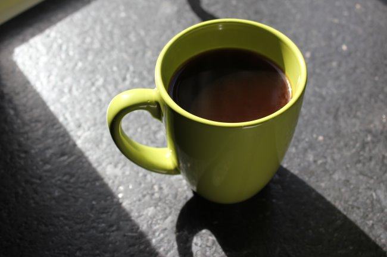

I received what has to be the most simple coffee brewing method I’ve ever seen. It is a sock attached to a wire. Not just any sock, though. The Coffee Sock is a tightly knitted sock perfect for coffee brewing.

I don’t go camping, but if I did, this would be an ideal brewing method for someone wishing to keep their pack weight down. You don’t need to step outside to use the brewer. I’ve been brewing with it in my kitchen.

The coffee tasted closest to the [Clever Dripper](/clever-coffee-dripper-review/) or a cleaner [French press](/press-pot-tutorial/).

### #1 Place Coffee Sock into Mug

This brewing method is similar to making loose-leaf tea with an in-mug filter.

*Place the Coffee Sock into the empty mug.*

### #2 Add Ground Coffee

I am getting good results using a [drip ground](/coffee-grind-chart/). My baseline brewing ratio is 17 to 1 (17 grams of water per 1 gram of coffee). Since you will make one mug of coffee at a time, figure out how many ounces or grams your mug holds and do some basic math.

I use a kitchen scale, but you could follow this basic rule.

-   A 12-ounce mug of coffee is 340 grams.
-   Divide 340 by 17, and you get 20 grams of coffee.
-   That little scoop that comes in a can of coffee holds 10 grams.
-   So, two scoops per 12-ounce mug.
-   If you have a 16-ounce mug, add another 1/2 a scoop.
-   If you have an 8-ounce mug, subtract 1/2 a scoop.

*A coffee can scoop holds about 10 grams of coffee.*

*Add ground coffee inside the Coffee Sock.*

### #3 Add Hot Water

Bring water to a boil and let it cool for 10-30 seconds to keep the temperature down. Fill the coffee sock slowly. After adding water, if you notice any clumps of coffee not making contact with it, use a spoon or a chopstick to break them apart. You want all the coffee grounds to make contact with it.

### #4 Wait About 3 Minutes

On the official site, they use a 2-minute brew time. I got better results with a 3-minute brew time. Experiment. Use what works best for you.

### #5 Remove the Sock Filter and Serve

Remove the filter, and the coffee is ready to drink.

*After 3 minutes, lift the Coffee Sock out of the mug.* 

*The coffee is ready!*

### #6 Clean Up

Let the filter cool before emptying the grounds into the trash or compost. Turn it inside out and give it a rinse. Set it aside to dry so it is ready for the next use.

### Resources

Coffee Sock Company – Official site with product FAQ. (UPDATE March 2023: site offline)

[Coffee Brewing Guide](/coffee-brewing-guide/) – INeedCoffee library of coffee brewing tutorials.

*Disclosure: INeedCoffee received a Coffee Sock for this tutorial.*
