If you like coffee, then chances are that you’ll really enjoy Italian coffee (or caffè). There are many different styles, including “espresso” and cappuccino, which are both popular in the United States. All styles are based on espresso. For example, a cappuccino is an espresso with steamed milk and milk foam.

Note that “espresso” is a non-Italian term used in the US. What we call espresso is simply “caffè” in Italy (note the accent on the second syllable). I’ll use the more familiar term “espresso” for this page. Just note that in Italy, the correct term is caffè.

If you want to make “true” espresso, then be prepared to spend several hundred dollars on a high-quality espresso machine as you see in restaurants or cappuccino bars. These machines use high-pressure water to produce the espresso. Home machines, even the $100 models found at Walmart and other places, do not produce enough pressure to create espresso as you find in a coffee bar.

A very reasonable alternative for home use is an “espresso pot”, called a Moka in Italy. The Moka is a simple device that uses steam pressure to force water through a strainer to make espresso. It won’t be exactly like the espresso you find in bars, but it can come close. The espresso pot is an inexpensive alternative to making good caffè.

The method below is the Neapolitan way of making caffè. The foam usually developed from a machine is manufactured by hand in this method. One word of caution before proceeding. A 2-ounce shot of espresso has about the same amount of caffeine as an 8-ounce cup of drip coffee. Don’t get into the habit of pouring 8-ounce cups of espresso throughout the day (unless you want to be wired out all day).

You’ll need the following items to make Italian espresso: good quality espresso (popular Italian brands are Illy and Kimbo), sugar, cold water, an espresso pot, a container in which to mix the espresso, and small cups (preferably ceramic espresso cups).

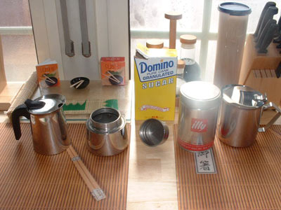  
*This picture shows a disassembled espresso pot, the espresso, sugar, and a stainless steel container (far right).*

Some items on the espresso pot are replaceable. After several months of use, you may have to replace the rubber gasket (pictured on the left) or the entire strainer (right). When emptying the strainer of used coffee grounds, do not bang it. This will dent it and ruin the seal. Instead, rinse it under running water.

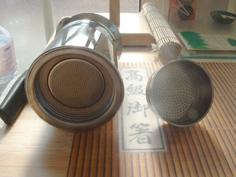  
*Rubber Gasket (left) Entire Strainer (right)*

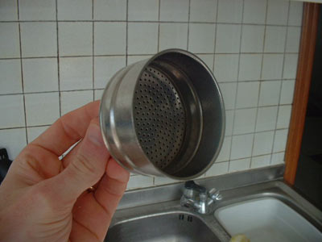  
*This is a close-up of the strainer assembly.*

### #1 Fill With Cold Water

Fill the espresso pot with cold water. The inside of the pot is usually marked with a line to show the fill level. If not, then fill it up to the relief valve on the side. The water should not seep through the strainer when you insert it. This will waterlog the coffee and possibly affect the flavor.

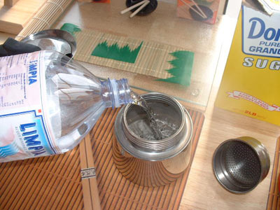  
*Fill water*

### #2 Insert the Strainer Assembly

Insert the strainer assembly into the base. (Alternately, you can fill the assembly first and then insert it. It’s a personal preference).

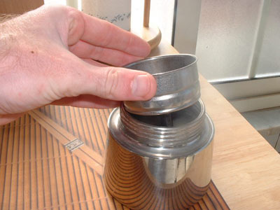  
*Insert strainer assembly*

### #3 Add Coffee Grounds

Fill the strainer with espresso. Ensure that you do not get any grounds on the outside rim of the container. There must be a perfect seal at this point or else the water will spew out once it begins to boil. Simply wipe any excess grounds off before assembling the pot. This is one reason why some people fill the strainer first then insert it.

**Warning: Do not pack the espresso down!** This could possibly clog the system and generate too much pressure. Although acceptable for commercial machines, packing the espresso in this type of pot can be dangerous.

If you make Stovetop Espresso on a regular basis, consider getting a [Moka Pot Coffee Dispenser](http://ineedcoffee.com/moka-pot-coffee-dispenser-review/).

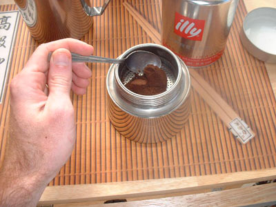  
*Add espresso to Moka.*

This is what the espresso should look like after you fill the strainer. Piling the espresso in like this places it flush with the upper strainer of the pot, thus producing a stronger flavored drink. You can adjust it to your liking.

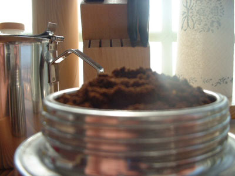  
*Espresso in the Moka.*

### #4 Assemble the Pot

Assemble the pot. Once again, ensure that no grounds are on the outside rim. Screw the pot onto the base by holding the pot itself, not the handle. The handles can break easily (but are also replaceable).

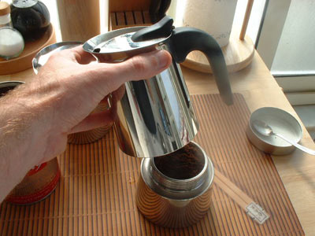  
*Assemble the pot.*

### #5 Place the Coffee Pot Over Heat

Place the pot over a low flame. A low flame increases the brew time, which enhances the flavor. At a later step, you’ll want a slow trickle of espresso instead of a full-force fountain.

In this picture, you’ll notice a small metal piece under the pot. This piece is common for Italian stoves and is available at any hardware store. It should work with an American-style stove if the burner sides are spaced too far apart.

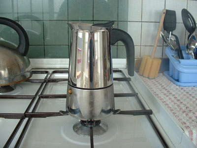  
*Low Flame*

### #6 Get Sugar Ready

While the espresso is brewing, add sugar to your mixing container. You can start with about a teaspoon per cup and then adjust it from there to suit your taste. The pot in this picture is a 10-cup pot, so I used a little more than 10 teaspoons. After some experience, you will be able to dump the right amount of sugar into the container without measuring it. Remember, making espresso is an art, not a science.

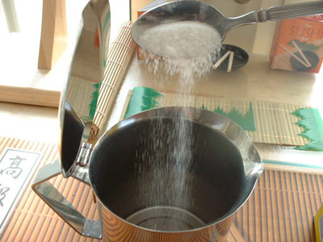  
*Add sugar*

### #7 Pour Coffee and Mix with Sugar

This step is critical and may take some practice to get right. As soon as the espresso comes out, remove the pot from the heat and pour some of the liquid into the mixing container with the sugar.

Adding too little is much better than adding too much, so be conservative. Once you have some espresso with the sugar, start stirring. The end result will be a slurry with the consistency of peanut butter (or a little thinner). If it is too dry, keep adding espresso a little at a time until you get the right consistency.

If you run out of espresso, add it back to the flame until more comes out. You should use the first espresso out of the pot since it is the strongest. Don’t brew the entire pot then try to add it to the sugar. It won’t taste the same.

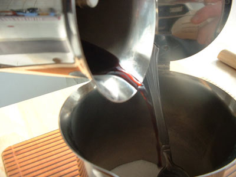  
*Pour coffee*

This is about the right consistency, maybe a little thin but it worked. If you accidentally add too much liquid, you can either add more sugar (not recommended unless you don’t mind it being super sweet) or simply add the remaining espresso at the end of the brew. It won’t have a lot of foam on top but is still drinkable.

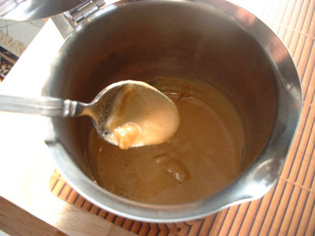  
*Stir coffee*

The espresso comes out as mostly steam toward the end of the brew. The pot pictured here has a tube designed to minimize splatter during the brewing process. The lid on this one can remain open during brewing. Other models have two holes in the side and will spray espresso all over the kitchen if the lid is up.

### #8 Pour More

When the espresso finishes brewing, pour about half of it into the mixing container.

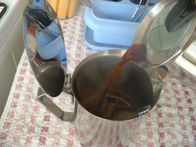  
*Pour half the espresso*

### #9 Stir, Add Remaining Espresso, and Mix Again

Stir vigorously to aerate the mixture and produce a thick foam. Once thoroughly mixed, add the remaining espresso to the container and mix once again.

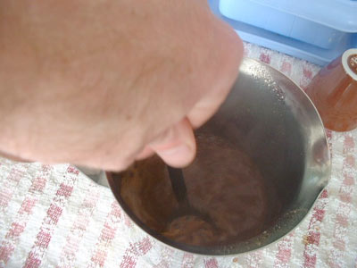  
*Mix again.*

The end result. The amount of foam produced depends on the technique and the amount of sugar used. With just a little practice, you’ll be able to make perfect caffè every time, just like a Neapolitan.

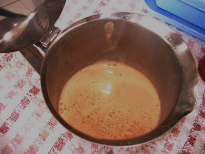  
*Espresso foam*

### #10 Serve

The best part. Pour the espresso into small ceramic cups. You can use a spoon to get the foam into the cups if necessary.

Since the cups are small, the espresso can become cold very quickly. To keep it hotter longer, place the cups in hot water just before you start brewing the espresso. When you pour the espresso into the hot cups, it will retain the heat and allow you to serve piping hot espresso to your friends.

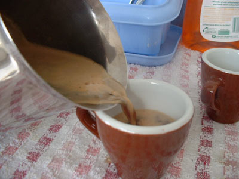  
*Serve Espresso*

Two cups of perfect caffè in ten easy steps!

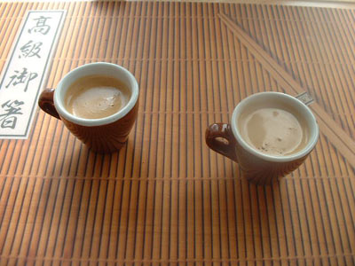  
*Finished Espresso*

Learning how to make caffè using the espresso pot is not hard. Part of the enjoyment of caffè is actually making it.

### Resources  

[Stovetop Espresso Brewing Tutorial](http://ineedcoffee.com/stovetop-espresso-brewing-tutorial/) – INeedCoffee article

[The Story of the Bialetti Moka Express](http://ineedcoffee.com/the-story-of-the-bialetti-moka-express/) – INeedCoffee article