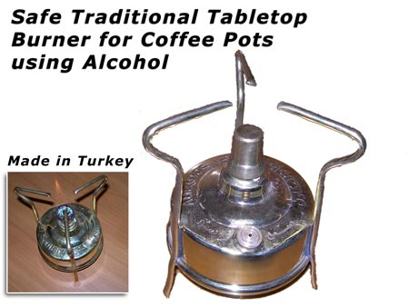
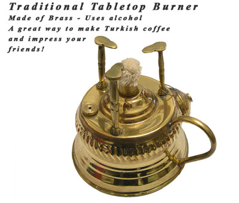

Before electricity and gas, people made coffee with plain old fire! They used wood fire and big pots and ground their coffee with stones or wood.

Fast-forward to the present. The tabletop burner, a small device like a lamp, was invented. This burner uses cheap (impure) blue-colored alcohol. You light it up, and it heats coffee SLOWLY so you can make Turkish coffee.

  
*Turkish Tabletop Burner*

Once the coffee comes to a boil you just blow out the fire, and you serve in your favorite cups.

The burner has a beautiful traditional design, and that’s why many people use it for decoration.

Coffee enthusiasts use these traditional burners because of nostalgia for the good old days and also because they have the benefit of heating coffee SLOWLY, which is the best way.

  
*Traditional Tabletop Burner*

### Turkish Brewing Instructions Using a Tabletop Burner

1.  Add water to the ibrik.
2.  Add coffee and sugar to taste.
3.  Stir.
4.  Use a lighter to start the burner.
5.  Place the ibrik on the burner.
6.  Stir.
7.  Wait till the brew comes to a boil and lift. (Repeat brew if you want)
8.  Serve and enjoy.