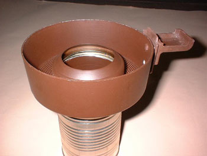

Many of you roast with the [Westbend Poppery](/roasting-coffee-in-a-popcorn-popper/), Proctor-Silex Popcorn Pumper, or some other style that may use a *soup can* style chimney. Although these units work well, there is always the menacing problem of how to contain the chaff during the roast. This article details how to adapt the Melitta coffee roaster chaff collector to any of these style roasters.

  
*Melitta AromaRoast*

The parts list is short, as is the tool list and the skill level required to make the collector. However, with the popularity of home roasting on the rise, the Melitta roasters are beginning to demand an inflated price even though they are a far inferior roaster. Assuming you are able to obtain a Melitta roaster, its chaff collector is the only part you’ll need – the actual roaster can be discarded or re-sold.

### Parts List

-   Melitta roaster chaff collector
-   Piece of glass to use as a “window”
-   Two each pint canning jar rings
-   High-temperature Red “RTV” or equivalent (for sealing the glass window and jar rings)
-   One each soup can (that will fit the jar rings and your roaster)

### Tool List

-   Drill and 3/16 inch bit
-   Metal file
-   Small Philips screwdriver
-   Hacksaw

The “stock” Melitta chaff collector is a two-piece unit: the lid and the base. Begin by disassembling the two pieces and then removing the “handle” from the top. Sit the handle and the two small screws aside so they won’t be misplaced.

Before any modifications begin to the lid, it is critical that you decide what shape and size piece of glass you will be using for a window. Of course, the window is used to view the spin and progress of the roast. For our demonstration, we used a 2″ round piece obtained from an old pressure gauge.

You may decide to use a piece of scrap donated or purchased from a glass shop or hardware store. The shape is really of no consequence as long as it fits well in the lid. What is important, however, is that you have the glass to use as a template for tracing the opening you are about to cut in the lid. The Melitta collector is made of thin, soft aluminum that is easy to cut and shape. As a result, it is also easily bent, so be careful.

After you have traced the glass outline on the lid, retrace the image 1/4″ inside the original outline – this will be the centerline for drilling the pilot holes. Note that a center punch has been used to mark the drill points – this will prevent the bit from “wandering” should you use a hand-held drill. Also note that a wooden block has been, and should be used as a backup to help prevent distortion of the soft aluminum lid during drilling.

After all the pilot holes are drilled and the opening has been cut, trimmed, and deburred, this should allow an opening of approximately 1/16″ smaller than your piece of glass. This remaining “lip” will allow a surface for final gluing (with the RED RTV) of the window to the lid. Simply apply a small bead of RED RTV around the lip and “set” the glass firmly into it. After the RTV cures/sets/dries, it can easily be trimmed with a knife edge. Reattach the handle and the lid is complete.

The Melitta chaff collector base “donut” is complete as is. Our modification(s) are centered around the aluminum “throat” that transitions the original roaster to the chaff collector donut itself. This will require removing the throat in its entirety from the roaster base unit.

After disassembling the aluminum base from the plastic roaster, the throat can easily be cut off with a hacksaw. Cut the throat off flush with the base of the collector and “dress” the sharp edges so as to remove any burrs or otherwise sharp edges. Now, you will have two distinct pieces – the base donut and the cut and dressed throat. In actuality, the throat will serve only as an adaptor to the soup can chimney. I will give you two different variations on the same theme.

Option one utilizes two-pint canning jar rings. One ring will need to have its “lip” filed, sanded, or otherwise removed so that it will fit snugly inside the soup can while the other ring can remain as is with its “shoulder” intact. RTV the ring with the shoulder on one end of the throat piece that you have cut and dressed. This piece can now have a small bead of RTV applied to the outside of the ring and the whole assembly can be inserted into the bottom opening on the donut.

Now you can RTV the second, shoulderless, ring onto the opposite and male end of the throat. The shoulderless ring acts as a “bushing” which allows for a snug slip fit into the female side of the soup can. Note that the shouldered ring will prevent the throat from inserting completely to the bottom of the donut. This option provides for the longest total throat and most stable connection between the chaff collector itself and the soup can.

Option two eliminates the shouldered ring and simply allows the original throat to insert into the donut as was originally designed on the Melitta system. The shoulderless ring is RTV’d to the opposite end of the throat as described above. This option provides for a much shorter and less stable throat. However, if you feel comfortable that your roasting skills and coordination don’t threaten the less stable setup, this may work well for you. Neither is incorrect but my recommendation would be to opt for the longer, more stable throat.

Once all the RTV has cured/dried/set, the unit can be assembled onto your Poppery or Pumper with the soup can chimney. One word of caution: As with any metal, **the chaff collector gets very hot during the roasting process**. Therefore, extreme caution must be exercised when touching the chaff collector.

### Resources

[Roasting Coffee in a Popcorn Popper](/roasting-coffee-in-a-popcorn-popper/) – Tutorial on using the Westbend Popcorn Popper to home roast coffee.

[Melitta Mishap](/melitta-mishap/) – A cautionary tale on leaving a home coffee roast unattended.
