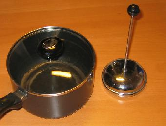
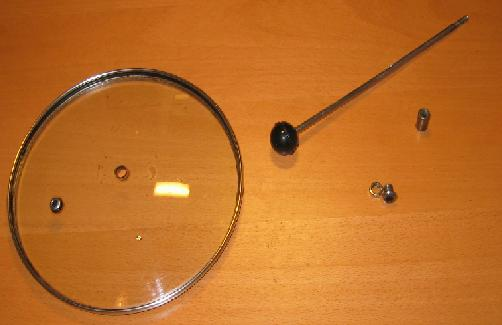
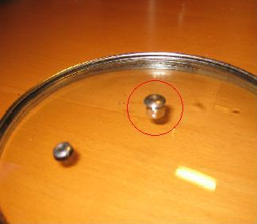
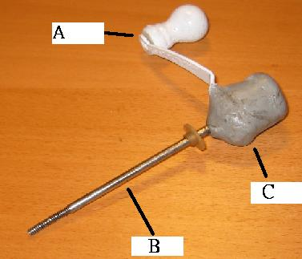
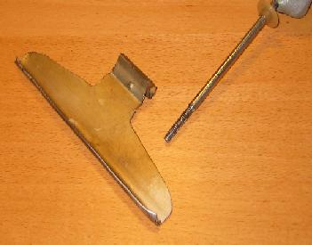
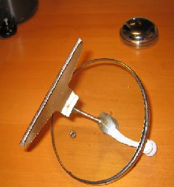
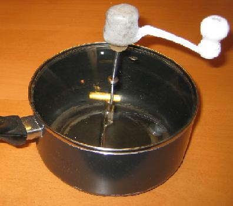

In this tutorial, you will learn how to build your own stovetop coffee roaster. It will work very similar to the [Whirley-Pop popcorn poppers](http://ineedcoffee.com/stovetop-roasting-with-the-whirley-pop/), which can also be used to roast coffee.

Materials needed:

1.  a steel pot with an air hole on the cover
2.  French press
3.  coffee grinder handle and an aluminum plate.

  
*DIY Coffee Roaster Setup*

Dismantle the handle from the boiler cover and take out the press bar and the adjusting screw parts from the French press.

  
*Dismantle Handle*

Place the adjusting screw part of the French press into the hole of the cover of the boiler and fix the position.

  
*Fix the position.*

Now, build your spin handlebar for the roaster.

1.  The handlebar was taken from the Coffee Grinder.
2.  Press bar of the French press.
3.  Cement clay.

Use these 3 materials to build your spin handlebar for the roaster.

  
*Spin Handle*

Cut the aluminum plate for the internal wiper inside the roaster. Make sure that on both sides, you have a height of 2.5-3cm so that the coffee beans can be evenly turned over while roasting. Also, drill a hole on top of the aluminum plate for you to attach it to the spin handlebar.

  
*Aluminum Plate*

When the whole thing is done, it should look like this and test it if you can turn the spin handlebar smoothly.

  
*Test the Handle*

Now you are done and need to study how to control the heat and how to roast. You need a lot of experience to get used to your own homemade roaster. Even after you get your coffee roasted, you need to let it rest for around 48-72 hours before testing the taste. So a lot of time is needed. The only thing that you could test just after roasting is checking if the coffee bean is evenly roasted by taking one coffee bean and breaking it to check that the external color and internal color are the same or not.

  
*Finished DIY Coffee Roaster*