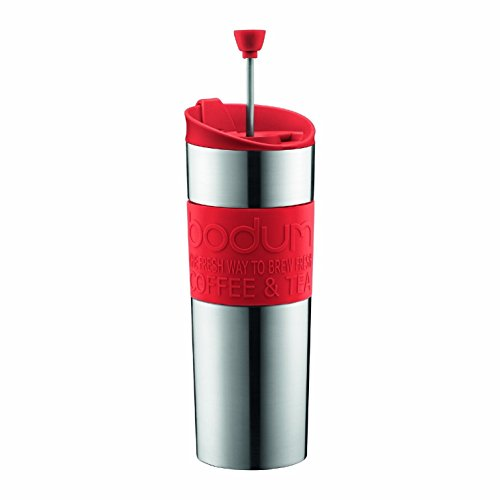
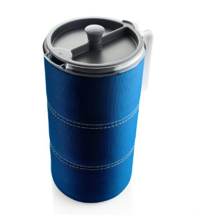
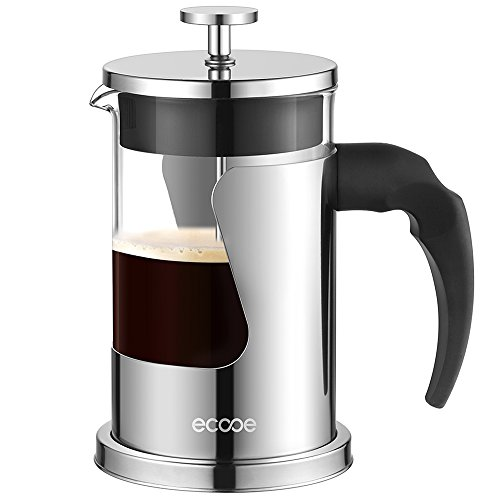
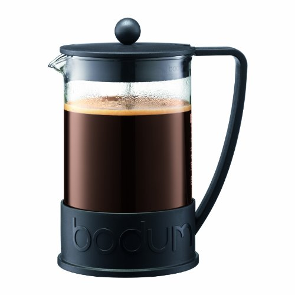
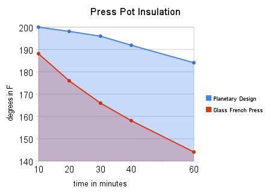
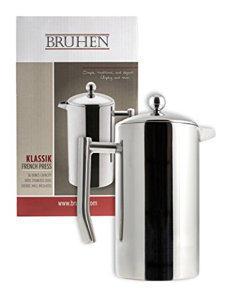
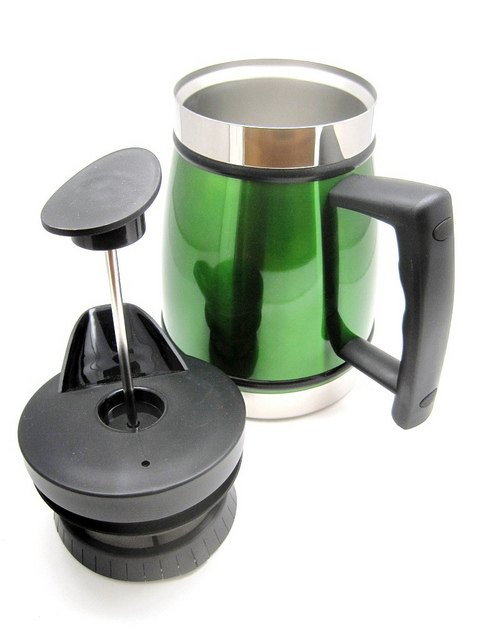

Since the first version of this article was published several years ago, the landscape of French Press options has changed. Back then, most French Press options for sale in coffee shops were various sizes of the same glass or plastic press pot. Today, there are so many more options.

Even though there are more options, **I believe selecting a French Press is one of the easiest coffee equipment decisions**. For this article, I divided French Press users into four groups: The Road Warrior, The Traveler, Glass Fans, and Stainless Steel Fans.

For about a decade, I brewed almost exclusively with the French Press. I had two different French Press brewers at home: a larger one that I used when guests came over and a smaller one that was my day-to-day workhorse. I also kept a cheap French Press at my desk for brewing coffee at the office.

Despite their differences, the coffee they brewed tasted pretty much the same. After brewing a few thousand times with various French Press brewers, I learned that **as long as the filter seal was tight, no one French Press made better coffee than the next**. Using better coffee, having a more consistent grind, or [changing your coffee to water ratio](/coffee-grind-chart/) will be vastly more important. So, if you already have a working French Press and don’t like the results, head over to the Troubleshooting French Press Coffee article before pulling out your credit card to buy a new brewer.

### #1 The Road Warrior

For the Road Warrior, seek out an all-in-one French Press travel mug. You brew the coffee right in the mug, which is pretty slick. A good one will fit in your car’s drink holder. I used to dislike these brewers because the seals were never that great. Some of the coffee would over-extract, and then the rebel grounds would escape up into the coffee. The next thing I know, I’m spitting out coffee grounds.

Fortunately, *Bodum* has solved the problem. They have a travel French Press that keeps the grounds down and the coffee warm. Just be sure to use the provided recipe and not overload it with too much ground coffee.

*Bodum Insulated Stainless-Steel Travel French Press Coffee and Tea Mug  
*

The downside to this method would be if you needed more than 15 ounces of coffee on your road trip. In that case, brew with something larger at home and seek a thermos solution.

### #2 The Traveler

If you will use this French Press for traveling or camping, the most important features will be portability and durability. You don’t want to be pulling pieces of broken glass out of your luggage on your vacation. If you are traveling alone, consider the recommendation in the Road Warrior section. However, if you want to have more coffee while sitting around a campfire, you will need a higher-volume French Press.

GSI Outdoors makes a 50-ounce lightweight French Press made of BPA-free plastic. I love the insulating sleeve that covers this brewer. It will help keep the coffee warmer for longer.

*GSI Outdoors Java Press Coffee Maker*

### #3 Glass French Press Fans

Now that we have covered the needs of The Road Warriors and The Travelers let’s step inside and pick an ideal French Press for our kitchen or office break room. At this stage, we can focus on deciding between glass or stainless steel brewers.

Most people instinctively prefer the look of one over the other, but if you are undecided, ask yourself the following questions.

1.  Do you like to see the coffee when you brew it? Seeing it on the counter and watching the plunger descend into the brew. If so, then go for glass.
2.  Glass can and will break—I’ve had a few shatters—but there are glass options with more sturdy and protective frames. If your cat or child knocks your stainless steel brewer off the counter, it won’t shatter.
3.  Do you drink your coffee slowly? If so, stainless steel models retain heat for longer. More on that in the next section.

The perfect glass French Press model will have a stable base and a sturdy frame. I like the look and feel of the *Ecooe Borosilicate*. Its solid base grips the counter, which is important for those times when you accidentally grind too fine and have to push down with some force.

*Ecooe Borosilicate Glass Stainless Steel French Press Coffee Maker with 4-Filter, 600ml  
*

The *Ecooe Borosilicate* makes 20 ounces of coffee at a time. What if you need more volume? The *Bodum Brazil* comes in both a 34-ounce and a 51-ounce model. I prefer the flat plastic base of the *Brazil* to the metal-framed *Chambord* model. Not only does the Brazil cost less, but I once had a metal leg break on a *Chambord*, rendering my brewer useless or unsafe.

*Bodum Brazil French Press*

### #4 Stainless Steel French Press Fans

Stainless Steel French Press brewers have two advantages over glass models: They can’t shatter and retain heat better. If you serve all your coffee as soon as it finishes brewing, heat retention will not be important. However, stainless steel is a great option if you like to stretch out your coffee experience and want your coffee to stay hot. See the chart below.

This chart compares the heat retention of a stainless steel French Press versus a glass French Press. We used the [Tabletop model](/table-top-press-pot-review/) for this test. Other stainless steel models should retain heat equally. My tip would be to rinse the brewer with hot water before brewing.

There are a few stainless steel French Press options. The *Bruhen* has a slick design and is more affordable than the [Frieling](/the-frieling-french-press/). It can also brew 32 ounces of coffee and has a heat retention curve similar to the Planetary Design model in the above chart.  

*Bruhen Large Stainless Steel French Press Coffee Maker  
*

If you want a French Press in a brighter color, look into Tabletop French Press models by Planetary Designs. They come in a variety of colors, such as black, brushed steel, candy apple red, mocha, and green tea.

  
*French Press Tabletop Coffee and Tea Maker*

### Conclusion

See how easy that was? Unlike an espresso machine, which can take longer to research than a car, picking the right French press is pretty straightforward. Most are inexpensive, so even if you don’t like the one you purchase, you can always buy another one.

### Resources

[French Press Tutorial](/press-pot-tutorial/) – This tutorial will get you brewing once you’ve bought your French Press.

[Troubleshooting French Press Coffee](/troubleshooting-french-press-coffee/) – Follow this troubleshooting guide if your coffee isn’t fantastic.
