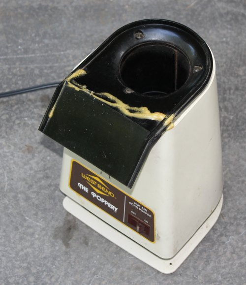

I started home roasting coffee in June 1998. Since then, I’ve used several different roasters and methods. I’ll be the first to confess that I haven’t kept up with all the different machines available to home coffee roasters. What I have learned are the most important factors to consider when buying your first home coffee roaster.

### #1 Indoor, Outdoor, or Somewhere In Between?

The most important factor in deciding on a roaster is answering the question, “Where do you plan on roasting?”

Some coffee roasters work indoors, but many or most would be better set up in a garage, a patio, or a porch. Roasting coffee produces smoke—more smoke than you get when cooking food. Coffee also releases thin paper-like chaff during the roast that can add to the cleanup.

The darker you roast your coffee or the more beans you roast, the more I encourage you not to roast indoors. An exception would be kitchens with extremely good vents. Most dedicated home roasters will have some filter to catch the chaff. They also clean the smoke to differing degrees. Popcorn poppers won’t.

The downside to outdoor roasting is that if you live in a cold environment, you will need to devise hacks to keep your roaster warm enough without creating a fire hazard.

### #2 Noise

Coffee roasters can be somewhat quiet or extremely loud. Air roasters tend to be louder than drum roasters.

Noise can be problematic for the new home roaster since you are learning to listen for the first and second crack. The quieter the roaster is, the easier it is to hear those cracks. Generally, drum roasters tend to be quieter than air roasters. They also tend to cost more, but they also last longer.

### #3 Price

Home coffee roasters can be as cheap as a tray in an [oven](http://ineedcoffee.com/home-roasting-coffee-in-an-oven/) or as much as you want to spend. The [Hottop Programmable](http://ineedcoffee.com/hottop-kn-8828p-coffee-bean-roaster-first-look/) is about $1000. Roasting coffee is an intense process. Don’t expect your roaster to last as long as your coffee pot. It won’t. Almost half the roasters I’ve owned have died shortly before or after the warranty expired. If the machine you buy has a 2-year warranty, expect 2 years of life and no more. Start saving for your next machine as soon as you pull it out of the box.

### #4 Volume

Different roasters have different volumes. Some coffee roasters roast too little for some households. Although something is to be said about starting small while you are learning, you also don’t want to spend a lot of money on a small-volume roaster you are certain to outgrow.

### Decision Time

Once you’ve answered those four questions, you can then choose the best home coffee roaster for you. Keep in mind that most of the people I know who started roasting their own coffee will try many different roasting methods. It is too much fun not to experiment with new roasting methods.

  
*Westbend Poppery 1500 Watt – Best For Beginners.*

### The Poppery For Beginners

However, if I were to recommend a single home roasting method for the beginner, it would be the Westbend Poppery 1500 Watt popcorn popper. It is not an indoor roaster, but it is super quiet and hands-on, so you can hear and see the coffee roasting.

They are available on eBay for about $60. That is too expensive for a lousy popcorn popper, but a bargain for a solid coffee roaster. My Poppery roasters have outlasted every other coffee roaster I’ve ever owned. The Poppery does require access to the outdoors, as it throws chaff and produces smoke.

I hope this helped. Knowing how much money you have to spend, your noise sensitivity, how much coffee your home consumes, and if you have access to a porch or patio with an electrical outlet will help guide your search for your first home coffee roaster.

### Resources

[Roasting Coffee in a Popcorn Popper](http://ineedcoffee.com/roasting-coffee-in-a-popcorn-popper/) – My tutorial on roasting coffee in the Westbend Poppery

[Hottop KN-8828P Coffee Bean Roaster First Look](http://ineedcoffee.com/hottop-kn-8828p-coffee-bean-roaster-first-look/) – Overview of the Hottop coffee roaster.

[Home Roasting Coffee in an Oven](http://ineedcoffee.com/home-roasting-coffee-in-an-oven/) – Tutorial on roasting coffee in an oven.

[Behmor 1600 Coffee Roaster Tutorial](http://ineedcoffee.com/behmor-1600-coffee-roaster-tutorial/) – How to roast coffee using the Behmor 1600.