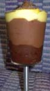

Cafe Au Lait Pudding is a delicious coffee-flavored take on pudding. This super-easy recipe rounds out the recipes for this summer. You can create this in just a few minutes without forsaking your tan.

  
*Cafe Au Lait Pudding*

### Ingredients: (Makes enough for 2-3 people)

-   1 package of Jell-O brand vanilla instant pudding (2.5 oz.)
-   1 package of Jell-O brand chocolate instant pudding (2.5 oz.)
-   3 1/2 cups of milk.
-   1 cup of drip coffee, chilled. (Any house blend will do, just don’t use a flavored coffee.)
-   Whipped cream in a can for garnish.
-   Three bowls, and serving dishes for the pudding.

### Directions

Follow the directions on the package for preparing the vanilla pudding: add 2 cups of cold milk and pudding mix in a bowl and whisk for two minutes.

In a separate bowl, prepare the chocolate pudding. The directions call for 2 cups of milk. Instead, put in 1 1/2 cups of milk and 1/2 cup of chilled coffee and pudding mix in a bowl and whisk for two minutes.

Transfer about 4 tablespoons of the vanilla and 4 tablespoons of the chocolate pudding to a third bowl. Add 2 more tablespoons of coffee to this batch. Whisk this batch. It should appear a few shades lighter than the chocolate pudding’s color. Discard the remainder of the coffee (or drink it).

Layer in cups or parfait glasses. Refrigerate for five minutes. Garnish with whipped cream before serving.
