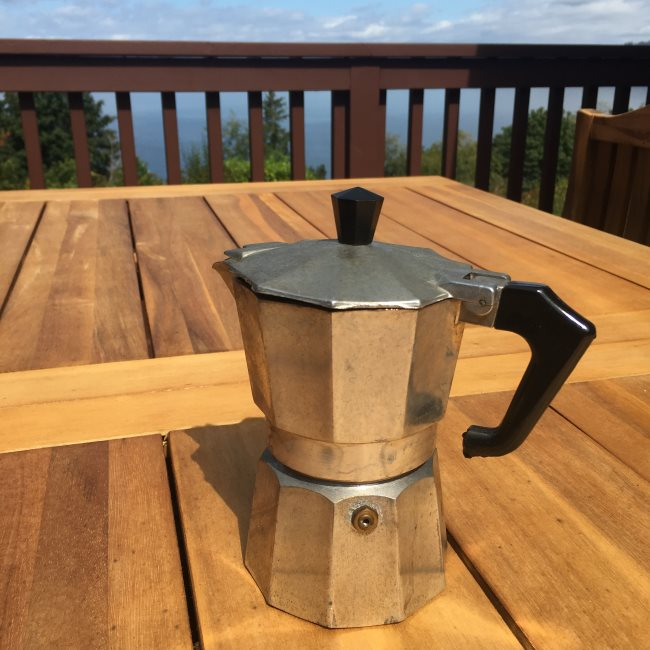
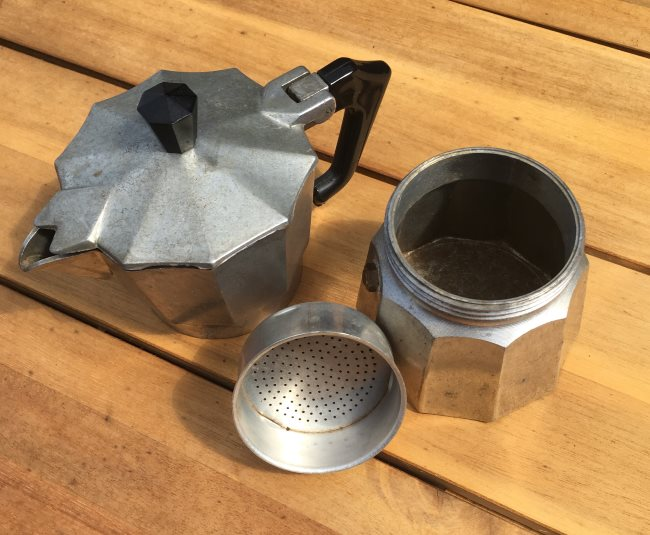
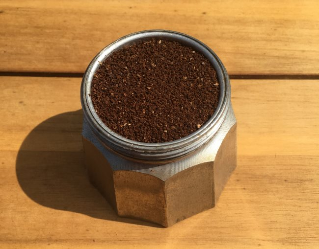
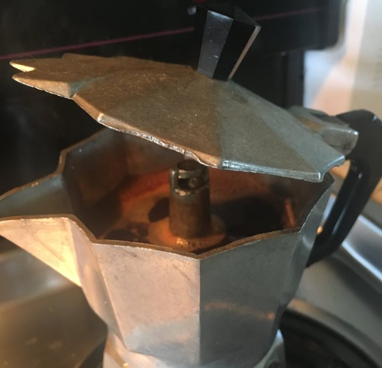
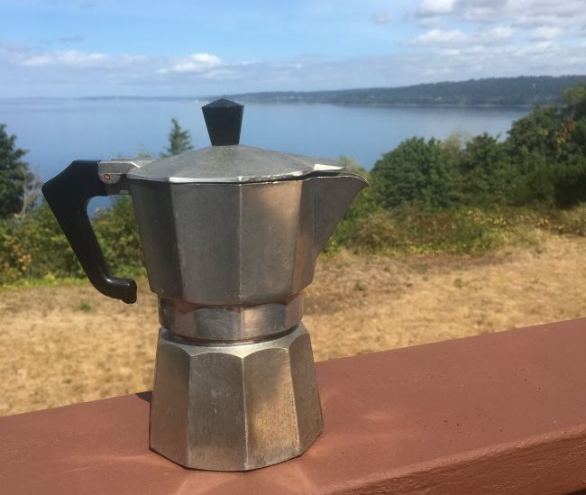

What tequila is to liquor, *cafe cubano* is to the world of coffee. It is not sipped or savored… it is shot! *Cafe Cubano* is at least double the strength of American coffee. It is a daily morning ritual for Cubans and Cuban-Americans. At any time of day or night at the countless little Cuban restaurants that dot Miami, people line up for “jolts” of *cafe cubano* served in thimble-sized paper cups.

Cuban coffee is served at the end of a meal in *tacitas* (tiny cups) that are smaller than demitasse cups. The old-fashioned way to make *cafe cubano* is in a pot on the stove, though the truth is that Cubans in this country often make their coffee in Italian espresso makers. The tutorial below will use a Stovetop Espresso pot.

### The Coffee

You can best approximate the taste of Cuban coffee by using finely ground, almost powdered coffee. Cuban-style coffee is also widely available in both whole bean and ground espresso blends. Cubans enjoy their coffee with generous amounts of sugar. I have added sugar to this coffee recipe since that is how it generally is made, but if you wish to omit the sugar, that’s fine.

  
*Stovetop Espresso*

### The Process

Unscrew the Italian espresso maker and remove the metal filter cup from the bottom half. Pour ice-cold water into the bottom of the espresso maker up to the bolt located on the inside.

  
*Disassemble Pot, Remove Filter, and Fill with Water*

Position the metal filter cup back into the bottom half and tamp very tightly with coffee grounds, leveling it off at the top. Screw the espresso maker together and place it on a hot burner (high heat). While keeping an eye on the espresso maker, take a metal cup and pour about one teaspoon for each *tacita*.

  
*Portafilter Loaded*

A typical stovetop espresso maker makes four *tacitas*, but they are available in as small as two (for the lonely Cuban bachelor) and as many as eight and up (for Noche Buena – the family Christmas Eve dinner). As the first trickles of coffee percolate, pour enough to moisten the sugar in the metal cup. Vigorously mix the moistened sugar and coffee until it becomes a light paste.

In the meantime, take the espresso maker off the heat once the top portion is about 3/4 of the way full. This will prevent it from burning and/or overflowing onto your stove. Once the coffee is done, pour it slowly into the metal cup while gently mixing it with the sugar paste. If done properly (and yes, it takes practice and a special touch), the sugar paste will create a “foam” once it is mixed with the rest of the coffee. Pour into *tacitas* or demitasse cups and shoot!

### Cafe con Leche (Cuban Coffee with Milk)

*Cafe Cubano’s* quieter cousin, *cafe con leche* should be called *leche con cafe* for it really is milk with coffee. A steaming cup of this sweet, comforting portion served with toasted bread or Cuban crackers is a typical Cuban breakfast.

Heat milk in a pot. *Cafe con leche* is usually made with whole milk, or a mixture of whole and evaporated milk, but any milk will do – dare I say, even soy. *Sorry, Abuelita (Dear Grandmother)!*

Pour the hot milk into a mug, filling it almost to the top. Throw in a *tacita* of *Cafe Cubano* and stir. Sit back, pop in the Buena Vista Social Club CD, and feel the warm Gulf breeze.

### Resources

[Stovetop Espresso Brewing Tutorial](http://ineedcoffee.com/stovetop-espresso-brewing-tutorial/) – An updated step-by-step brewing tutorial.

[Moka Pot Stove](http://ineedcoffee.com/moka-pot-stove/) – How to build your burner for the Moka pot.

[The Story of the Bialetti Moka Express](http://ineedcoffee.com/the-story-of-the-bialetti-moka-express/) – The history of the Bialetti Moka Pot.