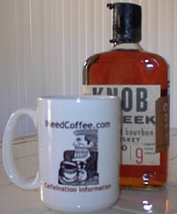

I grew up with my parents drinking a fresh cup of coffee first thing in the morning, and the same thing before going to bed at night. My family called this recipe “cafe fourb”, which means “crazy coffee” in Italian. When I became of age, I too, picked up this habit and I still find it the most tasteful, calming, delightful cup of fresh coffee with the memory of my parents enjoying that quiet, satisfying drink. Following is the recipe:

-   1 cup fresh coffee (could be decaf if preferred)
-   1 shot of good bourbon
-   1 teaspoon sugar

  
*Coffee + Bourbon = Cafe Fourb*

When choosing a good, any level of roast will work. I’ve used 100 proof bourbons with this recipe. One good inexpensive 100-proof bourbon is Knob Creek. But remember, no more than one cup each time. Try it, my friend, guarantee you too will enjoy it.

Oh, as an added attraction, I would always have a jar of the whiskey full of fat Bing cherries soaking until each cherry was equivalent to 1 shot. Gracious sake, everybody loved my crazy coffee!
